Verifying MS detected peptides as HLA ligands
================
Kaspar Bresser
29/07/2021

-   [Compare length distributions](#compare-length-distributions)
-   [AA usage vs IEDB](#aa-usage-vs-iedb)
-   [AA usage vs proteome](#aa-usage-vs-proteome)
-   [AA positional bias](#aa-positional-bias)
-   [Sequence logo’s](#sequence-logos)
-   [affinity and chop in train data](#affinity-and-chop-in-train-data)

Below a few analysis that we performed to verify if the peptides
detected by Mass Spec were indeed HLA ligands

Lets load in the packages required for the analysis.

``` r
library(here)
library(ggseqlogo)
library(pheatmap)
library(RColorBrewer)
library(seqinr)
library(ggrepel)
library(ggpubr)
library(scales)
library(rstatix)
library(viridis)
library(tidyverse)
```

# Compare length distributions

HLA ligands have a recognizable length distribution, with the majority
being 9mers. We’ll compare the length distributions of the MS detected
peptides with the length distribution of validated HLA ligands derived
from melanomas.

Lets import the melanomas dataset (downloaded from IEDB). First line of
the file is non-sense, so ignore that. Peptide sequences are present in
the ‘Description’ column.

``` r
read_csv(here("Data", "IEDB_melanoma_ligands.csv"), skip = 1) %>% 
  select(3) %>% 
  rename(Sequence = contains("Description")) %>% 
  mutate(length = nchar(Sequence),
         source = "IEDB") -> IEDB.peptides
```

    ## Warning: One or more parsing issues, see `problems()` for details

``` r
IEDB.peptides
```

    ## # A tibble: 31,997 × 3
    ##    Sequence    length source
    ##    <chr>        <int> <chr> 
    ##  1 AAGIGILTV        9 IEDB  
    ##  2 AARPATSTL        9 IEDB  
    ##  3 AASKERSGVSL     11 IEDB  
    ##  4 ACDPHSGHFV      10 IEDB  
    ##  5 AEVDKVTGRF      10 IEDB  
    ##  6 AHSTIMPRL        9 IEDB  
    ##  7 ALAPSTMKI        9 IEDB  
    ##  8 ALDGGNKHFL      10 IEDB  
    ##  9 ALFGALFLA        9 IEDB  
    ## 10 ALKGTNESL        9 IEDB  
    ## # … with 31,987 more rows

``` r
table(IEDB.peptides$length)
```

    ## 
    ##     6     7     8     9    10    11    12    13    14    15    16    17    18 
    ##    36   226  1278 19035  5291  3519  1094   530   227   179   147   102    59 
    ##    19    20    21    22    23    24    25    26    27    28    29    30    31 
    ##    35    34    32    21    25    20     8    17    11     8     7     5     6 
    ##    32    33    34    35    36    37    38    39    41    43    44    47    49 
    ##     4     4     5     2     2     6     4     3     3     1     1     3     1 
    ##    50    51    55    58    60    62 
    ##     1     1     1     1     1     1

Indeed, the vast majority of peptides are 9mers.

Now import the MS detected peptides from our dataset. The peptides are
stored as multiple files, so will import as a list column using the
`purrr::map` function. Needed to set the q-Value column as character to
resolve some parsing errors.

The MS peptide tables annoyingly contain different column names, so in
order to unnest them I combined `dplyr::select` with `purrr:map` to
retain only the peptide sequence column from each dataframe. Then use
unnest and add length info.

``` r
file.names<- list.files(here("Data", "MS_peptides"))

MS.peptides <- tibble(
  
  peptide.tables = map( here("Data", "MS_peptides", file.names), read_tsv, col_types = cols(`q-Value` = "c") ),
  source = c("SK-MEL-95", "M026.X1", "NKIRTIL006")

  )

MS.peptides
```

    ## # A tibble: 3 × 2
    ##   peptide.tables             source    
    ##   <list>                     <chr>     
    ## 1 <spec_tbl_df [5,395 × 58]> SK-MEL-95 
    ## 2 <spec_tbl_df [6,917 × 37]> M026.X1   
    ## 3 <spec_tbl_df [8,384 × 37]> NKIRTIL006

``` r
library(UpSetR)

MS.peptides$peptide.tables %>% 
  map( ~select(., "Sequence",contains("Area"))) %>% 
  map(~mutate(., across(contains("Area"), ~ case_when(. == "0,000E0" ~ 0, TRUE ~ 1)))) %>% 
  map(~upset(as.data.frame(.), nsets = 17,  mb.ratio = c(0.5, 0.5), order.by = c("freq", "degree")))
```

    ## [[1]]

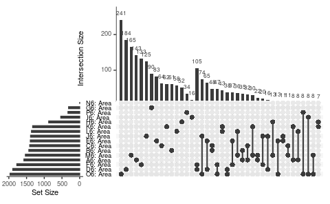

    ## 
    ## [[2]]

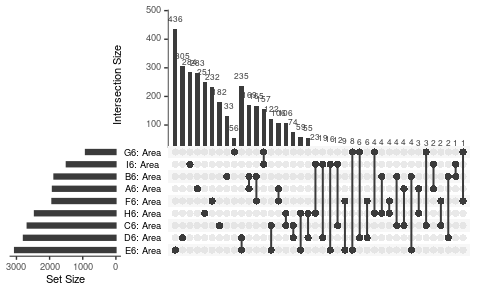

    ## 
    ## [[3]]

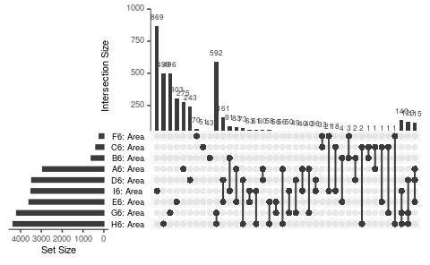

``` r
MS.peptides$peptide.tables %>% 
  map(~select(., contains("Area"))) %>% 
  map(~mutate(., across(contains("Area"), ~ case_when(. == "0,000E0" ~ 0, TRUE ~ 1)))) %>% 
  map(~mutate(., overlap = rowSums(.))) %>% 
  map(~select(., "overlap")) %>% 
  set_names("SK-MEL-95", "M026.X1", "NKIRTIL006") %>% 
  enframe() %>% 
  unnest() -> plot.data
```

    ## Warning: `cols` is now required when using unnest().
    ## Please use `cols = c(value)`

``` r
plot.data %>% 
  count(name, overlap) %>% 
  group_by(name) %>% 
  mutate(perc = (n / sum(n))*100 )
```

    ## # A tibble: 36 × 4
    ## # Groups:   name [3]
    ##    name    overlap     n   perc
    ##    <chr>     <dbl> <int>  <dbl>
    ##  1 M026.X1       0    67  0.969
    ##  2 M026.X1       1  2162 31.3  
    ##  3 M026.X1       2  1387 20.1  
    ##  4 M026.X1       3  1385 20.0  
    ##  5 M026.X1       4   830 12.0  
    ##  6 M026.X1       5   408  5.90 
    ##  7 M026.X1       6   349  5.05 
    ##  8 M026.X1       7   173  2.50 
    ##  9 M026.X1       8    79  1.14 
    ## 10 M026.X1       9    77  1.11 
    ## # … with 26 more rows

``` r
ggplot(plot.data, aes(x = overlap))+
  geom_bar()+
  facet_wrap(~name, scales = "free")
```

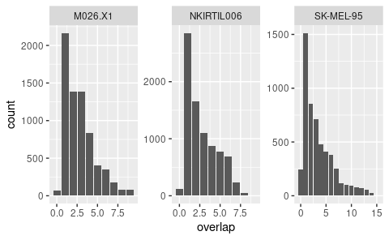

``` r
MS.peptides %>% 
  mutate(peptide.tables = map(peptide.tables, select, "Sequence")) %>% 
  unnest(cols = peptide.tables) %>% 
  mutate(length = nchar(Sequence))  -> MS.peptides

MS.peptides
```

    ## # A tibble: 20,696 × 3
    ##    Sequence       source    length
    ##    <chr>          <chr>      <int>
    ##  1 HSKIIIIKKGHAKD SK-MEL-95     14
    ##  2 GARPREEVVQKEQE SK-MEL-95     14
    ##  3 HKVTQYKKGKDSLY SK-MEL-95     14
    ##  4 TKETIEQEKRSEIS SK-MEL-95     14
    ##  5 AKRTKKVGIVGKY  SK-MEL-95     13
    ##  6 SRRAEEKIKSVGGA SK-MEL-95     14
    ##  7 KIRAADKRSKALKA SK-MEL-95     14
    ##  8 EFHDSSDHHTF    SK-MEL-95     11
    ##  9 RRRNTLQLHRYR   SK-MEL-95     12
    ## 10 VITDKEKAEKLKQS SK-MEL-95     14
    ## # … with 20,686 more rows

Can now combine the tibbles and calculate the fraction-of-total for each
peptide length to nicely visualize the distribution. Focusing only on
sizes 8-14 as that was the range that we looked for in the mass-spec.

``` r
MS.peptides %>% 
  bind_rows( IEDB.peptides) %>% 
  filter(length < 15, length > 7) %>% 
  mutate(length = as.factor(length))%>%
  count(source, length) %>% 
  group_by(source) %>% 
  mutate(fraction = n/sum(n)) -> length.distributions

write_tsv(length.distributions, here("Output", "length_distributions.tsv"))

length.distributions
```

    ## # A tibble: 28 × 4
    ## # Groups:   source [4]
    ##    source  length     n fraction
    ##    <chr>   <fct>  <int>    <dbl>
    ##  1 IEDB    8       1278  0.0413 
    ##  2 IEDB    9      19035  0.615  
    ##  3 IEDB    10      5291  0.171  
    ##  4 IEDB    11      3519  0.114  
    ##  5 IEDB    12      1094  0.0353 
    ##  6 IEDB    13       530  0.0171 
    ##  7 IEDB    14       227  0.00733
    ##  8 M026.X1 8        220  0.0318 
    ##  9 M026.X1 9       4118  0.595  
    ## 10 M026.X1 10      1361  0.197  
    ## # … with 18 more rows

``` r
length.distributions %>% 
  ggplot(aes(x = length, y = fraction))+
  geom_bar(aes(fill = source), stat = "identity",  position = "dodge")+
  theme_classic()+
  theme(panel.grid.major.y = element_line())
```

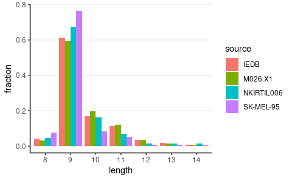

``` r
ggsave(here("Figs", "verify_length_distribution.pdf"), width = 3, height = 1.5, scale = 1.5)
```

# AA usage vs IEDB

Another facet we can look at is the amino acid usage of our MS detected
peptides and compare it to the amino acid frequencies found in IEDB.

To calculate the frequencies lets first extract the peptide sequences as
a list. Nest the peptides by source, an then use `purrr:map` with
`dplyr::pull` to extract the sequences into a character variable. Then
deframe these into a named list.

``` r
MS.peptides %>% 
  bind_rows( IEDB.peptides) %>% 
  group_by(source) %>%
  nest %>% 
  mutate(seqs = map(data, pull, "Sequence")) %>% 
  select(source, seqs) %>% 
  deframe() -> MS.peptide.list

str(MS.peptide.list)
```

    ## List of 4
    ##  $ SK-MEL-95 : chr [1:5395] "HSKIIIIKKGHAKD" "GARPREEVVQKEQE" "HKVTQYKKGKDSLY" "TKETIEQEKRSEIS" ...
    ##  $ M026.X1   : chr [1:6917] "NTETTEDVKGRIY" "ATEQVGQHKDAY" "AASKERSGVSL" "DSELQREGVSHY" ...
    ##  $ NKIRTIL006: chr [1:8384] "RMRDGRGMGGHGY" "RSHRRDQKWHDKQY" "AKRTKKVGIVGKY" "RRRNTLQLHRYR" ...
    ##  $ IEDB      : chr [1:31997] "AAGIGILTV" "AARPATSTL" "AASKERSGVSL" "ACDPHSGHFV" ...

Used this bit of code below to get all the amino acids as a character
vector.

``` r
MS.peptide.list[[1]] %>% 
  str_flatten %>% 
  str_split("") %>% 
  unlist() %>% 
  unique() -> amino.acids

amino.acids
```

    ##  [1] "H" "S" "K" "I" "G" "A" "D" "R" "P" "E" "V" "Q" "T" "Y" "L" "F" "N" "W" "M"
    ## [20] "C"

Now use a series of `purrr:map` calls to (1) paste peptides for each
source into a single character vector using `stringr::str_flatten`, (2)
count all amino acids using `stringr::str_count`, and (3) use
`stringr::set_names` to change to named vectors.

``` r
MS.peptide.list %>% 
  map(str_flatten) %>% 
  map(str_count, amino.acids) %>% 
  map(set_names, amino.acids) -> AA.counts

AA.counts
```

    ## $`SK-MEL-95`
    ##    H    S    K    I    G    A    D    R    P    E    V    Q    T    Y    L    F 
    ## 1607 2504 3190 3408 1479 3043 2246 2050 1710 3273 4105 1752 2418 3506 6104 3455 
    ##    N    W    M    C 
    ## 1694  575 1337  186 
    ## 
    ## $M026.X1
    ##    H    S    K    I    G    A    D    R    P    E    V    Q    T    Y    L    F 
    ## 1452 4455 3412 3547 2968 4078 4454 2700 2412 5125 5427 2650 3657 3862 8793 2153 
    ##    N    W    M    C 
    ## 2053  569 2288  319 
    ## 
    ## $NKIRTIL006
    ##    H    S    K    I    G    A    D    R    P    E    V    Q    T    Y    L    F 
    ## 2485 4788 5411 4826 3768 5070 2993 4119 2223 5857 5822 5115 3752 4719 9062 3834 
    ##    N    W    M    C 
    ## 2272  694 1911  408 
    ## 
    ## $IEDB
    ##     H     S     K     I     G     A     D     R     P     E     V     Q     T 
    ## 10632 23594 19018 16628 16422 21950 14593 15230 15884 21283 22516 15552 17960 
    ##     Y     L     F     N     W     M     C 
    ## 15880 34134 12897 10584  1733  5783   741

Next we can switch back to a tibble format. First `purrr:map` the
enframe function to get a list of count tables, then enframe those into
a single tibble, and unnest.

``` r
AA.counts %>% 
  map(enframe, "AA", "count") %>% 
  enframe( "source", "counts") %>% 
  unnest(counts) -> AA.counts

AA.counts
```

    ## # A tibble: 80 × 3
    ##    source    AA    count
    ##    <chr>     <chr> <int>
    ##  1 SK-MEL-95 H      1607
    ##  2 SK-MEL-95 S      2504
    ##  3 SK-MEL-95 K      3190
    ##  4 SK-MEL-95 I      3408
    ##  5 SK-MEL-95 G      1479
    ##  6 SK-MEL-95 A      3043
    ##  7 SK-MEL-95 D      2246
    ##  8 SK-MEL-95 R      2050
    ##  9 SK-MEL-95 P      1710
    ## 10 SK-MEL-95 E      3273
    ## # … with 70 more rows

Now calculate frequencies, and reshuffle the tibble slightly to allow us
to plot the tumors vs IEDB.

``` r
AA.counts %>% 
  group_by(source) %>% 
  mutate(fraction = count/sum(count)) %>% 
  pivot_wider(id_cols = c(AA) , names_from = source, values_from = fraction) %>% 
  pivot_longer(cols = c(`SK-MEL-95`, `M026.X1`, `NKIRTIL006`), names_to = "tumor", values_to = "tumorFraction") -> to.plot

to.plot
```

    ## # A tibble: 60 × 4
    ##    AA      IEDB tumor      tumorFraction
    ##    <chr>  <dbl> <chr>              <dbl>
    ##  1 H     0.0340 SK-MEL-95         0.0324
    ##  2 H     0.0340 M026.X1           0.0219
    ##  3 H     0.0340 NKIRTIL006        0.0314
    ##  4 S     0.0754 SK-MEL-95         0.0504
    ##  5 S     0.0754 M026.X1           0.0671
    ##  6 S     0.0754 NKIRTIL006        0.0605
    ##  7 K     0.0608 SK-MEL-95         0.0643
    ##  8 K     0.0608 M026.X1           0.0514
    ##  9 K     0.0608 NKIRTIL006        0.0684
    ## 10 I     0.0531 SK-MEL-95         0.0687
    ## # … with 50 more rows

And make the plot. Used `ggrepel::geom_label_repel` to add the amino
acid identities.

``` r
to.plot %>% 
  ggplot( aes(x = tumorFraction, y = IEDB))+
  geom_smooth(method = "lm", color = "red")+
  geom_point(aes(fill=AA), colour="black",pch=21, size=5)+
  scale_fill_viridis(discrete = T)+
  geom_label_repel(aes(label = AA),
                   box.padding   = .5, 
                   point.padding = 0.5,
                   segment.color = 'black', size = 3 )+
  labs(x = "AA usage fraction of MS detected peptides", y = "AA usage fraction within IEDB")+
  theme_minimal()+
  theme(legend.position = "none")+
  facet_wrap(~tumor)
```

    ## Warning: ggrepel: 1 unlabeled data points (too many overlaps). Consider
    ## increasing max.overlaps

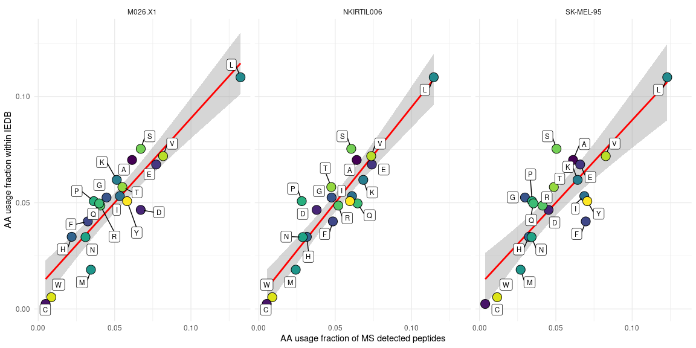

``` r
ggsave(here("Figs", "verify_AAdist_tumor_vs_IEDB.pdf"), width = 8.5, height = 3, scale = 1.5)
```

    ## Warning: ggrepel: 1 unlabeled data points (too many overlaps). Consider
    ## increasing max.overlaps

Finally, calculate the Spearman correlation coefficients. Using the
**rstatix** package

``` r
to.plot %>% 
  group_by(tumor) %>% 
  cor_test(tumorFraction, IEDB, method = "spearman") %>% 
  adjust_pvalue(method = "bonferroni")
```

    ## # A tibble: 3 × 8
    ##   tumor      var1          var2    cor statistic          p method        p.adj
    ##   <chr>      <chr>         <chr> <dbl>     <dbl>      <dbl> <chr>         <dbl>
    ## 1 M026.X1    tumorFraction IEDB   0.88       164 0          Spearman 0         
    ## 2 NKIRTIL006 tumorFraction IEDB   0.83       228 0.00000154 Spearman 0.00000462
    ## 3 SK-MEL-95  tumorFraction IEDB   0.72       366 0.000443   Spearman 0.00133

# AA usage vs proteome

Having seen that the AA usage of IEDB peptides and our MS detected
peptides correspond quite well, we next looked how well the AA usage of
MS detected peptides corresponds to AA usage within the proteome of
these tumors.

To do this, we’ll make use of the reference libraries used for each of
the tumors. These contain all (RNA) expressed protein sequences.
Allowing us the contain amino acid usage across all proteins that were
expressed in each line.

Will use `seqinr::read.fasta` to read the files. Read in the files as a
list, for easy manipulation

``` r
file.names <- list.files(here("Data", "sprot_databases", "databases_melanomas"))
file.list <- here("Data", "sprot_databases", "databases_melanomas", file.names)

map(file.list, read.fasta,  seqtype = "AA", seqonly = T) %>%
  set_names( c("SK-MEL-95", "M026.X1", "NKIRTIL006") ) -> references
#  set_names( map(str_split(file.names, "\\_|\\."), 2) ) -> references

summary(references)
```

    ##            Length Class  Mode
    ## SK-MEL-95  20410  -none- list
    ## M026.X1    20202  -none- list
    ## NKIRTIL006 20542  -none- list

Now, like we did in the previous analysis, use a series of
`purrr:map calls` to (1) paste peptides for each source into a single
character vector using `stringr::str_flatten`, (2) count all amino acids
using `stringr::str_count`, and (3) use `stringr::set_names` to change
to named vectors.

``` r
references %>% 
  map(str_flatten) %>% 
  map(str_count, amino.acids) %>% 
  map(set_names, amino.acids) -> AA.counts.ref

AA.counts.ref
```

    ## $`SK-MEL-95`
    ##       H       S       K       I       G       A       D       R       P       E 
    ##  297990  942679  648893  491781  744722  794836  536828  639604  715177  804352 
    ##       V       Q       T       Y       L       F       N       W       M       C 
    ##  676472  539958  607461  301961 1128699  413875  406859  138062  241418  260243 
    ## 
    ## $M026.X1
    ##       H       S       K       I       G       A       D       R       P       E 
    ##  297778  941932  648384  491421  744184  794252  536445  639116  714630  803734 
    ##       V       Q       T       Y       L       F       N       W       M       C 
    ##  675942  539572  607006  301725 1127896  413550  406535  137959  241229  260034 
    ## 
    ## $NKIRTIL006
    ##       H       S       K       I       G       A       D       R       P       E 
    ##  298140  943136  649174  492130  745034  795180  537075  639828  715540  804629 
    ##       V       Q       T       Y       L       F       N       W       M       C 
    ##  676746  540162  607863  302139 1129253  414093  407028  138136  241532  260432

Again, in the same manner as above, transform to a tibble format.

``` r
AA.counts.ref %>% 
  map(enframe, "AA", "count.ref") %>% 
  enframe( "source", "counts") %>% 
  unnest(counts) -> AA.counts.ref

AA.counts.ref
```

    ## # A tibble: 60 × 3
    ##    source    AA    count.ref
    ##    <chr>     <chr>     <int>
    ##  1 SK-MEL-95 H        297990
    ##  2 SK-MEL-95 S        942679
    ##  3 SK-MEL-95 K        648893
    ##  4 SK-MEL-95 I        491781
    ##  5 SK-MEL-95 G        744722
    ##  6 SK-MEL-95 A        794836
    ##  7 SK-MEL-95 D        536828
    ##  8 SK-MEL-95 R        639604
    ##  9 SK-MEL-95 P        715177
    ## 10 SK-MEL-95 E        804352
    ## # … with 50 more rows

Now we can combine the tumor count tibble, and the reference count
tibble. We’ll drop the IEDB count from the former, and calculate the two
fractions we’d like to plot.

``` r
AA.counts %>% 
  filter(!(source == "IEDB")) %>% 
  full_join(AA.counts.ref) %>% 
  group_by(source) %>% 
  mutate(fraction.MS = count/sum(count),
         fraction.ref = count.ref/sum(count.ref)) -> to.plot2

to.plot2
```

    ## # A tibble: 60 × 6
    ## # Groups:   source [3]
    ##    source    AA    count count.ref fraction.MS fraction.ref
    ##    <chr>     <chr> <int>     <int>       <dbl>        <dbl>
    ##  1 SK-MEL-95 H      1607    297990      0.0324       0.0263
    ##  2 SK-MEL-95 S      2504    942679      0.0504       0.0832
    ##  3 SK-MEL-95 K      3190    648893      0.0643       0.0573
    ##  4 SK-MEL-95 I      3408    491781      0.0687       0.0434
    ##  5 SK-MEL-95 G      1479    744722      0.0298       0.0657
    ##  6 SK-MEL-95 A      3043    794836      0.0613       0.0701
    ##  7 SK-MEL-95 D      2246    536828      0.0452       0.0474
    ##  8 SK-MEL-95 R      2050    639604      0.0413       0.0564
    ##  9 SK-MEL-95 P      1710    715177      0.0344       0.0631
    ## 10 SK-MEL-95 E      3273    804352      0.0659       0.0710
    ## # … with 50 more rows

And make the plots.

``` r
to.plot2 %>% 
  ggplot( aes(x = fraction.MS, y = fraction.ref))+
  geom_smooth(method = "lm", color = "red")+
  geom_point(aes(fill=AA), colour="black",pch=21, size=5)+
  scale_fill_viridis(discrete = T)+
  geom_label_repel(aes(label = AA),
                   box.padding   = .5, 
                   point.padding = 0.5,
                   segment.color = 'black', size = 3 )+
  labs(x = "AA usage fraction of MS detected peptides", y = "AA usage fraction within proteome")+
  theme_minimal()+
  theme(legend.position = "none")+
  facet_wrap(~source)
```

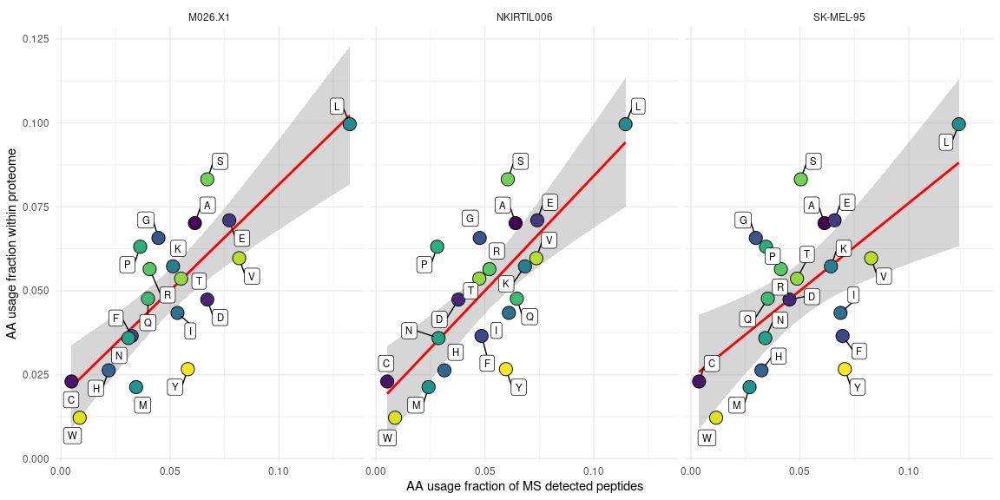

``` r
ggsave(here("Figs", "verify_AAdist_tumor_vs_proteome.pdf"), width = 8.5, height = 3, scale = 1.5)
```

Finally, calculate the Spearman correlation coefficients. We’ll find
that, although a weak correlation still exsists, it is much weaker than
the correlation with the IEDB peptides.

``` r
to.plot2 %>% 
  group_by(source) %>% 
  cor_test(fraction.MS, fraction.ref, method = "spearman") %>% 
  adjust_pvalue(method = "bonferroni")
```

    ## # A tibble: 3 × 8
    ##   source     var1        var2           cor statistic        p method      p.adj
    ##   <chr>      <chr>       <chr>        <dbl>     <dbl>    <dbl> <chr>       <dbl>
    ## 1 M026.X1    fraction.MS fraction.ref  0.75       330 0.000201 Spearman 0.000603
    ## 2 NKIRTIL006 fraction.MS fraction.ref  0.7        398 0.000817 Spearman 0.00245 
    ## 3 SK-MEL-95  fraction.MS fraction.ref  0.5        662 0.0256   Spearman 0.0768

# AA positional bias

Another facet we can look at is whether amino acids favor specific
positions within the MS peptides. To do this we’ll focus on the 9mers of
our dataset, determine the amino acid usage at each position, and
compare that to the overall amino acid usage in proteins. That will give
us some idea of the enrichment of AAs at specific positions.

First filter on 9mers, and extract the peptide sequences of each tumor
as a list.

``` r
MS.peptides %>% 
  filter(length == 9) %>% 
  group_by(source) %>%
  nest %>% 
  mutate(seqs = map(data, pull, "Sequence")) %>% 
  select(source, seqs) %>% 
  deframe() -> tumor.9mers

str(tumor.9mers)
```

    ## List of 3
    ##  $ SK-MEL-95 : chr [1:4115] "KYVKDFHKF" "KFSPRPLKF" "DALDKIRLI" "VYKKYPNVF" ...
    ##  $ M026.X1   : chr [1:4118] "ETEKRCQVY" "KTDLHNEGY" "EIDKNDHLY" "GTDGHVHLY" ...
    ##  $ NKIRTIL006: chr [1:5669] "AQHFTHQFF" "HQRRQLVHF" "RMRHLKIVY" "IQKYIKSHY" ...

Now we’ll use a nested application of purrr:map to extract the amino
acids found at each position. Basically, the first call maps over the
numeric sequence 1:9 (i.e. the peptide positions), the nested call maps
the `stringr::str_sub` function over the 9mer list using the former
numeric sequence as inputs to the start/end arguments.

This will give us a list of length 9 (the 9 positions that we gave as
input in the first call), each containing a list of the tumors, which in
turn contain the AAs at the given position.

``` r
map(1:9, ~map(tumor.9mers, str_sub, start = ., end = .)) -> positions.list

str(positions.list)
```

    ## List of 9
    ##  $ :List of 3
    ##   ..$ SK-MEL-95 : chr [1:4115] "K" "K" "D" "V" ...
    ##   ..$ M026.X1   : chr [1:4118] "E" "K" "E" "G" ...
    ##   ..$ NKIRTIL006: chr [1:5669] "A" "H" "R" "I" ...
    ##  $ :List of 3
    ##   ..$ SK-MEL-95 : chr [1:4115] "Y" "F" "A" "Y" ...
    ##   ..$ M026.X1   : chr [1:4118] "T" "T" "I" "T" ...
    ##   ..$ NKIRTIL006: chr [1:5669] "Q" "Q" "M" "Q" ...
    ##  $ :List of 3
    ##   ..$ SK-MEL-95 : chr [1:4115] "V" "S" "L" "K" ...
    ##   ..$ M026.X1   : chr [1:4118] "E" "D" "D" "D" ...
    ##   ..$ NKIRTIL006: chr [1:5669] "H" "R" "R" "K" ...
    ##  $ :List of 3
    ##   ..$ SK-MEL-95 : chr [1:4115] "K" "P" "D" "K" ...
    ##   ..$ M026.X1   : chr [1:4118] "K" "L" "K" "G" ...
    ##   ..$ NKIRTIL006: chr [1:5669] "F" "R" "H" "Y" ...
    ##  $ :List of 3
    ##   ..$ SK-MEL-95 : chr [1:4115] "D" "R" "K" "Y" ...
    ##   ..$ M026.X1   : chr [1:4118] "R" "H" "N" "H" ...
    ##   ..$ NKIRTIL006: chr [1:5669] "T" "Q" "L" "I" ...
    ##  $ :List of 3
    ##   ..$ SK-MEL-95 : chr [1:4115] "F" "P" "I" "P" ...
    ##   ..$ M026.X1   : chr [1:4118] "C" "N" "D" "V" ...
    ##   ..$ NKIRTIL006: chr [1:5669] "H" "L" "K" "K" ...
    ##  $ :List of 3
    ##   ..$ SK-MEL-95 : chr [1:4115] "H" "L" "R" "N" ...
    ##   ..$ M026.X1   : chr [1:4118] "Q" "E" "H" "H" ...
    ##   ..$ NKIRTIL006: chr [1:5669] "Q" "V" "I" "S" ...
    ##  $ :List of 3
    ##   ..$ SK-MEL-95 : chr [1:4115] "K" "K" "L" "V" ...
    ##   ..$ M026.X1   : chr [1:4118] "V" "G" "L" "L" ...
    ##   ..$ NKIRTIL006: chr [1:5669] "F" "H" "V" "H" ...
    ##  $ :List of 3
    ##   ..$ SK-MEL-95 : chr [1:4115] "F" "F" "I" "F" ...
    ##   ..$ M026.X1   : chr [1:4118] "Y" "Y" "Y" "Y" ...
    ##   ..$ NKIRTIL006: chr [1:5669] "F" "F" "Y" "Y" ...

Next we use a series of calls to `purrr::modify_depth` to get our amino
acid counts. This function is very useful to edit nested lists, like the
one we ended up with now. It will basically apply the function passed to
modify_depth at the “list depth” given. The amino acids of a given
position, of a given tumor are stored at the 2nd level, so we pass
`depth = 2`.

We’ll first flatten the character vectors to a single string (comprising
all AAs at that position), then count the amino acids, and finally set
their names.

``` r
positions.list %>% 
  modify_depth(.depth = 2, str_flatten) %>% 
  modify_depth(.depth = 2, str_count, pattern = amino.acids) %>% 
  modify_depth(.depth = 2, set_names, amino.acids) -> AA.counts.positions

str(AA.counts.positions)
```

    ## List of 9
    ##  $ :List of 3
    ##   ..$ SK-MEL-95 : Named int [1:20] 124 333 498 314 80 290 230 318 38 128 ...
    ##   .. ..- attr(*, "names")= chr [1:20] "H" "S" "K" "I" ...
    ##   ..$ M026.X1   : Named int [1:20] 128 467 578 120 185 581 61 505 12 135 ...
    ##   .. ..- attr(*, "names")= chr [1:20] "H" "S" "K" "I" ...
    ##   ..$ NKIRTIL006: Named int [1:20] 204 575 613 380 280 608 17 552 10 155 ...
    ##   .. ..- attr(*, "names")= chr [1:20] "H" "S" "K" "I" ...
    ##  $ :List of 3
    ##   ..$ SK-MEL-95 : Named int [1:20] 4 110 1 129 54 711 3 1 140 268 ...
    ##   .. ..- attr(*, "names")= chr [1:20] "H" "S" "K" "I" ...
    ##   ..$ M026.X1   : Named int [1:20] 0 293 4 274 27 197 6 139 227 116 ...
    ##   .. ..- attr(*, "names")= chr [1:20] "H" "S" "K" "I" ...
    ##   ..$ NKIRTIL006: Named int [1:20] 2 159 1 405 56 406 12 1 1 627 ...
    ##   .. ..- attr(*, "names")= chr [1:20] "H" "S" "K" "I" ...
    ##  $ :List of 3
    ##   ..$ SK-MEL-95 : Named int [1:20] 98 309 134 310 106 361 300 78 165 63 ...
    ##   .. ..- attr(*, "names")= chr [1:20] "H" "S" "K" "I" ...
    ##   ..$ M026.X1   : Named int [1:20] 101 244 155 225 78 349 928 129 69 272 ...
    ##   .. ..- attr(*, "names")= chr [1:20] "H" "S" "K" "I" ...
    ##   ..$ NKIRTIL006: Named int [1:20] 228 299 549 567 119 497 407 349 88 125 ...
    ##   .. ..- attr(*, "names")= chr [1:20] "H" "S" "K" "I" ...
    ##  $ :List of 3
    ##   ..$ SK-MEL-95 : Named int [1:20] 108 349 281 106 271 180 647 115 362 742 ...
    ##   .. ..- attr(*, "names")= chr [1:20] "H" "S" "K" "I" ...
    ##   ..$ M026.X1   : Named int [1:20] 80 323 236 89 272 175 688 117 363 888 ...
    ##   .. ..- attr(*, "names")= chr [1:20] "H" "S" "K" "I" ...
    ##   ..$ NKIRTIL006: Named int [1:20] 124 343 431 159 499 262 844 190 569 955 ...
    ##   .. ..- attr(*, "names")= chr [1:20] "H" "S" "K" "I" ...
    ##  $ :List of 3
    ##   ..$ SK-MEL-95 : Named int [1:20] 227 189 381 347 194 173 162 197 59 222 ...
    ##   .. ..- attr(*, "names")= chr [1:20] "H" "S" "K" "I" ...
    ##   ..$ M026.X1   : Named int [1:20] 150 241 486 240 241 193 219 277 121 350 ...
    ##   .. ..- attr(*, "names")= chr [1:20] "H" "S" "K" "I" ...
    ##   ..$ NKIRTIL006: Named int [1:20] 275 344 444 431 444 278 244 284 256 429 ...
    ##   .. ..- attr(*, "names")= chr [1:20] "H" "S" "K" "I" ...
    ##  $ :List of 3
    ##   ..$ SK-MEL-95 : Named int [1:20] 127 163 141 573 76 187 49 98 227 128 ...
    ##   .. ..- attr(*, "names")= chr [1:20] "H" "S" "K" "I" ...
    ##   ..$ M026.X1   : Named int [1:20] 61 186 112 605 139 171 93 118 188 152 ...
    ##   .. ..- attr(*, "names")= chr [1:20] "H" "S" "K" "I" ...
    ##   ..$ NKIRTIL006: Named int [1:20] 170 324 290 709 322 287 129 228 175 298 ...
    ##   .. ..- attr(*, "names")= chr [1:20] "H" "S" "K" "I" ...
    ##  $ :List of 3
    ##   ..$ SK-MEL-95 : Named int [1:20] 404 144 391 215 15 188 89 390 139 285 ...
    ##   .. ..- attr(*, "names")= chr [1:20] "H" "S" "K" "I" ...
    ##   ..$ M026.X1   : Named int [1:20] 262 195 154 319 27 174 114 159 159 318 ...
    ##   .. ..- attr(*, "names")= chr [1:20] "H" "S" "K" "I" ...
    ##   ..$ NKIRTIL006: Named int [1:20] 440 335 438 428 50 296 68 401 135 443 ...
    ##   .. ..- attr(*, "names")= chr [1:20] "H" "S" "K" "I" ...
    ##  $ :List of 3
    ##   ..$ SK-MEL-95 : Named int [1:20] 173 294 481 75 93 205 55 359 7 482 ...
    ##   .. ..- attr(*, "names")= chr [1:20] "H" "S" "K" "I" ...
    ##   ..$ M026.X1   : Named int [1:20] 99 378 308 57 228 274 88 202 27 667 ...
    ##   .. ..- attr(*, "names")= chr [1:20] "H" "S" "K" "I" ...
    ##   ..$ NKIRTIL006: Named int [1:20] 210 643 579 79 246 492 69 443 27 547 ...
    ##   .. ..- attr(*, "names")= chr [1:20] "H" "S" "K" "I" ...
    ##  $ :List of 3
    ##   ..$ SK-MEL-95 : Named int [1:20] 6 1 3 527 0 53 1 1 2 0 ...
    ##   .. ..- attr(*, "names")= chr [1:20] "H" "S" "K" "I" ...
    ##   ..$ M026.X1   : Named int [1:20] 5 2 4 275 0 110 0 0 2 0 ...
    ##   .. ..- attr(*, "names")= chr [1:20] "H" "S" "K" "I" ...
    ##   ..$ NKIRTIL006: Named int [1:20] 18 3 3 229 0 114 1 0 1 1 ...
    ##   .. ..- attr(*, "names")= chr [1:20] "H" "S" "K" "I" ...

Now we have a list of 9 (1 for each position), containing lists of 3
(tumors), containing counts for each AA. To convert this messy nested
list to a tidy tibble, we can call the `enframe` function to each level
of the list.

``` r
AA.counts.positions %>% 
  modify_depth(.depth = 2, enframe, "AA", "count") %>% 
  modify_depth(.depth = 1, enframe, "tumor", "count.table") %>% 
  enframe("position", "data") -> AA.counts.positions.table

AA.counts.positions.table
```

    ## # A tibble: 9 × 2
    ##   position data            
    ##      <int> <list>          
    ## 1        1 <tibble [3 × 2]>
    ## 2        2 <tibble [3 × 2]>
    ## 3        3 <tibble [3 × 2]>
    ## 4        4 <tibble [3 × 2]>
    ## 5        5 <tibble [3 × 2]>
    ## 6        6 <tibble [3 × 2]>
    ## 7        7 <tibble [3 × 2]>
    ## 8        8 <tibble [3 × 2]>
    ## 9        9 <tibble [3 × 2]>

Now we’ve got nested tibbles, lets unfold all those data into a table
and we’ve got our data in a useful format!

``` r
AA.counts.positions.table %>% 
  unnest(cols = data) %>% 
  unnest(cols = count.table) %>% 
  mutate(count = count + 1) -> AA.counts.positions.table

AA.counts.positions.table
```

    ## # A tibble: 540 × 4
    ##    position tumor     AA    count
    ##       <int> <chr>     <chr> <dbl>
    ##  1        1 SK-MEL-95 H       125
    ##  2        1 SK-MEL-95 S       334
    ##  3        1 SK-MEL-95 K       499
    ##  4        1 SK-MEL-95 I       315
    ##  5        1 SK-MEL-95 G        81
    ##  6        1 SK-MEL-95 A       291
    ##  7        1 SK-MEL-95 D       231
    ##  8        1 SK-MEL-95 R       319
    ##  9        1 SK-MEL-95 P        39
    ## 10        1 SK-MEL-95 E       129
    ## # … with 530 more rows

Now we can join this tibble with the AA.counts.ref that contains the
reference counts for each tumor. Next, group by tumor and position and
calculate the position frequencies. Some amino acids do not occur at
specific positions, so calculating the log2 enrichment will result in a
`-Inf`. Convert these to NA’s using `dplyr::na_if`.

``` r
AA.counts.positions.table %>% 
  left_join(AA.counts.ref, by = c("tumor" = "source", "AA" = "AA")) %>% 
  group_by(tumor, position) %>% 
  mutate(fraction.MS = count/sum(count),
         fraction.ref = count.ref/sum(count.ref),
         position.bias = log2(fraction.MS/fraction.ref)) %>% 
  ungroup() -> position.frequencies

write_tsv(position.frequencies, here("Output", "position_frequencies.tsv"))

position.frequencies
```

    ## # A tibble: 540 × 8
    ##    position tumor     AA    count count.ref fraction.MS fraction.ref position.bias
    ##       <int> <chr>     <chr> <dbl>     <int>       <dbl>        <dbl>         <dbl>
    ##  1        1 SK-MEL-95 H       125    297990     0.0302        0.0263       0.201  
    ##  2        1 SK-MEL-95 S       334    942679     0.0808        0.0832      -0.0425 
    ##  3        1 SK-MEL-95 K       499    648893     0.121         0.0573       1.08   
    ##  4        1 SK-MEL-95 I       315    491781     0.0762        0.0434       0.812  
    ##  5        1 SK-MEL-95 G        81    744722     0.0196        0.0657      -1.75   
    ##  6        1 SK-MEL-95 A       291    794836     0.0704        0.0701       0.00479
    ##  7        1 SK-MEL-95 D       231    536828     0.0559        0.0474       0.238  
    ##  8        1 SK-MEL-95 R       319    639604     0.0771        0.0564       0.451  
    ##  9        1 SK-MEL-95 P        39    715177     0.00943       0.0631      -2.74   
    ## 10        1 SK-MEL-95 E       129    804352     0.0312        0.0710      -1.19   
    ## # … with 530 more rows

Now we’ve got all the data we need to start plotting the positional bias
amino acids. We’ll visualize as a heatmap using the
**[pheatmap](https://www.rdocumentation.org/packages/pheatmap/versions/1.0.12/topics/pheatmap)**
package. The pheatmap function takes a matrix as input, so we’ll have to
re-format a bit. I’ll convert to a list of matrices, which will allow us
to plot the heatmaps in a for loop.

To get the desired result, first save the order of the tumor names, so
we can use that to refer to our tables.

Then, split the tibble into 3 tibbles (1 for each tumor), and add names,
so we end up with a named list of tibbles. Then map the select function
to pick out the position, AA and enrichment columns. Then map
pivot_wider to set positions as columns, and finally set the AA column
to the rownames so we can convert to matrix.

``` r
tumor.names <- unique(position.frequencies$tumor)

position.frequencies %>% 
  group_split(tumor) %>% 
  set_names(tumor.names) %>% 
  map(select, c(position, AA, position.bias)) %>% 
  map(pivot_wider, names_from = position, values_from = position.bias) %>% 
  map(column_to_rownames, "AA") %>% 
  map(as.matrix) -> position.frequencies.matrices

position.frequencies.matrices
```

    ## $`SK-MEL-95`
    ##             1          2           3             4           5           6
    ## H  0.24542587 -6.7658014 -0.09337604 -0.4259513796  0.47260336 -0.81160507
    ## S  0.44317760 -0.2275148 -0.49054919 -0.0873371213 -0.50832389 -0.88029266
    ## K  1.28900684 -5.5664846 -0.60301048  0.0003305469  1.03936526 -1.06823374
    ## I -0.56966048  0.6147641  0.33165524 -0.9966706254  0.42436561  1.75465026
    ## G -0.54806477 -3.2798687 -1.78344284  0.0055335564 -0.16836035 -0.95794057
    ## A  1.00371431 -0.5518044  0.27005008 -0.7217294109 -0.58124819 -0.75489627
    ## D -1.66079816 -4.8076396  2.24454031  1.8133656973  0.16636524 -1.06040562
    ## R  1.11535156 -0.7383590 -0.84527420 -0.9849989675  0.25129906 -0.97282425
    ## P -4.32832097 -0.1958707 -1.89947767  0.4790339493 -1.09802335 -0.46651827
    ## E -1.11081948 -1.3279176 -0.10552518  1.5977572842  0.25704490 -0.94089448
    ## V -0.39387482  0.2512087 -1.02960043 -1.3938748197  0.25610747  1.28275751
    ## Q -0.66918339 -0.6010119 -0.23967540 -0.1971149415  0.10454076 -0.09199824
    ## T -0.07217580  0.8103514 -1.03838749 -0.6334036519 -0.03172376  0.40148187
    ## Y  1.20388624 -3.6148734  0.15771605 -0.8779078548  0.66641266 -0.37540751
    ## L -1.19527326  1.9285033 -0.07979604 -1.4391988404 -0.93893350  0.53446077
    ## F -0.05971689 -5.2396260  0.04577624 -1.2854296694  0.26021991  0.19500225
    ## N -0.12748093 -3.5145041  0.02346096  0.0518427647  0.44326771  0.37001872
    ## W -1.65580379 -5.6558038  0.77046097 -1.4078762748 -0.65580379 -1.13224183
    ## M  0.07719124  2.2453916  1.45689567 -1.4619675669 -0.37450473  0.45689567
    ## C -3.40033948 -2.4003395 -1.48280164 -3.4003394813 -2.86982476 -1.52587036
    ##             7           8          9
    ## H  1.27311761 -0.12194519 -4.1808389
    ## S -0.81247728  0.13886691 -6.8422246
    ## K -0.61228830  0.38305033 -5.5664846
    ## I  0.83340437 -1.63054273  0.6200007
    ## G -3.27986866 -0.24801980 -8.0872236
    ## A -0.72994992 -0.07787322 -1.3867452
    ## D -0.76950442 -1.13926104 -7.6149945
    ## R -0.54571392 -0.20230610 -7.8676420
    ## P -0.70683260 -3.22140577 -6.4437982
    ## E  0.11913029  1.18542197 -8.1982823
    ## V  0.78624595 -0.14110875  2.2658554
    ## Q  0.47990811  0.69854840 -6.6233797
    ## T  0.31524947  0.62035294 -4.0928353
    ## Y  1.02255647  0.65814505  2.9414197
    ## L  0.08766071 -0.44395237  1.7391384
    ## F  0.54173373 -0.26234606 -0.1206849
    ## N -0.05507244  0.29285086 -6.2149438
    ## W  0.64797696 -2.48587879 -0.7489132
    ## M  0.73770478  0.23847215  0.2794994
    ## C -2.32233697 -2.48280164 -1.8698248
    ## 
    ## $M026.X1
    ##            1           2          3          4           5            6
    ## H  0.4544577 -5.64005988  0.6141814 -0.2592381  0.88350207  0.192830129
    ## S  0.2834267 -1.56457017 -0.6576796 -0.4602335 -0.45604571 -0.542202352
    ## K  0.9144572 -7.34763766  0.7556502  0.4072498  0.45002387 -0.162762315
    ## I  0.6255753  0.71726401  1.2016752 -0.6261438  0.80681560  1.523603311
    ## G -0.4119124 -2.71344869 -1.6394481  0.4194456  0.25132282 -0.210948348
    ## A  0.6099845  0.02857107  0.3196880 -0.6013949 -0.51619260 -0.470388908
    ## D -3.9042310 -4.37371629  0.5982693  1.6486515 -0.13751807 -1.051788193
    ## R  0.7844191 -7.32671657  0.1244945 -0.7492877 -0.17189846 -0.487512779
    ## P -5.0286332 -7.48806486 -2.0123314  0.6667533 -0.48244031 -1.028633238
    ## E -1.3719540  0.63726458 -1.6800763  1.2435106  0.09083668 -0.433354500
    ## V  0.2612381  0.33718694 -0.3361845 -1.0239426  0.20337790  0.988957888
    ## Q -0.6645721  2.03131758 -0.0937399 -0.1876068 -0.08807115  0.010332552
    ## T  0.1222608 -1.44542372 -0.8864564 -0.6678161  0.07365084  0.387466292
    ## Y  1.2110824 -6.24424486  0.8164511 -1.3135075  0.03187955 -0.462885143
    ## L -0.8889414  1.82880218 -0.3357576 -1.1921330 -0.21559194  0.237375013
    ## F  1.0986743 -3.89163233  0.7767462 -1.4322007  0.28969743  0.272556301
    ## N -0.7915174 -4.86680556  0.3973019  0.1137421  0.15238801 -0.001735139
    ## W -1.3602343 -4.53015929  0.6127987 -1.0276590 -0.30776687 -2.115121791
    ## M -0.2070013  1.25866231  1.1231473 -1.0143562 -0.51185584 -0.179779793
    ## C -2.5063772 -2.07574285 -1.3294994 -4.7080111 -2.86001416 -1.538086069
    ##            7           8          9
    ## H  1.5596125  0.49607680 -2.9770949
    ## S -0.4941808  0.44441862 -6.8864983
    ## K  0.4304395  0.83227143 -6.3476377
    ## I  0.7967619 -1.62614381 -0.1025819
    ## G -2.8739134 -0.59797147 -8.5463387
    ## A -0.4259948  0.30512993 -1.7948239
    ## D -1.9656315 -1.94487299 -7.0741560
    ## R  0.3243351  0.46769930 -8.3267166
    ## P -1.4006020 -3.68070993 -7.4880649
    ## E  0.1370597  0.44067591 -7.6573562
    ## V  0.8259728  0.26477845  1.1373175
    ## Q  0.7409427  0.89485533 -6.4974621
    ## T  0.4407083  0.79978941 -4.9308505
    ## Y  0.1220774  0.03187955  3.4228667
    ## L -0.3229620 -0.99658216  1.5584390
    ## F -0.2643590 -0.47981873  2.1354838
    ## N -0.2647695 -0.09673165 -6.0891980
    ## W -0.1378419 -3.79319370  0.8506625
    ## M  0.1121762 -0.51185584  0.5463588
    ## C -2.6376217 -2.02993917 -1.8600142
    ## 
    ## $NKIRTIL006
    ##              1          2          3            4          5           6
    ## H  0.201090899 -4.4427653 -0.1353368  0.003490939  1.0681966  0.23530661
    ## S -0.042491765 -1.6317802 -0.1500717  0.025015054 -0.8563404 -1.06864405
    ## K  1.075485934 -6.8874101 -0.8105945  0.252141281  0.6900188 -0.73766295
    ## I  0.811762553 -0.4650777  0.7933253 -0.745978479  0.9554980  1.67746146
    ## G -1.746281442 -2.3047717 -1.3446645  0.001331396 -0.4788011 -1.81934490
    ## A  0.004788658  1.2956467  0.3197592 -0.680240798 -0.7371432 -0.62549783
    ## D  0.237859651 -5.6138894  0.6197303  1.725960613 -0.2651612 -1.97003320
    ## R  0.450804184 -6.8666084 -1.5628277 -1.008627434 -0.2372518 -1.23725181
    ## P -2.742327590 -0.8881785 -0.6526904  0.476095930 -2.1208392 -0.19483979
    ## E -1.186029203 -0.1257941 -2.1972565  1.339961942 -0.3963566 -1.18602920
    ## V  0.696396501 -1.3036035 -0.4238977 -1.233214171  0.6709258  1.26199368
    ## Q -1.067687810 -1.6680804 -0.1960119 -0.577882542 -0.1384609 -0.58885366
    ## T  0.224587031 -1.6836968  0.6794540 -0.452371253 -0.3003682  0.07196489
    ## Y  1.276904234  3.5814372  0.7319081 -1.002431984  1.0741893 -0.16908185
    ## L -0.971772847  1.0738698  0.3746776 -1.243074868 -0.1861725  0.58076818
    ## F  0.800294416 -0.7467715  0.6501187 -1.431269652  0.8958017  1.32361785
    ## N  0.261775058 -3.7545268  0.2778947  0.520751248  0.2454732 -0.25976206
    ## W -1.954306039 -0.7967648  0.6671823 -0.796764762  0.6306565 -0.04003591
    ## M -0.068645292  0.6158529  1.4094020 -1.460962715 -0.1941762  0.42168033
    ## C -4.569288827 -2.1098572 -1.1769714 -3.984326326 -2.5692888 -2.48182599
    ##             7            8          9
    ## H  1.89708471  0.678250111 -3.9573385
    ## S -1.24628697 -0.221624913 -7.4261961
    ## K  0.72729977  1.025479265 -5.8874101
    ## I  0.26744204 -1.239517952  1.5569487
    ## G -4.08613145 -1.531542594 -8.0861314
    ## A -0.61784426 -0.493586158 -2.4251992
    ## D -1.12203629 -1.806534468 -6.6138894
    ## R  0.74441637  0.625244667 -6.8666084
    ## P -0.89844679 -5.027729808 -6.4427673
    ## E -0.03738512  0.718622920 -8.1972565
    ## V  0.42757974 -0.046592881  1.7529800
    ## Q  0.26036639  0.649186367 -6.6222767
    ## T -0.14116957  0.770021168 -5.2072588
    ## Y  0.92356743  0.582530517  1.3089654
    ## L -0.55673535 -0.170318526  1.6415343
    ## F  0.42671134 -0.140592491  2.5879239
    ## N  0.75182591  0.317423088 -6.2139584
    ## W  0.34525424 -1.654745757  0.7028062
    ## M -0.17556050 -0.001531096  0.5943197
    ## C -2.98432633 -2.399363825 -3.5692888

This gives a list of matrices in which each the columns correspond to
peptide position (1-9), the rows correspond to the 20 amino acids, and
the values are log2 transformed folds of AA occurrence at each position
relative to their expected occurrence in a random scenario.

Simply for loop over de list and make the heatmaps. Will only cluster
the AAs. NAs will be colored in grey. As you can see in the matrices
above, there’s a couple of values that are very low, which will make the
scaling in the heatmap a bit funky. As we’re mainly interested in
relative enrichment/depletion of AA’s at different positions, I’ll
manually set the color-scale to values between -4 and 2 using the breaks
argument. To set the colors properly so that the mid-point is around 0,
I create a color vector by picking colors from the two halves `"RdYbu"`
color-scale, re-positioning as necessary.

``` r
library(gridExtra)
cols <- c( colorRampPalette(rev(brewer.pal(n = 7, name = "RdYlBu"))[1:4])(66),
           colorRampPalette(rev(brewer.pal(n = 7, name = "RdYlBu"))[4:7])(34))

plot.list <- list()
for(tumor in tumor.names){

 plot.list[[tumor]] <- pheatmap(position.frequencies.matrices[[tumor]],  
                                cluster_rows = T, cluster_cols = F,
                                clustering_method = "complete",  
                                color = cols,  breaks = seq(-4,2,by=0.06), 
                                main = tumor, silent = T)[[4]]
  
}

maps <- do.call(grid.arrange, plot.list)
```

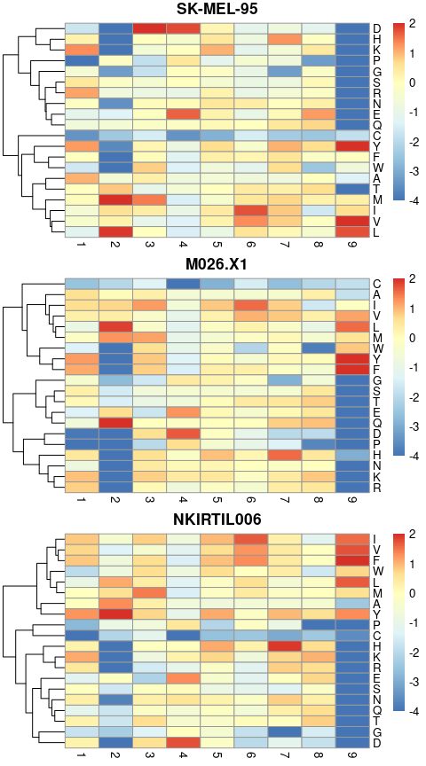

``` r
ggsave(here("Figs", "verify_AA_position_frequency.pdf"), plot = maps,  width = 6, height = 10)
```

One way to summarise this information is to plot the average amount of
positional bias at each position, for each tumor. Below I do this by
calculating, at each position, the median absolute positional.bias
(which was a log2 metric). This would roughly mean that at positions
where this value is \>1, the median enrichment/depletion of amino acids
was more than 2-fold.

``` r
position.frequencies %>% 
  group_by(tumor, position) %>% 
  summarise(bias = median(abs(position.bias), na.rm=TRUE) ) %>% 
  ggplot(aes(x = position, y = bias, fill = tumor))+
  geom_bar(stat = "identity", position = "dodge",  col = "black")+
  scale_x_continuous(breaks = pretty_breaks(n = 9))+
  geom_hline(yintercept = 1, linetype = "dashed")+
  theme_classic()
```

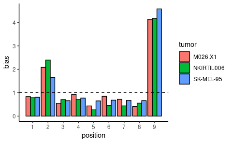

``` r
ggsave(here("Figs", "verify_positional_bias.pdf"), width = 3, height = 1.5, scale = 1.5)

position.frequencies %>% 
  group_by(tumor, position) %>% 
  summarise(bias = median(abs(position.bias), na.rm=TRUE) ) %>% 
  write_tsv(here("Output", "positional_bias.tsv"))
```

# Sequence logo’s

We’ll compare the peptide sequence motifs that we’ve found using the
GibbsCluster algorithm to the sequence motifs of known ligands of each
allele expressed by the melanoma lines.

To make the reference, we’ll use all Human HLA class I ligands in IEDB.

``` r
IEDB.class.I <- read_tsv(here("Data", "human_class_I_ligands_IEDB.tsv"))

IEDB.class.I
```

    ## # A tibble: 1,061,140 × 15
    ##    `Object Type`  Description `Starting Posit… `Ending Positio… `Parent Protein`
    ##    <chr>          <chr>                  <dbl>            <dbl> <chr>           
    ##  1 Linear peptide LIYDSSLCDL                83               92 Mammaglobin-A   
    ##  2 Linear peptide LLDVTAAV                  NA               NA <NA>            
    ##  3 Linear peptide LLSAEPVPA                 20               28 B-cell antigen …
    ##  4 Linear peptide IMLEALERV                 68               76 Small nuclear r…
    ##  5 Linear peptide SIIGRLLEV                 11               19 Serine/threonin…
    ##  6 Linear peptide ILDQKINEV                 23               31 Ornithine decar…
    ##  7 Linear peptide RLAVYIDRV                 41               49 Prelamin-A/C    
    ##  8 Linear peptide ILMEHIHKL                137              145 60S ribosomal p…
    ##  9 Linear peptide SLAGGIIGV                154              162 Heterogeneous n…
    ## 10 Linear peptide GLYSGVTTV                 46               54 Ribonucleoside-…
    ## # … with 1,061,130 more rows, and 10 more variables: Parent Protein IRI <chr>,
    ## #   Organism Name <chr>, Parent Species <chr>, Name <chr>,
    ## #   Method/Technique <chr>, Assay Group <chr>, Qualitative Measure <chr>,
    ## #   Quantitative measurement <dbl>, Allele Name <chr>, MHC allele class <chr>

Store the expressed alleles of each line in variables

``` r
MEL.list <- list(
  c("HLA-A*02:01","HLA-A*01:01", "HLA-B*08:01","HLA-B44","HLA-C*05:01","HLA-C*07:01"),
  c("HLA-A*02:01","HLA-A24", "HLA-B*18:01","HLA-B*51:01","HLA-C*05:01","HLA-C*16:01"),
  c("HLA-A*02:01", "HLA-B*15:01","HLA-B44","HLA-C*05:01","HLA-C*03:04")
)
```

Define a function that extracts the peptide sequences needed for the
logo for a given HLA allele. And a function that maps this function over
the HLA alleles of a given melanoma line and generates the sequence logo
plots.

``` r
get_peptides <- function(al){
  IEDB.class.I %>% 
    filter(`Allele Name` == al) %>% 
    filter(nchar(`Description`) == 9) %>% 
    filter(`Qualitative Measure` == "Positive") %>% 
    pull(Description)
}

make_logos <- function(tum, main.title){
tum %>% 
  map(get_peptides) %>% 
  set_names(tum) %>% 
  ggseqlogo()+
    ggtitle(main.title)
}
```

Then map this latter function over the three melanoma lines and plot.

``` r
Mels <- c("SK-MEL-95", "M026.X1", "NKIRTIL006")

logos <- map2(MEL.list, Mels, make_logos)

ggarrange(plotlist = logos, ncol = 1, common.legend = T, legend = "bottom" )
```

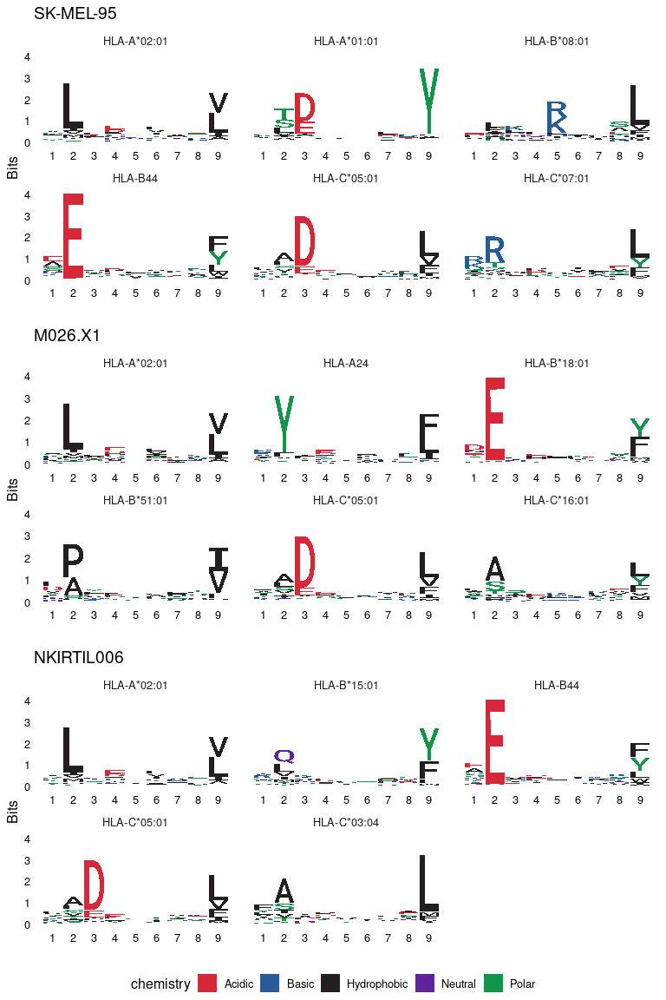

``` r
ggsave(here("Figs", "Logos_HLA_alleles.pdf"), width = 6, height = 12)
```

Now make the logo’s for the peptide cluster identified by GibbsCluster.
The peptides that make up each cluster are stored in single files per
cluster. Bit below imports each in a list format.

``` r
map(here("Data", "gibbs_clusters", c("MEL1", "MEL2", "MEL3")), list.files) %>% 
  set_names(Mels) %>%
  map2(c("MEL1", "MEL2", "MEL3"), ~paste0("../Data/gibbs_clusters/", .y,"/", .x)) %>% 
  map(~map(., read_lines)) -> peptide.cores
  
str(peptide.cores)
```

    ## List of 3
    ##  $ SK-MEL-95 :List of 6
    ##   ..$ : chr [1:1011] "KLTGILQEV" "FTWEGLYNV" "AVAQQVQQV" "KLLGNIKNV" ...
    ##   ..$ : chr [1:434] "AADEKSVSI" "ILDDSPKEI" "SMPEQAHKV" "ILDQTNVSA" ...
    ##   ..$ : chr [1:237] "GEVEQQRTY" "SEMRFVQDL" "KRWESERVL" "TELPKAEKW" ...
    ##   ..$ : chr [1:769] "KVAELVHFL" "MLYEGFYDV" "HLLEEPIYL" "YLYNEGLSV" ...
    ##   ..$ : chr [1:435] "MAAQRQRAL" "APRALLLLL" "APRPAGSYL" "ETKLRKEEL" ...
    ##   ..$ : chr [1:706] "YTDENQHQY" "KMDLDNNFY" "FSEQVAMGY" "MADKNIQYY" ...
    ##  $ M026.X1   :List of 6
    ##   ..$ : chr [1:777] "KVTGHLKLY" "NQTEFERVF" "FAMPYFIQV" "YATEAVYES" ...
    ##   ..$ : chr [1:1006] "FLNKEITSV" "ALADGVQKV" "HLYDYTVKL" "TLCDLYETL" ...
    ##   ..$ : chr [1:249] "DEAHLASVY" "EEYEARENF" "HEGEILQAF" "WENSFVSVY" ...
    ##   ..$ : chr [1:561] "NYFLDPVTI" "YYSPHGHIL" "VYGSFASKL" "TYKVISNEF" ...
    ##   ..$ : chr [1:239] "VPNNKITVV" "HPDSHQLFI" "DAYKGLFEV" "DAYELKHAL" ...
    ##   ..$ : chr [1:764] "FYVDTVRAF" "IYLPYLQNW" "LYNDRMFRI" "IYIKQIKTF" ...
    ##  $ NKIRTIL006:List of 5
    ##   ..$ : chr [1:586] "QEQEIEHHL" "DENSVIKSF" "NESSVLHTL" "SESALEKKL" ...
    ##   ..$ : chr [1:1024] "SQADIKKAY" "VQAPRLAAL" "RQREMEEQM" "AQKGLQVDL" ...
    ##   ..$ : chr [1:611] "CVSPHNHTV" "NSDPNLHLL" "FAEDGARTV" "TAIERSQTL" ...
    ##   ..$ : chr [1:1705] "CLYGNVEKV" "YLPEDFIRV" "LLYDAEIHL" "SLLRHLEKV" ...
    ##   ..$ : chr [1:1125] "AVFNHTEDY" "AIKAFIAVY" "VVKEPETRY" "ALRRTMEKY" ...

Define a function that plots the logos and map it over the tumor lines.

``` r
make_logos <- function(tum, main.title){
tum %>% 
  ggseqlogo()+
    ggtitle(main.title)
}

logos <- map2(peptide.cores, c("SK-MEL-95", "M026.X1", "NKIRTIL006"), make_logos)

ggarrange(plotlist = logos, ncol = 1, common.legend = T, legend = "bottom" )
```

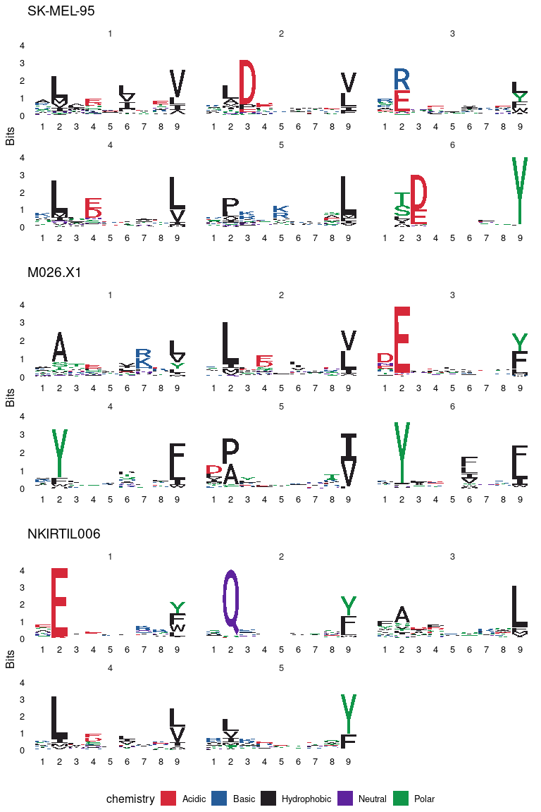

``` r
ggsave(here("Figs", "Logos_gibbs_cores.pdf"), width = 6, height = 12)
```

# affinity and chop in train data

To look at peptide level features, I’ll use the train dataset that we
used for the randomforest models. This table contains a partition of the
detected MS peptides, plus large amount (4-fold more than the detected
peptides) of decoy peptides.

Lets load in the data

``` r
columns.to.keep <- c("ligand", "affMIN", "chop", "rna", "ribo","tumor")

read_tsv(here("Data", "rf_train_peptides.tsv")) %>% 
  select(one_of(columns.to.keep)) -> peptide.table
  
peptide.table
```

    ## # A tibble: 84,117 × 6
    ##    ligand affMIN   chop     rna   ribo tumor    
    ##    <lgl>   <dbl>  <dbl>   <dbl>  <dbl> <chr>    
    ##  1 FALSE    12   0.0434   0.195    56  SK-MEL-95
    ##  2 FALSE    24   0.417   23.8     511. SK-MEL-95
    ##  3 FALSE    85   0.0241   2.49    438  SK-MEL-95
    ##  4 FALSE    41   0.0255  14.6     473. SK-MEL-95
    ##  5 FALSE     2.5 0.133   14.2     272. SK-MEL-95
    ##  6 FALSE    39   0.0323 120.    21009. SK-MEL-95
    ##  7 FALSE    43   0.0342 100.     2647. SK-MEL-95
    ##  8 FALSE     2.5 0.0926  91.8    2047. SK-MEL-95
    ##  9 FALSE    33   0.0235  15.8     326  SK-MEL-95
    ## 10 FALSE    38   0.0330  12.8     328. SK-MEL-95
    ## # … with 84,107 more rows

According to NetMHCpan peptides can be subdivided in different binding
classes. Those above 0.5 percentile rank are generally called “strong
binders”, those above 2.0 percentile rank are generally called “weak
binders”. Lets plot the distribution of these classes

``` r
peptide.table %>% 
  mutate(bind.strength = case_when(affMIN <= 0.5 ~ "SB",
                                   affMIN <= 2 ~ "WB",
                                   affMIN > 2 ~ ">2%"),
         bind.strength = factor(bind.strength, levels = c("SB", "WB", ">2%"))) %>% 
  ggplot(aes(x = ligand, fill = bind.strength))+
    geom_bar(position = "fill", color = "black")+
    scale_fill_manual(values = c("tomato4", "tomato1", "steelblue1"))+
    facet_wrap(~tumor)+
    theme_classic()
```

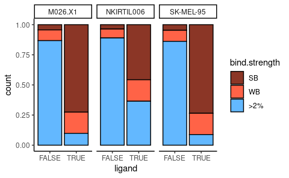

``` r
ggsave(here("Figs", "peptide_binding_classes.pdf"), width = 5, height = 2.5)
```

And calculate the frequencies at which these classes occur.

``` r
peptide.table %>% 
  mutate(bind.strength = case_when(affMIN <= 0.5 ~ "SB",
                                   affMIN <= 2 ~ "WB",
                                   affMIN > 2 ~ ">2%")) %>% 
  dplyr::count(bind.strength, ligand, tumor) %>% 
  group_by(ligand, tumor) %>% 
  mutate(freq = n / sum(n)) %>% 
  group_by(tumor) %>% 
  arrange(ligand) %>% 
  group_split()
```

    ## <list_of<
    ##   tbl_df<
    ##     bind.strength: character
    ##     ligand       : logical
    ##     tumor        : character
    ##     n            : integer
    ##     freq         : double
    ##   >
    ## >[3]>
    ## [[1]]
    ## # A tibble: 6 × 5
    ##   bind.strength ligand tumor       n   freq
    ##   <chr>         <lgl>  <chr>   <int>  <dbl>
    ## 1 >2%           FALSE  M026.X1 22115 0.868 
    ## 2 SB            FALSE  M026.X1  1106 0.0434
    ## 3 WB            FALSE  M026.X1  2269 0.0890
    ## 4 >2%           TRUE   M026.X1   251 0.0985
    ## 5 SB            TRUE   M026.X1  1850 0.726 
    ## 6 WB            TRUE   M026.X1   448 0.176 
    ## 
    ## [[2]]
    ## # A tibble: 6 × 5
    ##   bind.strength ligand tumor          n   freq
    ##   <chr>         <lgl>  <chr>      <int>  <dbl>
    ## 1 >2%           FALSE  NKIRTIL006 22680 0.890 
    ## 2 SB            FALSE  NKIRTIL006   930 0.0365
    ## 3 WB            FALSE  NKIRTIL006  1880 0.0738
    ## 4 >2%           TRUE   NKIRTIL006   930 0.365 
    ## 5 SB            TRUE   NKIRTIL006  1165 0.457 
    ## 6 WB            TRUE   NKIRTIL006   454 0.178 
    ## 
    ## [[3]]
    ## # A tibble: 6 × 5
    ##   bind.strength ligand tumor         n   freq
    ##   <chr>         <lgl>  <chr>     <int>  <dbl>
    ## 1 >2%           FALSE  SK-MEL-95 21967 0.862 
    ## 2 SB            FALSE  SK-MEL-95  1197 0.0470
    ## 3 WB            FALSE  SK-MEL-95  2326 0.0913
    ## 4 >2%           TRUE   SK-MEL-95   225 0.0883
    ## 5 SB            TRUE   SK-MEL-95  1874 0.735 
    ## 6 WB            TRUE   SK-MEL-95   450 0.177

And finally some density plots of the affinities of real and decoy
peptides.

``` r
peptide.table %>% 
  ggplot(aes(x = affMIN, fill = ligand))+
    geom_density(outline.type = "full", alpha = 0.75, )+
    scale_x_log10()+
    facet_wrap(~tumor)+
    theme_classic()+
    theme(panel.grid.major.y = element_line())
```

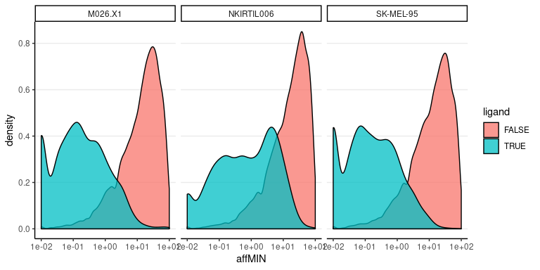

``` r
ggsave(here("Figs", "affinity_density.pdf"), width = 5, height = 3)
```
