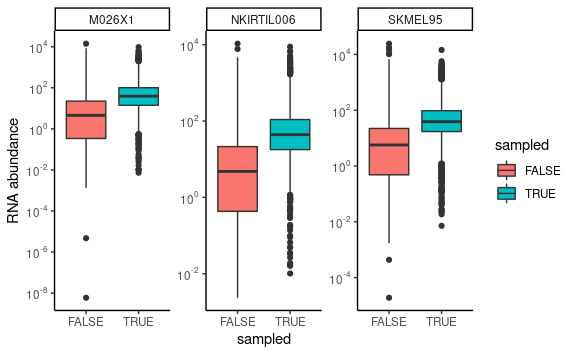
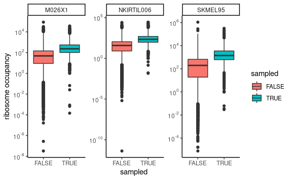
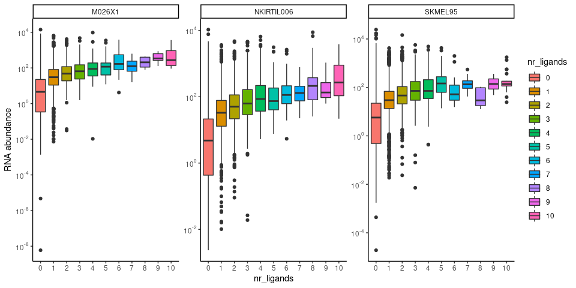
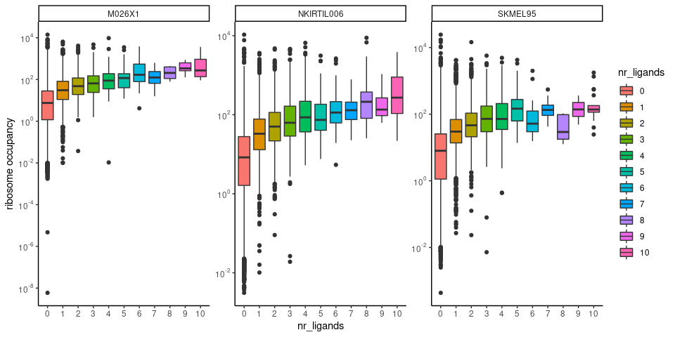
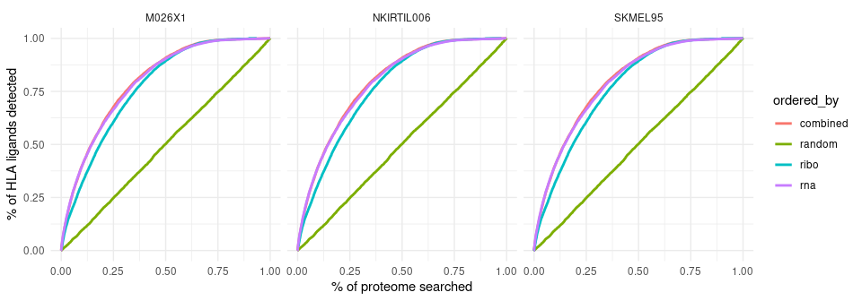
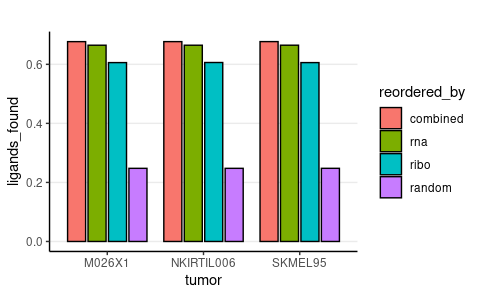
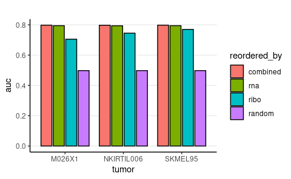
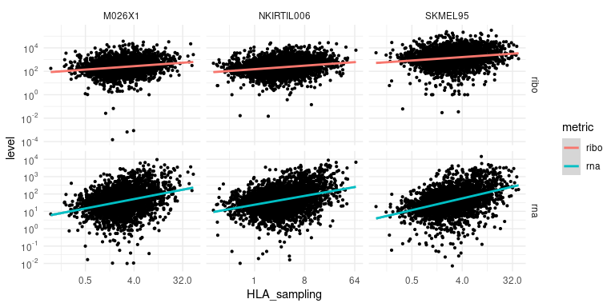

Protein level analysis of HLA ligand sampling
================
Kaspar Bresser
29/07/2021

-   [Import and tidy data](#import-and-tidy-data)
-   [Sampled vs non-sampled](#sampled-vs-non-sampled)
-   [Ligand yield vs expression](#ligand-yield-vs-expression)
-   [Cumulative plots](#cumulative-plots)
-   [Expression vs HLA sampling](#expression-vs-hla-sampling)

Below follows some analysis performed to investigate the relationship
between protein sampling and transcription level and ribosome occupancy.

Let load in the packages required for the analysis.

``` r
library(here)
library(tidyverse)
library(rstatix)
library(scales)
```

# Import and tidy data

Start off with loading in the expression data. I have separate tsv files
for each tumor. First get the file names, then use map to import the
tables as a list, also label them with the tumor names in a separate
variable. Can then use `unnest` to unfold the data into a single tibble.

``` r
file.names <- list.files(here("Data", "protein_data")) 

expression.data <- tibble(
  
  expression.info = map( here("Data", "protein_data", file.names), read_tsv ),
  tumor = map_chr(str_split(file.names, "_"), 1)

  )

expression.data
```

    ## # A tibble: 3 × 2
    ##   expression.info            tumor     
    ##   <list>                     <chr>     
    ## 1 <spec_tbl_df [15,727 × 4]> M026X1    
    ## 2 <spec_tbl_df [15,973 × 4]> NKIRTIL006
    ## 3 <spec_tbl_df [16,258 × 4]> SKMEL95

``` r
(expression.data <- unnest(expression.data, cols = expression.info))
```

    ## # A tibble: 47,958 × 5
    ##    swissprot_id     rna   ribo length tumor 
    ##    <chr>          <dbl>  <dbl>  <dbl> <chr> 
    ##  1 Q8IW70        0.0377   0       566 M026X1
    ##  2 Q8NAP8        0.0614   2.28    495 M026X1
    ##  3 Q8IV76        7.78    84       773 M026X1
    ##  4 O94876       21.8     19       653 M026X1
    ##  5 Q6P1R3        1.59    13.0     559 M026X1
    ##  6 Q15714       19.6    357.     1073 M026X1
    ##  7 Q13207        8.92   544.      712 M026X1
    ##  8 Q9H4H8       29.0    133       585 M026X1
    ##  9 P31277        0.0632   0       338 M026X1
    ## 10 Q96KQ7       21.1    305.     1210 M026X1
    ## # … with 47,948 more rows

Can use the same approach to import the peptide tables. These tables
contain a single row for each peptide detected.

``` r
file.names <- list.files(here("Data", "detected_peptides")) 

peptide.data <- tibble(
  
  peptide.tables = map( here("Data", "detected_peptides", file.names), read_tsv ),
  tumor = map_chr(str_split(file.names, "_"), 1)

  )

peptide.data
```

    ## # A tibble: 3 × 2
    ##   peptide.tables             tumor     
    ##   <list>                     <chr>     
    ## 1 <spec_tbl_df [4,606 × 37]> M026X1    
    ## 2 <spec_tbl_df [7,198 × 28]> NKIRTIL006
    ## 3 <spec_tbl_df [6,024 × 30]> SKMEL95

``` r
(peptide.data <- unnest(peptide.data, cols = peptide.tables))
```

    ## # A tibble: 17,828 × 50
    ##    peptide   swissprot_id length affA0201 affpA0201  chop   rna   ribo affA2402
    ##    <chr>     <chr>         <dbl>    <dbl>     <dbl> <dbl> <dbl>  <dbl>    <dbl>
    ##  1 AAAEEEKVL Q02952         1782   31885       41   0.492  29.5  2556.   43069.
    ##  2 AAAEITRKL O00567          594   16191.      19   0.956 468.    962.   29787.
    ##  3 AAAELERRY Q9P2E5          772   36986.      55   0.502  11.8  1044.   43584.
    ##  4 AAAELIKEV Q13425          540    1845.       5.5 0.765 134.    840.   37380.
    ##  5 AAAGHMKLV Q9C0D5         1861    5423.       9   0.504  28.6   562.   32774.
    ##  6 AAAGLHRYL P54802          743   14287       17   0.702  44.5   575.   24555 
    ##  7 AAANAIRVY Q9NRK6          738   32248.      41   0.867  15.1   202    39046.
    ##  8 AAAPDVKEL P24821         2201   20037       23   0.957 583.  17890.   37490.
    ##  9 AAAPVIKAY Q8IW45          347   26937       32   0.965  13.1    82    38356.
    ## 10 AAATSVHVV Q68EM7          881    4348.       8   0.321  25.9   136.   28277 
    ## # … with 17,818 more rows, and 41 more variables: affpA2402 <dbl>,
    ## #   affB1801 <dbl>, affpB1801 <dbl>, affB5101 <dbl>, affpB5101 <dbl>,
    ## #   affC0501 <dbl>, affpC0501 <dbl>, affC1602 <dbl>, affpC1602 <dbl>,
    ## #   affMIN <dbl>, ligand <lgl>, peptide_length <dbl>, A6: Area <chr>,
    ## #   B6: Area <chr>, C6: Area <chr>, D6: Area <chr>, E6: Area <chr>,
    ## #   F6: Area <chr>, G6: Area <chr>, H6: Area <chr>, I6: Area <chr>,
    ## #   J6: Area <chr>, K6: Area <chr>, L6: Area <chr>, M6: Area <chr>, …

Count HLA ligands per protein, for each tumor, and join with the
expression data.

``` r
peptide.data %>% 
  count(tumor, swissprot_id, name = "nr_ligands") %>% 
  right_join(expression.data, by = c("swissprot_id", "tumor")) %>% 
  mutate(nr_ligands = replace_na(nr_ligands, 0)) -> combined.data

combined.data
```

    ## # A tibble: 47,958 × 6
    ##    tumor  swissprot_id nr_ligands   rna  ribo length
    ##    <chr>  <chr>             <dbl> <dbl> <dbl>  <dbl>
    ##  1 M026X1 A0AVF1                1 17.5   55.0    554
    ##  2 M026X1 A0AVT1                1 64.9  202     1052
    ##  3 M026X1 A1A4V9                1  5.61  21.0    331
    ##  4 M026X1 A1L390                1  4.93  79.1   1219
    ##  5 M026X1 A1XBS5                1 56.1   71.0    289
    ##  6 M026X1 A2RRP1                3 49.1  293.    2371
    ##  7 M026X1 A3KMH1                4 19.4  242.    1905
    ##  8 M026X1 A3KN83                2 34.5  322.    1393
    ##  9 M026X1 A5PLL7                1 62.8  151.     270
    ## 10 M026X1 A5PLN9                1 13.2   40.4    417
    ## # … with 47,948 more rows

# Sampled vs non-sampled

We can first investigate if proteins that yielded a ligand are expressed
to a higher extent. Add a logicle variable defining sampled and
non-sampled proteins, and make a boxplot for rna expression

``` r
combined.data %>% 
  mutate(sampled = nr_ligands > 0) %>% 
ggplot( aes(sampled, rna))+
  geom_boxplot(aes(fill = sampled))+
  scale_y_log10(breaks = trans_breaks("log10", function(x) 10^x),
                labels = trans_format("log10", math_format(10^.x)))+
  theme_classic()+
  labs( y = "RNA abundance")+
  facet_wrap(~tumor, scales = "free")
```



``` r
ggsave(here("Figs", "protein_sampled_vs_rna.pdf"), width = 4, height = 2, scale = 1.5)

# calculate statistics
combined.data %>% 
  mutate(sampled = nr_ligands > 0) %>% 
  group_by(tumor) %>% 
  t_test(rna ~ sampled) %>% 
  adjust_pvalue(method = "bonferroni")
```

    ## # A tibble: 3 × 10
    ##   tumor      .y.   group1 group2    n1    n2 statistic    df        p    p.adj
    ## * <chr>      <chr> <chr>  <chr>  <int> <int>     <dbl> <dbl>    <dbl>    <dbl>
    ## 1 M026X1     rna   FALSE  TRUE   12902  2825     -11.9 3322. 3.81e-32 1.14e-31
    ## 2 NKIRTIL006 rna   FALSE  TRUE   12307  3666     -15.5 4137. 1.98e-52 5.94e-52
    ## 3 SKMEL95    rna   FALSE  TRUE   12878  3380     -11.9 4751. 4.87e-32 1.46e-31

``` r
# fold difference
combined.data %>% 
  mutate(sampled = nr_ligands > 0) %>% 
  group_by(sampled, tumor) %>% 
  summarise(median = median(rna))
```

    ## # A tibble: 6 × 3
    ## # Groups:   sampled [2]
    ##   sampled tumor      median
    ##   <lgl>   <chr>       <dbl>
    ## 1 FALSE   M026X1       4.55
    ## 2 FALSE   NKIRTIL006   4.78
    ## 3 FALSE   SKMEL95      5.71
    ## 4 TRUE    M026X1      39.1 
    ## 5 TRUE    NKIRTIL006  43.9 
    ## 6 TRUE    SKMEL95     39.0

Plot the same for ribosome occupancy. Focus here only on proteins
detected by riboseq (i.e. occupancy \> 0)

``` r
combined.data %>% 
  filter(ribo > 0) %>% 
  mutate(sampled = nr_ligands > 0) %>% 
ggplot( aes(sampled, ribo))+
  geom_boxplot(aes(fill = sampled))+
  scale_y_log10(breaks = trans_breaks("log10", function(x) 10^x),
                labels = trans_format("log10", math_format(10^.x)))+
  theme_classic()+
  labs( y = "ribosome occupancy")+
  facet_wrap(~tumor, scales = "free")
```



``` r
ggsave(here("Figs", "protein_sampled_vs_ribo.pdf"), width = 4, height = 2, scale = 1.5)

# calculate statistics
combined.data %>% 
  filter(ribo > 0) %>% 
  mutate(sampled = nr_ligands > 0) %>% 
  group_by(tumor) %>% 
  t_test(ribo ~ sampled) %>% 
  adjust_pvalue(method = "bonferroni")
```

    ## # A tibble: 3 × 10
    ##   tumor      .y.   group1 group2    n1    n2 statistic    df        p    p.adj
    ## * <chr>      <chr> <chr>  <chr>  <int> <int>     <dbl> <dbl>    <dbl>    <dbl>
    ## 1 M026X1     ribo  FALSE  TRUE   11000  2819     -12.9 3362. 2.43e-37 7.29e-37
    ## 2 NKIRTIL006 ribo  FALSE  TRUE   10121  3659     -17.5 4021. 7.85e-66 2.35e-65
    ## 3 SKMEL95    ribo  FALSE  TRUE   11466  3368     -14.0 4881. 6.68e-44 2.00e-43

``` r
# fold difference
combined.data %>% 
  mutate(sampled = nr_ligands > 0) %>% 
  group_by(sampled, tumor) %>% 
  summarise(median = median(ribo))
```

    ## # A tibble: 6 × 3
    ## # Groups:   sampled [2]
    ##   sampled tumor      median
    ##   <lgl>   <chr>       <dbl>
    ## 1 FALSE   M026X1       31.0
    ## 2 FALSE   NKIRTIL006   22.0
    ## 3 FALSE   SKMEL95     138. 
    ## 4 TRUE    M026X1      231. 
    ## 5 TRUE    NKIRTIL006  213. 
    ## 6 TRUE    SKMEL95    1411.

# Ligand yield vs expression

Now lets have a look at the association between the amount of ligands
detected per protein, and their expression level. As the occurrence of
more than 10 ligands per protein is rather uncommon, I’ve opted to pool
proteins together that yielded 10 or more ligands.

Convert `nr_ligands` to factor and make a boxplot.

``` r
combined.data %>% 
  filter(nr_ligands > 10) %>% 
  nrow
```

    ## [1] 39

``` r
combined.data %>% 
  mutate(nr_ligands = case_when(nr_ligands > 9 ~ 10, 
                                TRUE ~ nr_ligands),
         nr_ligands = as.factor(nr_ligands)) %>% 
  ggplot( aes(nr_ligands, rna))+
  geom_boxplot(aes(fill = nr_ligands))+
  scale_y_log10(breaks = trans_breaks("log10", function(x) 10^x),
                labels = trans_format("log10", math_format(10^.x)))+
  theme_classic()+
  labs( y = "RNA abundance")+
  facet_wrap(~tumor, scales = "free")
```



``` r
ggsave(here("Figs", "protein_yield_vs_rna.pdf"), width = 6, height = 2, scale = 1.5)
```

Same for ribosome occupancy, again removed undetected proteins.

``` r
combined.data %>% 
  filter(ribo > 0) %>% 
  mutate(nr_ligands = case_when(nr_ligands > 9 ~ 10, 
                                TRUE ~ nr_ligands),
         nr_ligands = as.factor(nr_ligands)) %>% 
  ggplot( aes(nr_ligands, rna))+
  geom_boxplot(aes(fill = nr_ligands))+
  scale_y_log10(breaks = trans_breaks("log10", function(x) 10^x),
                labels = trans_format("log10", math_format(10^.x)))+
  theme_classic()+
  labs( y = "ribosome occupancy")+
  facet_wrap(~tumor, scales = "free")
```



``` r
ggsave(here("Figs", "protein_yield_vs_ribo.pdf"), width = 6, height = 2, scale = 1.5)
```

# Cumulative plots

Another way of visualizing an association between expression and
sampling is making use of cumulative sum plots, in which we’ll order the
proteins by their expression level and then go down the list to see how
fast we detect all the HLA ligands. i.e. we’ll plot % proteome searched
VS % HLA ligands detected.

A nice comparison is a situation where we randomly assign expression
levels to proteins, so lets add that as a column.

We can then pivot to longer data, allowing us to `group_by` the 3
situations, arrange, and then calculate cumsums. Normalize the cumsums
to the total.

``` r
combined.data %>% 
  select(tumor, rna, ribo, length, nr_ligands) %>% 
  mutate(random = sample(rna, n()),
         combined = dense_rank(ribo)+dense_rank(rna)) %>% 
  pivot_longer(cols = c(rna, ribo, combined, random), 
               names_to = "ordered_by", values_to = "expression") %>% 
  group_by(ordered_by) %>% 
  arrange(desc(expression)) %>% 
  mutate(proteome_searched = cumsum(length) / sum(length),
         ligands_found = cumsum(nr_ligands) / sum(nr_ligands)) -> cumsum.data

cumsum.data
```

    ## # A tibble: 191,832 × 7
    ## # Groups:   ordered_by [4]
    ##    tumor   length nr_ligands ordered_by expression proteome_search… ligands_found
    ##    <chr>    <dbl>      <dbl> <chr>           <dbl>            <dbl>         <dbl>
    ##  1 SKMEL95   1006          0 ribo         1095156         0.0000344      0       
    ##  2 SKMEL95    375          5 ribo          318082.        0.0000473      0.000280
    ##  3 SKMEL95    462          0 ribo          286469.        0.0000631      0.000280
    ##  4 SKMEL95   2386          5 ribo          239487.        0.000145       0.000561
    ##  5 SKMEL95   2647         11 ribo          213979.        0.000235       0.00118 
    ##  6 SKMEL95   1170          0 ribo          202334.        0.000276       0.00118 
    ##  7 SKMEL95    375          1 ribo          179255.        0.000288       0.00123 
    ##  8 SKMEL95    466          4 ribo          176072.        0.000304       0.00146 
    ##  9 SKMEL95   1960          4 ribo          159971.        0.000371       0.00168 
    ## 10 SKMEL95    335          3 ribo          139880.        0.000383       0.00185 
    ## # … with 191,822 more rows

This we can now plot as line graphs

``` r
cumsum.data %>% 
  ggplot( aes(proteome_searched, ligands_found, color = ordered_by) )+
  geom_line(size = 1)+
  facet_wrap(~tumor)+
  theme_minimal()+
  labs(x = "% of proteome searched", y = "% of HLA ligands detected")
```



``` r
ggsave(here("Figs", "protein_cumsum.pdf"), width = 6, height = 2, scale = 1.5)
```

``` r
cumsum.data %>% 
  group_by(tumor, ordered_by) %>% 
  slice_min(abs(proteome_searched - .25)) %>% 
 ggplot( aes(x = tumor, y = ligands_found, fill = reorder(ordered_by, -ligands_found))) +
  geom_bar(stat = "identity", width=0.75, position=position_dodge(width=0.85), color = "black")+
  ggtitle("")+
  theme_classic()+
  theme(plot.title = element_text(hjust = 0.5), panel.grid.major.y = element_line())+
  labs(fill="reordered_by")
```



``` r
ggsave(here("Figs", "protein_cumsum_25perc.pdf"), width = 6, height = 2, scale = 1.5)


cumsum.data %>% 
  group_by(tumor, ordered_by) %>% 
  slice_min(abs(proteome_searched - .25))
```

    ## # A tibble: 12 × 7
    ## # Groups:   tumor, ordered_by [12]
    ##    tumor      length nr_ligands ordered_by expression proteome_search… ligands_found
    ##    <chr>       <dbl>      <dbl> <chr>           <dbl>            <dbl>         <dbl>
    ##  1 M026X1        968          0 combined      53152              0.250         0.677
    ##  2 M026X1       1460          0 random           35.1            0.250         0.248
    ##  3 M026X1        671          0 ribo            383.             0.250         0.606
    ##  4 M026X1       1246          1 rna              31.3            0.250         0.665
    ##  5 NKIRTIL006    813          1 combined      53148              0.250         0.677
    ##  6 NKIRTIL006    968          1 random           35.1            0.250         0.248
    ##  7 NKIRTIL006    588          1 ribo            383.             0.250         0.606
    ##  8 NKIRTIL006    805          0 rna              31.3            0.250         0.665
    ##  9 SKMEL95       803          1 combined      53144              0.250         0.677
    ## 10 SKMEL95       730          1 random           35.1            0.250         0.248
    ## 11 SKMEL95       484          0 ribo            383.             0.250         0.606
    ## 12 SKMEL95       354          0 rna              31.3            0.250         0.665

``` r
library(bayestestR)
cumsum.data %>% 
  group_by(tumor, ordered_by) %>% 
   summarise(auc = area_under_curve(proteome_searched, ligands_found)) %>% 
 ggplot( aes(x = tumor, y = auc, fill = reorder(ordered_by, -auc))) +
  geom_bar(stat = "identity", width=0.75, position=position_dodge(width=0.85), color = "black")+
  ggtitle("")+
  theme_classic()+
  theme(plot.title = element_text(hjust = 0.5),panel.grid.major.y = element_line())+
  labs(fill="reordered_by")
```



``` r
ggsave(here("Figs", "protein_cumsum_auc.pdf"), width = 6, height = 2, scale = 1.5)
```

# Expression vs HLA sampling

Finally, we can have a look at the relationship between expression and
protein HLA sampling (i.e. the amount of detected HLA ligands per 1000
amino acids).

We’ll trash proteins for which we detected no HLA ligands, and calculate
the HLA sampling

``` r
combined.data %>% 
  filter(nr_ligands > 0) %>% 
  mutate(HLA_sampling = (nr_ligands/length)*1000) -> sampling.data

sampling.data
```

    ## # A tibble: 9,871 × 7
    ##    tumor  swissprot_id nr_ligands   rna  ribo length HLA_sampling
    ##    <chr>  <chr>             <dbl> <dbl> <dbl>  <dbl>        <dbl>
    ##  1 M026X1 A0AVF1                1 17.5   55.0    554        1.81 
    ##  2 M026X1 A0AVT1                1 64.9  202     1052        0.951
    ##  3 M026X1 A1A4V9                1  5.61  21.0    331        3.02 
    ##  4 M026X1 A1L390                1  4.93  79.1   1219        0.820
    ##  5 M026X1 A1XBS5                1 56.1   71.0    289        3.46 
    ##  6 M026X1 A2RRP1                3 49.1  293.    2371        1.27 
    ##  7 M026X1 A3KMH1                4 19.4  242.    1905        2.10 
    ##  8 M026X1 A3KN83                2 34.5  322.    1393        1.44 
    ##  9 M026X1 A5PLL7                1 62.8  151.     270        3.70 
    ## 10 M026X1 A5PLN9                1 13.2   40.4    417        2.40 
    ## # … with 9,861 more rows

Now visualize as a scatterplot.

``` r
sampling.data %>% 
  filter(ribo > 0) %>% 
  pivot_longer(cols = c(rna, ribo), names_to = "metric", values_to = "level") %>% 
  ggplot(aes(x = HLA_sampling, y = level))+
  geom_point(size = .8)+
  scale_x_continuous(trans = 'log2')+
  scale_y_log10(breaks = trans_breaks("log10", function(x) 10^x),
                labels = trans_format("log10", math_format(10^.x)))+
  geom_smooth(method = "lm", aes(color = metric))+
  facet_grid(metric~tumor, scales = "free")+
  theme_minimal()
```



``` r
ggsave(here("Figs", "protein_sampling_vs_expression.pdf"), width = 6, height = 3.5, scale = 1.5)

# Calculate statistics
sampling.data %>% 
  filter(ribo > 0) %>% 
  pivot_longer(cols = c(rna, ribo), names_to = "metric", values_to = "level") %>% 
  group_by(metric, tumor) %>% 
  cor_test(level, HLA_sampling , method = "spearman")
```

    ## # A tibble: 6 × 8
    ##   tumor      metric var1  var2           cor   statistic         p method  
    ##   <chr>      <chr>  <chr> <chr>        <dbl>       <dbl>     <dbl> <chr>   
    ## 1 M026X1     ribo   level HLA_sampling  0.19 3033506082. 1   e- 23 Spearman
    ## 2 NKIRTIL006 ribo   level HLA_sampling  0.22 6389245406. 2.07e- 40 Spearman
    ## 3 SKMEL95    ribo   level HLA_sampling  0.18 5203278823. 1.05e- 26 Spearman
    ## 4 M026X1     rna    level HLA_sampling  0.31 2586447810. 1.06e- 62 Spearman
    ## 5 NKIRTIL006 rna    level HLA_sampling  0.33 5476922134. 3.3 e- 93 Spearman
    ## 6 SKMEL95    rna    level HLA_sampling  0.43 3615254107. 2.21e-153 Spearman
