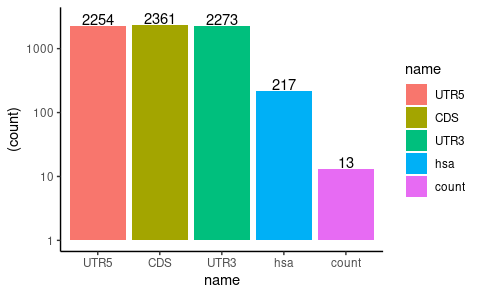
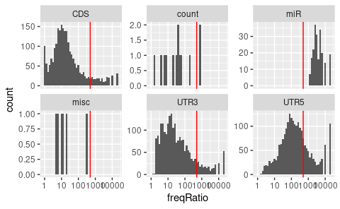
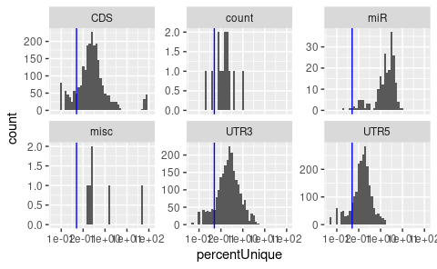
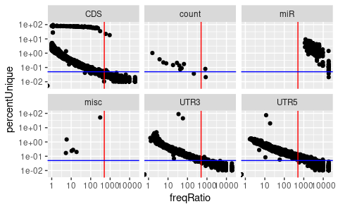

Trim sequence features
================
Kaspar Bresser
24/09/2021

-   [Initial trimming](#initial-trimming)
    -   [Import and inspect](#import-and-inspect)
    -   [Calculate variance](#calculate-variance)
    -   [Set cutoffs and extract](#set-cutoffs-and-extract)
    -   [Write data](#write-data)

The feature library contains many features. We intend to train multiple
random forest models as a first exploration to see if certain features
influence HLA sampling. No make these models a little bit less heavy,
we’ll subset the features to a more manageable size. We’ll filter based
on their variance using the `caret` package

``` r
library(here)
library(caret)
library(tidytext)
library(tidyverse)
```

# Initial trimming

## Import and inspect

``` r
(feats <- read_tsv(file = here("Data", "Protein_per_Uniprot_entry_library_v2_RBP_GC_length_codon_AA_m6A_m5C_AtoI_m1A_m7G_CD8miRDB_PTM.csv")))
```

    ## # A tibble: 19,008 × 7,125
    ##    Entry      Acetylation_count Amidation_count Hydroxylation_c… Malonylation_co…
    ##    <chr>                  <dbl>           <dbl>            <dbl>            <dbl>
    ##  1 A0A024RBG1                 0               0                0                0
    ##  2 A0A075B759                 0               0                0                0
    ##  3 A0A075B767                 0               0                0                0
    ##  4 A0A087WTH1                 0               0                0                0
    ##  5 A0A087WTH5                 0               0                0                0
    ##  6 A0A087WUL8                 0               0                0                0
    ##  7 A0A087WV53                 0               0                0                0
    ##  8 A0A087WVF3                 0               0                0                0
    ##  9 A0A087WWA1                 0               0                0                0
    ## 10 A0A087WXM9                 0               0                0                0
    ## # … with 18,998 more rows, and 7,120 more variables: Methylation_count <dbl>,
    ## #   N_linked_Glycosylation_count <dbl>, O_linked_Glycosylation_count <dbl>,
    ## #   Palmitoylation_count <dbl>, Phosphorylation_count <dbl>,
    ## #   S_nitrosylation_count <dbl>, Succinylation_count <dbl>,
    ## #   Sumoylation_count <dbl>, Ubiquitination_count <dbl>,
    ## #   UTR5_length_UTR5 <dbl>, AAAA_UTR5 <dbl>, AAAAA_UTR5 <dbl>,
    ## #   AAAAAA_UTR5 <dbl>, AAAAAAA_UTR5 <dbl>, AAAAAAAA_UTR5 <dbl>, …

Lets have a look at the different types of features in the dataset.
Feature names use “\_” as interpunction. The broad categories of
features seem to be stored in the last word of the feature name. Will
extract that information and count the occurrences.

``` r
feat.names <- names(feats[-1])

feat.classes <- (c("UTR5","CDS" ,"UTR3","hsa",  "count"))

feat.classes %>% 
  map( ~str_subset(feat.names,.)) %>% 
  set_names(feat.classes) %>% 
  enframe %>% 
  mutate(count = map_dbl(value, length),
         name = factor(name, levels = feat.classes)) %>% 
  ggplot(aes(x = name, y = (count), fill = name, label = count))+
    geom_bar(stat = "identity")+
    scale_y_log10()+
  theme_classic()+
  geom_text(nudge_y = 0.1)
```



``` r
ggsave(here("Figs", "trim_feature_counts.pdf"), width = 4, height = 3)


feat.classes %>% 
  map( ~str_subset(feat.names,.)) %>% 
  set_names(feat.classes) %>% 
  str()
```

    ## List of 5
    ##  $ UTR5 : chr [1:2254] "UTR5_length_UTR5" "AAAA_UTR5" "AAAAA_UTR5" "AAAAAA_UTR5" ...
    ##  $ CDS  : chr [1:2361] "CDS_length_CDS" "AAAA_CDS" "AAAAA_CDS" "AAAAAA_CDS" ...
    ##  $ UTR3 : chr [1:2273] "UTR3_length_UTR3" "AAAA_UTR3" "AAAAA_UTR3" "AAAAAA_UTR3" ...
    ##  $ hsa  : chr [1:217] "hsa.let.7a.3p" "hsa.let.7a.5p" "hsa.let.7b.3p" "hsa.let.7b.5p" ...
    ##  $ count: chr [1:13] "Acetylation_count" "Amidation_count" "Hydroxylation_count" "Malonylation_count" ...

Features corresponding to the 3’ UTR, 5’ UTR and CDS seem quite equal in
numbers. Features ending in “count”, appear to be protein related. m6a
is a mRNA modification.

## Calculate variance

We’ll use `caret::nearZeroVar` to calculate the amount of variance
across features. First convert the `NA` values to zero’s.

``` r
feats %>% 
  mutate(across(everything(), replace_na, 0 )) -> feats


variance.metrics <- nearZeroVar(feats[-1], saveMetrics = TRUE)

write_tsv(variance.metrics, here("Output", "variance_metrics.tsv"))
```

Now we have the variance metrics, lets have a look at them. First tidy
the output table a bit. Move the names to a column, generate a
feature.type column, and filter for the main types.

``` r
feat.classes <- str_sort(c("UTR5", "UTR3", "CDS", "count", "hsa"))

variance.metrics %>% 
  as_tibble(rownames = "feature") %>% 
  mutate(feature.type = case_when(str_detect(feature, "UTR5") ~ "UTR5",
                                  str_detect(feature, "UTR3") ~ "UTR3",
                                  str_detect(feature, "count") ~ "count",
                                  str_detect(feature, "CDS") ~ "CDS",
                                  str_detect(feature, "hsa") ~ "miR",
                                  TRUE ~ "misc"))  -> variance.metrics

variance.metrics %>% 
  count(feature.type)
```

    ## # A tibble: 6 × 2
    ##   feature.type     n
    ##   <chr>        <int>
    ## 1 CDS           2361
    ## 2 count           13
    ## 3 miR            217
    ## 4 misc             6
    ## 5 UTR3          2273
    ## 6 UTR5          2254

``` r
variance.metrics %>% 
  filter(feature.type == "misc")
```

    ## # A tibble: 6 × 6
    ##   feature                   freqRatio percentUnique zeroVar nzv   feature.type
    ##   <chr>                         <dbl>         <dbl> <lgl>   <lgl> <chr>       
    ## 1 total_m6A                      5.84         1.49  FALSE   FALSE misc        
    ## 2 total_m5C                     12.5          0.279 FALSE   FALSE misc        
    ## 3 total_AtoI                    18.8          0.200 FALSE   FALSE misc        
    ## 4 total_m1A                      5.34         0.168 FALSE   FALSE misc        
    ## 5 total_m7G                     10.5          0.237 FALSE   FALSE misc        
    ## 6 drerio_homolog_perc_id_r1    307.          51.8   FALSE   FALSE misc

Now plot the frequency ratio. This indicates the ratio between the most
common, and the second most common value. A lower value would indicate a
more heterogeneous variable.

``` r
variance.metrics %>% 
  ggplot(aes(x = freqRatio))+ 
    geom_histogram(binwidth = .1)+
    facet_wrap(~feature.type, scales = "free_y")+
    scale_x_log10()+
    geom_vline(xintercept = 500, color = "red")
```

    ## Warning: Transformation introduced infinite values in continuous x-axis

    ## Warning: Removed 33 rows containing non-finite values (stat_bin).



And the percentage of unique values within each variable, a lower value
indicates a more homogeneous variable.

``` r
variance.metrics %>% 
  ggplot(aes(x = percentUnique))+ 
    geom_histogram(binwidth = .1)+
    facet_wrap(~feature.type, scales = "free_y")+
    scale_x_log10()+
    geom_vline(xintercept = .05, color = "blue")
```



Lets look what we would slice off with these cutoffs.

``` r
variance.metrics %>% 
  ggplot(aes(x = freqRatio, y =percentUnique ))+ 
    geom_point()+
    facet_wrap(~feature.type)+
    scale_x_log10()+
    scale_y_log10()+
    geom_vline(xintercept = 500, color = "red")+
    geom_hline(yintercept = .05, color = "blue")
```

    ## Warning: Transformation introduced infinite values in continuous x-axis



## Set cutoffs and extract

If we adhere to these cutoffs we’ll be left with a significantly reduced
pool of features.

``` r
variance.metrics %>% 
  filter(feature.type %in% c("miR","count") | (freqRatio < 100 & percentUnique > 0.05) )  %>% 
  count(feature.type)
```

    ## # A tibble: 6 × 2
    ##   feature.type     n
    ##   <chr>        <int>
    ## 1 CDS           1905
    ## 2 count           13
    ## 3 miR            217
    ## 4 misc             5
    ## 5 UTR3          1677
    ## 6 UTR5           907

Let extract the selected features. Set the cutoffs (I kept all of the
protein level modifications, as this was such a small set). In addition,
I currently remove features that are directly protein related,
i.e. codons, AAs.

``` r
# Just to show that these protein related features are in there
str_subset(variance.metrics$feature, "codon|amino|AA_length")
```

    ##  [1] "AAA_codon_CDS" "AAC_codon_CDS" "AAG_codon_CDS" "AAT_codon_CDS"
    ##  [5] "ACA_codon_CDS" "ACC_codon_CDS" "ACG_codon_CDS" "ACT_codon_CDS"
    ##  [9] "AGA_codon_CDS" "AGC_codon_CDS" "AGG_codon_CDS" "AGT_codon_CDS"
    ## [13] "ATA_codon_CDS" "ATC_codon_CDS" "ATG_codon_CDS" "ATT_codon_CDS"
    ## [17] "CAA_codon_CDS" "CAC_codon_CDS" "CAG_codon_CDS" "CAT_codon_CDS"
    ## [21] "CCA_codon_CDS" "CCC_codon_CDS" "CCG_codon_CDS" "CCT_codon_CDS"
    ## [25] "CGA_codon_CDS" "CGC_codon_CDS" "CGG_codon_CDS" "CGT_codon_CDS"
    ## [29] "CTA_codon_CDS" "CTC_codon_CDS" "CTG_codon_CDS" "CTT_codon_CDS"
    ## [33] "GAA_codon_CDS" "GAC_codon_CDS" "GAG_codon_CDS" "GAT_codon_CDS"
    ## [37] "GCA_codon_CDS" "GCC_codon_CDS" "GCG_codon_CDS" "GCT_codon_CDS"
    ## [41] "GGA_codon_CDS" "GGC_codon_CDS" "GGG_codon_CDS" "GGT_codon_CDS"
    ## [45] "GTA_codon_CDS" "GTC_codon_CDS" "GTG_codon_CDS" "GTT_codon_CDS"
    ## [49] "TAA_codon_CDS" "TAC_codon_CDS" "TAG_codon_CDS" "TAT_codon_CDS"
    ## [53] "TCA_codon_CDS" "TCC_codon_CDS" "TCG_codon_CDS" "TCT_codon_CDS"
    ## [57] "TGA_codon_CDS" "TGC_codon_CDS" "TGG_codon_CDS" "TGT_codon_CDS"
    ## [61] "TTA_codon_CDS" "TTC_codon_CDS" "TTG_codon_CDS" "TTT_codon_CDS"
    ## [65] "A_amino_CDS"   "C_amino_CDS"   "D_amino_CDS"   "E_amino_CDS"  
    ## [69] "F_amino_CDS"   "G_amino_CDS"   "H_amino_CDS"   "I_amino_CDS"  
    ## [73] "K_amino_CDS"   "L_amino_CDS"   "M_amino_CDS"   "N_amino_CDS"  
    ## [77] "P_amino_CDS"   "Q_amino_CDS"   "R_amino_CDS"   "S_amino_CDS"  
    ## [81] "T_amino_CDS"   "V_amino_CDS"   "W_amino_CDS"   "Y_amino_CDS"  
    ## [85] "AA_length_CDS"

``` r
variance.metrics %>% 
  filter(feature.type %in% c("miR","count")  | (freqRatio < 500 & percentUnique > 0.05)) %>% 
  filter( !(feature %in% str_subset(feature, "codon|amino|AA_length")) ) %>% 
  filter(feature.type != "misc") %>% 
  group_by(feature.type) %>% 
  group_split() %>% 
  set_names(feat.classes) %>% 
  map(pull, feature) -> feature.list 

str(feature.list)
```

    ## List of 5
    ##  $ CDS  : chr [1:1943] "CDS_length_CDS" "AAAA_CDS" "AAAAA_CDS" "AAAAAA_CDS" ...
    ##  $ count: chr [1:13] "Acetylation_count" "Amidation_count" "Hydroxylation_count" "Malonylation_count" ...
    ##  $ hsa  : chr [1:217] "hsa.let.7a.3p" "hsa.let.7a.5p" "hsa.let.7b.3p" "hsa.let.7b.5p" ...
    ##  $ UTR3 : chr [1:1973] "UTR3_length_UTR3" "AAAA_UTR3" "AAAAA_UTR3" "AAAAAA_UTR3" ...
    ##  $ UTR5 : chr [1:1625] "UTR5_length_UTR5" "AAAA_UTR5" "AAAAA_UTR5" "AAAAAA_UTR5" ...

## Write data

And now we can write out these features as individual tables. Create a
directory, and then use `purrr:map` to select the desired columns from
the feats table, and finally used `purrr:map2` to write the resulting
list of tibbles to there desired locations.

We can then use these tibbles for the randomforest model training.

``` r
dir.create(here("Output", "feature_files"))
```

    ## Warning in dir.create(here("Output", "feature_files")): '/DATA/users/k.bresser/
    ## ligandome_project/analysis_new/Ligandome_models/Output/feature_files' already
    ## exists

``` r
feature.list %>% 
  map( ~select(feats, one_of(c("Entry", .))) ) %>% 
  map2( here("Output", "feature_files", paste0(names(.), "_features.tsv")) , write_tsv )
```

    ## $CDS
    ## # A tibble: 19,008 × 1,944
    ##    Entry      CDS_length_CDS AAAA_CDS AAAAA_CDS AAAAAA_CDS AAAAAAA_CDS AAAAAAAA_CDS
    ##    <chr>               <dbl>    <dbl>     <dbl>      <dbl>       <dbl>        <dbl>
    ##  1 A0A024RBG1            546        2         0          0           0            0
    ##  2 A0A075B759            495        1         0          0           0            0
    ##  3 A0A075B767            495        1         0          0           0            0
    ##  4 A0A087WTH1            327        0         0          0           0            0
    ##  5 A0A087WTH5            399        1         0          0           0            0
    ##  6 A0A087WUL8          11532      107        30          0           0            0
    ##  7 A0A087WV53            717        2         1          0           0            0
    ##  8 A0A087WVF3           1650        3         1          0           0            0
    ##  9 A0A087WWA1            288        0         0          0           0            0
    ## 10 A0A087WXM9           1122       17         9          2           1            1
    ## # … with 18,998 more rows, and 1,937 more variables: AAAAAAAAA_CDS <dbl>,
    ## #   AAAAAAC_CDS <dbl>, AAAAAACAAAG_CDS <dbl>, AAAAAAG_CDS <dbl>,
    ## #   AAAAAAGAAAG_CDS <dbl>, AAAAACA_CDS <dbl>, AAAAACC_CDS <dbl>,
    ## #   AAAAAT_CDS <dbl>, AAAACGA_CDS <dbl>, AAAACTA_CDS <dbl>, AAAAGA_CDS <dbl>,
    ## #   AAAAGAA_CDS <dbl>, AAAAGAGAAG_CDS <dbl>, AAAAT_CDS <dbl>, AAAATA_CDS <dbl>,
    ## #   AAAATCA_CDS <dbl>, AAAATT_CDS <dbl>, AAACAAA_CDS <dbl>, AAACACA_CDS <dbl>,
    ## #   AAACCAAA_CDS <dbl>, AAACTCA_CDS <dbl>, AAAGAAA_CDS <dbl>, …
    ## 
    ## $count
    ## # A tibble: 19,008 × 14
    ##    Entry      Acetylation_count Amidation_count Hydroxylation_c… Malonylation_co…
    ##    <chr>                  <dbl>           <dbl>            <dbl>            <dbl>
    ##  1 A0A024RBG1                 0               0                0                0
    ##  2 A0A075B759                 0               0                0                0
    ##  3 A0A075B767                 0               0                0                0
    ##  4 A0A087WTH1                 0               0                0                0
    ##  5 A0A087WTH5                 0               0                0                0
    ##  6 A0A087WUL8                 0               0                0                0
    ##  7 A0A087WV53                 0               0                0                0
    ##  8 A0A087WVF3                 0               0                0                0
    ##  9 A0A087WWA1                 0               0                0                0
    ## 10 A0A087WXM9                 0               0                0                0
    ## # … with 18,998 more rows, and 9 more variables: Methylation_count <dbl>,
    ## #   N_linked_Glycosylation_count <dbl>, O_linked_Glycosylation_count <dbl>,
    ## #   Palmitoylation_count <dbl>, Phosphorylation_count <dbl>,
    ## #   S_nitrosylation_count <dbl>, Succinylation_count <dbl>,
    ## #   Sumoylation_count <dbl>, Ubiquitination_count <dbl>
    ## 
    ## $hsa
    ## # A tibble: 19,008 × 218
    ##    Entry      hsa.let.7a.3p hsa.let.7a.5p hsa.let.7b.3p hsa.let.7b.5p hsa.let.7c.5p
    ##    <chr>              <dbl>         <dbl>         <dbl>         <dbl>         <dbl>
    ##  1 A0A024RBG1             0             0             0             0             0
    ##  2 A0A075B759             0             0             0             0             0
    ##  3 A0A075B767             0             0             0             0             0
    ##  4 A0A087WTH1             0             0             0             0             0
    ##  5 A0A087WTH5             0             0             0             0             0
    ##  6 A0A087WUL8             0             0             0             0             0
    ##  7 A0A087WV53             0             0             0             0             0
    ##  8 A0A087WVF3             0             0             0             0             0
    ##  9 A0A087WWA1             0             0             0             0             0
    ## 10 A0A087WXM9             0             0             0             0             0
    ## # … with 18,998 more rows, and 212 more variables: hsa.let.7d.3p <dbl>,
    ## #   hsa.let.7d.5p <dbl>, hsa.let.7e.5p <dbl>, hsa.let.7f.2.3p <dbl>,
    ## #   hsa.let.7f.5p <dbl>, hsa.let.7g.3p <dbl>, hsa.let.7g.5p <dbl>,
    ## #   hsa.let.7i.3p <dbl>, hsa.let.7i.5p <dbl>, hsa.miR.101.3p <dbl>,
    ## #   hsa.miR.101.5p <dbl>, hsa.miR.103a.3p <dbl>, hsa.miR.106a.5p <dbl>,
    ## #   hsa.miR.106b.3p <dbl>, hsa.miR.106b.5p <dbl>, hsa.miR.107 <dbl>,
    ## #   hsa.miR.10a.5p <dbl>, hsa.miR.10b.5p <dbl>, hsa.miR.125a.5p <dbl>, …
    ## 
    ## $UTR3
    ## # A tibble: 19,008 × 1,974
    ##    Entry      UTR3_length_UTR3 AAAA_UTR3 AAAAA_UTR3 AAAAAA_UTR3 AAAAAAA_UTR3
    ##    <chr>                 <dbl>     <dbl>      <dbl>       <dbl>        <dbl>
    ##  1 A0A024RBG1            2917         34         14           6          4  
    ##  2 A0A075B759             215          1          1           0          0  
    ##  3 A0A075B767              90          0          0           0          0  
    ##  4 A0A087WTH1            1253          8          0           0          0  
    ##  5 A0A087WTH5            1372.         7          2           1          0.5
    ##  6 A0A087WUL8            1623         11          5           1          1  
    ##  7 A0A087WV53              98          0          0           0          0  
    ##  8 A0A087WVF3             309          1          0           0          0  
    ##  9 A0A087WWA1             100          0          0           0          0  
    ## 10 A0A087WXM9             246          6          4           1          1  
    ## # … with 18,998 more rows, and 1,968 more variables: AAAAAAAA_UTR3 <dbl>,
    ## #   AAAAAAAAA_UTR3 <dbl>, AAAAAAC_UTR3 <dbl>, AAAAAACAAAG_UTR3 <dbl>,
    ## #   AAAAAAG_UTR3 <dbl>, AAAAAAGAAAG_UTR3 <dbl>, AAAAAATAAAG_UTR3 <dbl>,
    ## #   AAAAACA_UTR3 <dbl>, AAAAACC_UTR3 <dbl>, AAAAAGGAAAG_UTR3 <dbl>,
    ## #   AAAAAT_UTR3 <dbl>, AAAACGA_UTR3 <dbl>, AAAACTA_UTR3 <dbl>,
    ## #   AAAAGA_UTR3 <dbl>, AAAAGAA_UTR3 <dbl>, AAAAGAGAAG_UTR3 <dbl>,
    ## #   AAAAT_UTR3 <dbl>, AAAATA_UTR3 <dbl>, AAAATCA_UTR3 <dbl>, …
    ## 
    ## $UTR5
    ## # A tibble: 19,008 × 1,626
    ##    Entry      UTR5_length_UTR5 AAAA_UTR5 AAAAA_UTR5 AAAAAA_UTR5 AAAAAAA_UTR5
    ##    <chr>                 <dbl>     <dbl>      <dbl>       <dbl>        <dbl>
    ##  1 A0A024RBG1             179        0          0             0            0
    ##  2 A0A075B759              75        1          0             0            0
    ##  3 A0A075B767              75        1          1             0            0
    ##  4 A0A087WTH1              69        0          0             0            0
    ##  5 A0A087WTH5             232.       0.5        0.5           0            0
    ##  6 A0A087WUL8             786        7          2             2            1
    ##  7 A0A087WV53               0        0          0             0            0
    ##  8 A0A087WVF3             157        0          0             0            0
    ##  9 A0A087WWA1              17        0          0             0            0
    ## 10 A0A087WXM9             158        0          0             0            0
    ## # … with 18,998 more rows, and 1,620 more variables: AAAAAAAA_UTR5 <dbl>,
    ## #   AAAAAAAAA_UTR5 <dbl>, AAAAAAC_UTR5 <dbl>, AAAAAAG_UTR5 <dbl>,
    ## #   AAAAACA_UTR5 <dbl>, AAAAACC_UTR5 <dbl>, AAAAAT_UTR5 <dbl>,
    ## #   AAAACGA_UTR5 <dbl>, AAAACTA_UTR5 <dbl>, AAAAGA_UTR5 <dbl>,
    ## #   AAAAGAA_UTR5 <dbl>, AAAAT_UTR5 <dbl>, AAAATA_UTR5 <dbl>,
    ## #   AAAATCA_UTR5 <dbl>, AAAATT_UTR5 <dbl>, AAACAAA_UTR5 <dbl>,
    ## #   AAACACA_UTR5 <dbl>, AAACCAAA_UTR5 <dbl>, AAACTCA_UTR5 <dbl>, …
