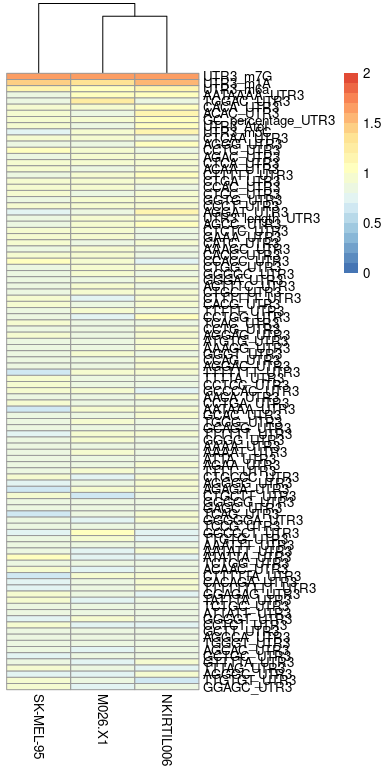

Investigate importance of features
================
Kaspar Bresser
11/10/2021

-   [Import and tidy data](#import-and-tidy-data)
-   [check metrics](#check-metrics)
-   [Check importance](#check-importance)
-   [Homogenicity with barplots](#homogenicity-with-barplots)
-   [Correlations between lines](#correlations-between-lines)
-   [Average importance plots](#average-importance-plots)

Used the analysis below to investigate the importance of the different
variables as determined by random forest models.

``` r
library(here)
library(tidyverse)
library(tidytext)
library(caret)
library(pheatmap)
library(RColorBrewer)
library(ggrepel)
```

# Import and tidy data

Import the results table. This table stores the different RandomForest
models, plus information of the tumor and the feature class to which the
model was fitted.

``` r
rf.results <- read_rds(here("Output", "RF_per_tumor_new.rds"))
```

# check metrics

Extract the results of each model,

``` r
rf.results %>% 
  transmute(metrics = map(rf.models, "results"), tumor = tumor, classes = classes) %>% 
  unnest(metrics) %>% 
  pivot_longer(2:9, names_to = "metric", values_to = "value") %>%
  mutate(which = case_when(str_detect(metric, "SD") ~ "SD",
                           TRUE ~ "value"),
         metric = str_remove(metric, "SD")) %>% 
  pivot_wider(names_from = which, values_from = "value") -> to.plot

write_tsv(to.plot, here("Output", "rf_model_metrics.tsv"))

to.plot
```

    ## # A tibble: 60 × 6
    ##     mtry tumor      classes metric value     SD
    ##    <dbl> <fct>      <chr>   <chr>  <dbl>  <dbl>
    ##  1    66 SK-MEL-95  CDS     ROC    0.701 0.0277
    ##  2    66 SK-MEL-95  CDS     Sens   0.686 0.0569
    ##  3    66 SK-MEL-95  CDS     Spec   0.638 0.0281
    ##  4    66 SK-MEL-95  CDS     Prec   0.487 0.0251
    ##  5    66 M026.X1    CDS     ROC    0.687 0.0297
    ##  6    66 M026.X1    CDS     Sens   0.666 0.0537
    ##  7    66 M026.X1    CDS     Spec   0.634 0.0394
    ##  8    66 M026.X1    CDS     Prec   0.477 0.0252
    ##  9    66 NKIRTIL006 CDS     ROC    0.723 0.0245
    ## 10    66 NKIRTIL006 CDS     Sens   0.672 0.0289
    ## # … with 50 more rows

``` r
ggplot(to.plot, aes(x=classes, y=value, fill=tumor)) + 
  geom_bar(stat="identity", color="black", position=position_dodge()) +
  geom_errorbar(aes(ymin=value, ymax=value+SD), width=.2,
                 position=position_dodge(.9))+
  facet_wrap(~metric, scales = "free_y", nrow = 1)+
  theme_classic()+
  theme(panel.grid.major.y = element_line())
```


``` r
ggsave(here("Figs", "importance_model_metrics.pdf"), width = 100, height = 20, units = "mm", scale = 4)
```

# Check importance

Extract the importance information from the models, and unnest into long
format.

``` r
rf.results %>% 
  mutate(importance = map(rf.models, varImp, scale = F),
         importance = map(importance, "importance"),
         importance = map(importance, as_tibble, rownames = "feature")) %>% 
  select(tumor, classes, importance) %>% 
  unnest(importance ) %>% 
  select(-no) %>% 
  rename(importance = yes) -> importance.table

rm(rf.results)
gc()
```

    ##           used  (Mb) gc trigger   (Mb)   max used   (Mb)
    ## Ncells 2566244 137.1    4857398  259.5    4857398  259.5
    ## Vcells 4427589  33.8 1076790831 8215.3 1041589991 7946.8

``` r
write_tsv(importance.table, here("Output", "rf_importance.tsv"))

importance.table
```

    ## # A tibble: 17,313 × 4
    ##    tumor     classes feature         importance
    ##    <fct>     <chr>   <chr>                <dbl>
    ##  1 SK-MEL-95 CDS     CDS_length_CDS        7.32
    ##  2 SK-MEL-95 CDS     AAAA_CDS              6.78
    ##  3 SK-MEL-95 CDS     AAAAA_CDS             4.88
    ##  4 SK-MEL-95 CDS     AAAAAA_CDS            5.41
    ##  5 SK-MEL-95 CDS     AAAAAAA_CDS           3.35
    ##  6 SK-MEL-95 CDS     AAAAAAAA_CDS          3.23
    ##  7 SK-MEL-95 CDS     AAAAAAAAA_CDS         2.32
    ##  8 SK-MEL-95 CDS     AAAAAAC_CDS           3.05
    ##  9 SK-MEL-95 CDS     AAAAAACAAAG_CDS       1.02
    ## 10 SK-MEL-95 CDS     AAAAAAG_CDS           4.55
    ## # … with 17,303 more rows

``` r
ggplot(importance.table, aes(x = importance))+
  geom_histogram(binwidth = 1)+
  facet_grid(tumor~classes,  scales = "free_y")+
  geom_vline(xintercept = 20, linetype = "dashed")
```


``` r
ggplot(importance.table, aes(x = classes, y = importance, fill = tumor))+
  geom_boxplot()
```


# Homogenicity with barplots

Want to focus on a few top features to plot, lets select the top 40 most
important features across the tumor lines. Used the sum of the 3 lines
to get the features that had a high score in at least two of the lines.

``` r
importance.table %>% 
  group_by(classes, feature) %>% 
  summarise(score = sum(importance)) %>% 
  slice_max(score, n = 40) -> top.important

write_tsv(top.important, here("Output", "top_important_features.tsv"))

importance.table %>% 
  group_by(classes, feature) %>% 
  summarise(score = sum(importance)) %>% 
  slice_max(score, n = 10) -> top10.important
```

Plot as barcharts.

``` r
importance.table %>% 
  semi_join(top.important) %>% 
  group_by(tumor) %>% 
  mutate(feature = reorder(feature, importance)) %>% 
  ggplot(aes(feature, importance, fill = tumor))+
    geom_bar(stat = "identity", position = "dodge")+
    facet_wrap(~classes, scales = "free", nrow = 2)+
    coord_flip()
```


``` r
importance.table %>% 
  semi_join(top10.important) %>% 
  group_by(tumor) %>% 
  mutate(feature = str_remove_all(feature, "UTR5|UTR3|CDS|count|hsa|\\."),
         feature = str_replace_all(feature, "_", " ")) %>% 
  mutate(feature = reorder_within(feature, importance, classes)) %>% 
  ggplot(aes(feature, importance, fill = tumor))+
    geom_bar(stat = "identity", position = "dodge")+
    facet_wrap(~classes, scales = "free", nrow = 1)+
    coord_flip()+
    scale_x_reordered()+
    theme_classic()
```


``` r
ggsave(here("Figs", "importance_importance.pdf"), width = 12, height = 3)
```

# Correlations between lines

Use GGally’s ggpairs function to check correlations between the tumor
lines.

``` r
library(GGally)
library(ggpubr)

importance.table %>% 
  pivot_wider(names_from = tumor, values_from = importance) %>% 
  ggpairs(columns = 3:5, aes(color = classes))+
  theme_classic()
```


``` r
ggsave(here("Figs", "importance_ggpairs.pdf"), width = 6, height = 6)
```

Visualization isn’t great, let’s plot the different comparisons for each
class as individual scatterplots.

``` r
comps <- list(c("SKMEL95", "NKIRTIL006"), c("M026.X1", "NKIRTIL006"), c("M026.X1", "SKMEL95"))


importance.table %>% 
  pivot_wider(names_from = tumor, values_from = importance) %>% 
  mutate(SKMEL95 = `SK-MEL-95`) -> to.plot

plots <- map(comps, ~ggplot(to.plot, aes_string(x = .[[1]], y = .[[2]]))+
                      geom_point()+
                      geom_smooth(aes(color = classes), method = "lm")+
                      facet_wrap(~classes, nrow = 1)+
                      theme_bw())

ggarrange(plotlist = plots, ncol = 1, nrow = 3, common.legend = T)
```


``` r
ggsave(here("Figs", "importance_scatter.pdf"), width = 10, height = 6)
```

Same, but log10 transformed

``` r
importance.table %>% 
  mutate(importance = log10(importance+1)) %>% 
  pivot_wider(names_from = tumor, values_from = importance) %>% 
  mutate(SKMEL95 = `SK-MEL-95`) -> to.plot-> to.plot
```

    ## Warning in mask$eval_all_mutate(quo): NaNs produced

``` r
plots <- map(comps, ~ggplot(to.plot, aes_string(x = .[[1]], y = .[[2]]))+
                      geom_point()+
                      geom_smooth(aes(color = classes), method = "lm")+
                      facet_wrap(~classes, nrow = 1)+
                      theme_bw())

ggarrange(plotlist = plots, ncol = 1, nrow = 3, common.legend = T)
```

    ## Warning: Removed 167 rows containing non-finite values (stat_smooth).

    ## Warning: Removed 167 rows containing missing values (geom_point).

    ## Warning: Removed 167 rows containing non-finite values (stat_smooth).

    ## Warning: Removed 167 rows containing missing values (geom_point).

    ## Warning: Removed 214 rows containing non-finite values (stat_smooth).

    ## Warning: Removed 214 rows containing missing values (geom_point).

    ## Warning: Removed 205 rows containing non-finite values (stat_smooth).

    ## Warning: Removed 205 rows containing missing values (geom_point).


``` r
ggsave(here("Figs", "importance_scatter_log10.pdf"), width = 10, height = 6)

ggsave(here("Figs", "importance_scatter_log10_mm.pdf"), width = 70, height = 60, units = "mm", scale = 3)
```

# Average importance plots

Calculate mean importance across tumor lines, simplify feature names,
and reorder. Log10 transform the importance metric.

``` r
importance.table %>% 
  group_by(classes, feature) %>% 
  summarise(importance = mean(importance)) %>% 
  mutate(feature = str_remove_all(feature, "UTR5|UTR3|CDS|count|hsa|\\."),
         feature = str_replace_all(feature, "_", " ")) %>% 
  mutate(feature.reordered = reorder_within(feature, importance, classes)) -> to.plot


ggplot(to.plot, aes(x = feature.reordered, y = importance, label = feature))+
    geom_point()+
    facet_wrap(~classes, scales = "free_x", nrow = 1)+
    theme_classic()+
    geom_point(data = slice_max(to.plot, importance, n = 10 ), color = "darkred")+
    geom_text_repel(data = slice_max(to.plot, importance, n = 10 ), 
                    box.padding = 1.4, max.overlaps = 25, color = "darkred", size = 4)+
    theme(axis.text.x=element_blank(),
          axis.ticks.x=element_blank(), panel.grid.major.y = element_line())+
  scale_y_log10()
```

    ## Warning in self$trans$transform(x): NaNs produced

    ## Warning: Transformation introduced infinite values in continuous y-axis

    ## Warning: Removed 183 rows containing missing values (geom_point).


``` r
ggsave(here("Figs", "importance_dotplots.pdf"), width = 122, height = 30, units = "mm", scale = 4)
```

    ## Warning in self$trans$transform(x): NaNs produced

    ## Warning: Transformation introduced infinite values in continuous y-axis

    ## Warning: Removed 183 rows containing missing values (geom_point).

To visualize as heatmaps, we’ll need the data to be in matrix format.
First extract these from the importance table.

``` r
importance.table %>% 
  group_by(classes, feature) %>% 
  summarise(score = sum(importance)) %>% 
  slice_max(score, n = 100) -> top.important

importance.table %>% 
  semi_join(top.important) %>%
  full_join(top.important) %>%
  group_by(classes) %>% 
  arrange(desc(score)) %>% 
  select(-score) %>% 
  pivot_wider(names_from = tumor, values_from = importance) %>% 
  group_by(classes) %>% 
  nest() %>% 
  mutate(data = map(data, column_to_rownames, "feature"),
         data = map(data, as.matrix)) %>% 
  deframe() -> matrixes

str(matrixes)
```

    ## List of 5
    ##  $ count: num [1:13, 1:3] 245.2 115.5 87.3 58 67.9 ...
    ##   ..- attr(*, "dimnames")=List of 2
    ##   .. ..$ : chr [1:13] "Ubiquitination_count" "Acetylation_count" "Phosphorylation_count" "Malonylation_count" ...
    ##   .. ..$ : chr [1:3] "SK-MEL-95" "M026.X1" "NKIRTIL006"
    ##  $ CDS  : num [1:100, 1:3] 53.4 32.3 18.2 14.3 13.6 ...
    ##   ..- attr(*, "dimnames")=List of 2
    ##   .. ..$ : chr [1:100] "CDS_m7G" "CDS_m1A" "CCTCC_CDS" "CTCC_CDS" ...
    ##   .. ..$ : chr [1:3] "SK-MEL-95" "M026.X1" "NKIRTIL006"
    ##  $ UTR3 : num [1:100, 1:3] 47.36 30.35 13.1 6.92 6.77 ...
    ##   ..- attr(*, "dimnames")=List of 2
    ##   .. ..$ : chr [1:100] "UTR3_m7G" "UTR3_m1A" "UTR3_m6a" "AATAAAA_UTR3" ...
    ##   .. ..$ : chr [1:3] "SK-MEL-95" "M026.X1" "NKIRTIL006"
    ##  $ UTR5 : num [1:100, 1:3] 54.3 21.7 26.3 20.9 22 ...
    ##   ..- attr(*, "dimnames")=List of 2
    ##   .. ..$ : chr [1:100] "UTR5_m1A" "UTR5_m7G" "GC_percentage_UTR5" "UTR5_m5C" ...
    ##   .. ..$ : chr [1:3] "SK-MEL-95" "M026.X1" "NKIRTIL006"
    ##  $ hsa  : num [1:100, 1:3] 11.78 1.27 13.65 3.19 12.19 ...
    ##   ..- attr(*, "dimnames")=List of 2
    ##   .. ..$ : chr [1:100] "hsa.miR.744.5p" "hsa.miR.101.3p" "hsa.miR.4677.3p" "hsa.miR.143.3p" ...
    ##   .. ..$ : chr [1:3] "SK-MEL-95" "M026.X1" "NKIRTIL006"

``` r
breaksList = seq(0, 100, by = 5)

breaksList = seq(0, 2, by = 0.1)
colors <- colorRampPalette(rev(brewer.pal(n = 7, name = "RdYlBu")))(length(breaksList))

tmp <- map(matrixes, ~pheatmap(log10(.+1), breaks = breaksList, color = colors, cluster_rows = F))
```

    ## Warning in rownames(mat): NaNs produced



    ## Warning in rownames(mat): NaNs produced


