Visualizing the importance of features
================
Kaspar Bresser
18/10/2021

-   [Import data and tidy](#import-data-and-tidy)
-   [Boxplots](#boxplots)
-   [T test](#t-test)
-   [HLA ligand enrichment](#hla-ligand-enrichment)

In these I analysis I’ll try to visualize features that were identified
to be important by the individually fitted randomforest models.

``` r
library(here)
library(tidyverse)
library(rstatix)
library(tidytext)
```

## Import data and tidy

Import the peptides used to train the models, down-sample decoy peptides
to the same amount as the MS-detected peptides (3389) for each tumor.

``` r
train.peptides <- read_tsv(here("Output", "test_train_tables_new", "rf_train_peptides.tsv"))

train.peptides %>% 
  group_by(tumor, ligand) %>% 
  nest() %>% 
  ungroup() %>% 
  mutate(sample.size = c(13556,13556,13556, 3389, 3389, 3389)) %>% 
  mutate(data = map2(data, sample.size, sample_n)) %>% 
  select(-sample.size) %>% 
  unnest(data) -> train.peptides

train.peptides
```

    ## # A tibble: 50,835 × 9
    ##    tumor     ligand peptide_length    rna  ribo   chop affMIN swissprot_id peptide
    ##    <fct>     <lgl>           <dbl>  <dbl> <dbl>  <dbl>  <dbl> <chr>        <chr>  
    ##  1 SK-MEL-95 FALSE               9 23.6   478.  0.0736  35    P53667       CTWREE…
    ##  2 SK-MEL-95 FALSE               9  0.886   7   0.0352  70    P78543       CGLLTC…
    ##  3 SK-MEL-95 FALSE               9  0.653  34.1 0.734    0.9  Q8TDI0       RLAEVE…
    ##  4 SK-MEL-95 FALSE               9  0.252   0   0.900    0.09 O95049       LRKHSS…
    ##  5 SK-MEL-95 FALSE               9  0.358   6   0.0257  12    Q6ZS72       SKACRL…
    ##  6 SK-MEL-95 FALSE               9  0.786  68.0 0.652    1.9  O75473       SLRSLN…
    ##  7 SK-MEL-95 FALSE               9 27.7   703.  0.156    8    P98161       GLSLPL…
    ##  8 SK-MEL-95 FALSE               9 14.2   575.  0.147   16    Q8TDM6       LLPILY…
    ##  9 SK-MEL-95 FALSE               9  2.57  485   0.0823  39    P23352       QPIRPK…
    ## 10 SK-MEL-95 FALSE              10  8.98  271.  0.187   11    Q12955       VLYREY…
    ## # … with 50,825 more rows

Import the important features and the entire feature table.

The `imp.features` table contains the top features, based on summed
importance score over the three lines.

Features table contains a lot of `NA`’s, replace these with 0’s, and
select only the important features.

``` r
imp.features <- read_tsv(here("Output", "top_important_features.tsv"))

features <- read_tsv(here("Data", "Protein_per_Uniprot_entry_library_v2_RBP_GC_length_codon_AA_m6A_m5C_AtoI_m1A_m7G_CD8miRDB_PTM.csv"))

features %>% 
  select(one_of("Entry", imp.features$feature)) %>% 
  mutate(across(everything(), replace_na, 0 )) -> features
```

select the top 10 features for each class.

``` r
imp.features %>%
  group_by(classes) %>% 
  slice_max(order_by = score, n = 10) %>% 
  pull(feature) -> focus.features 

focus.features
```

    ##  [1] "CDS_m7G"                      "CDS_m1A"                     
    ##  [3] "CCTCC_CDS"                    "CTCC_CDS"                    
    ##  [5] "CCTC_CDS"                     "GC_percentage_CDS"           
    ##  [7] "CCCT_CDS"                     "AGGGG_CDS"                   
    ##  [9] "GGGG_CDS"                     "ACCTCC_CDS"                  
    ## [11] "Ubiquitination_count"         "Acetylation_count"           
    ## [13] "Phosphorylation_count"        "Malonylation_count"          
    ## [15] "Methylation_count"            "Sumoylation_count"           
    ## [17] "S_nitrosylation_count"        "Succinylation_count"         
    ## [19] "O_linked_Glycosylation_count" "N_linked_Glycosylation_count"
    ## [21] "hsa.miR.744.5p"               "hsa.miR.101.3p"              
    ## [23] "hsa.miR.4677.3p"              "hsa.miR.143.3p"              
    ## [25] "hsa.miR.331.3p"               "hsa.miR.1285.3p"             
    ## [27] "hsa.miR.155.5p"               "hsa.miR.486.5p"              
    ## [29] "hsa.miR.361.5p"               "hsa.miR.421"                 
    ## [31] "UTR3_m7G"                     "UTR3_m1A"                    
    ## [33] "UTR3_m6a"                     "AATAAAA_UTR3"                
    ## [35] "TGGAC_UTR3"                   "CACA_UTR3"                   
    ## [37] "ACAC_UTR3"                    "GC_percentage_UTR3"          
    ## [39] "UTR3_AtoI"                    "UTR3_m5C"                    
    ## [41] "UTR5_m1A"                     "UTR5_m7G"                    
    ## [43] "GC_percentage_UTR5"           "UTR5_m5C"                    
    ## [45] "UTR5_m6a"                     "UTR5_length_UTR5"            
    ## [47] "CCAG_UTR5"                    "CCGC_UTR5"                   
    ## [49] "CGCC_UTR5"                    "GCGC_UTR5"

subset the feature table, join with the peptide table, switch to long,
and add feature types

``` r
features %>%
  select(one_of("Entry", focus.features)) %>%  
  inner_join(train.peptides, by =  c("Entry" = "swissprot_id")) %>% 
  pivot_longer(cols = one_of(focus.features), names_to = "feature", values_to = "value") %>%
  mutate(feature = factor(feature, levels = focus.features)) %>% 
  mutate(feature.type = case_when(str_detect(feature, "UTR5") ~ "UTR5",
                                  str_detect(feature, "UTR3") ~ "UTR3",
                                  str_detect(feature, "count") ~ "count",
                                  str_detect(feature, "CDS") ~ "CDS",
                                  str_detect(feature, "hsa") ~ "miR",
                                  TRUE ~ "misc")) -> plot.data

plot.data
```

    ## # A tibble: 2,541,750 × 12
    ##    Entry  tumor  ligand peptide_length   rna  ribo   chop affMIN peptide feature
    ##    <chr>  <fct>  <lgl>           <dbl> <dbl> <dbl>  <dbl>  <dbl> <chr>   <fct>  
    ##  1 A0AUZ9 SK-ME… FALSE               9  9.95  371. 0.0302     60 GHHPKK… CDS_m7G
    ##  2 A0AUZ9 SK-ME… FALSE               9  9.95  371. 0.0302     60 GHHPKK… CDS_m1A
    ##  3 A0AUZ9 SK-ME… FALSE               9  9.95  371. 0.0302     60 GHHPKK… CCTCC_…
    ##  4 A0AUZ9 SK-ME… FALSE               9  9.95  371. 0.0302     60 GHHPKK… CTCC_C…
    ##  5 A0AUZ9 SK-ME… FALSE               9  9.95  371. 0.0302     60 GHHPKK… CCTC_C…
    ##  6 A0AUZ9 SK-ME… FALSE               9  9.95  371. 0.0302     60 GHHPKK… GC_per…
    ##  7 A0AUZ9 SK-ME… FALSE               9  9.95  371. 0.0302     60 GHHPKK… CCCT_C…
    ##  8 A0AUZ9 SK-ME… FALSE               9  9.95  371. 0.0302     60 GHHPKK… AGGGG_…
    ##  9 A0AUZ9 SK-ME… FALSE               9  9.95  371. 0.0302     60 GHHPKK… GGGG_C…
    ## 10 A0AUZ9 SK-ME… FALSE               9  9.95  371. 0.0302     60 GHHPKK… ACCTCC…
    ## # … with 2,541,740 more rows, and 2 more variables: value <dbl>,
    ## #   feature.type <chr>

## Boxplots

Plot the different features as boxplots, separated on MS-detected and
decoy peptides.

``` r
ggplot(plot.data, aes(x = tumor, y = value, fill = ligand))+
  geom_boxplot()+
  facet_wrap(~feature, scales = "free", ncol = 10)
```

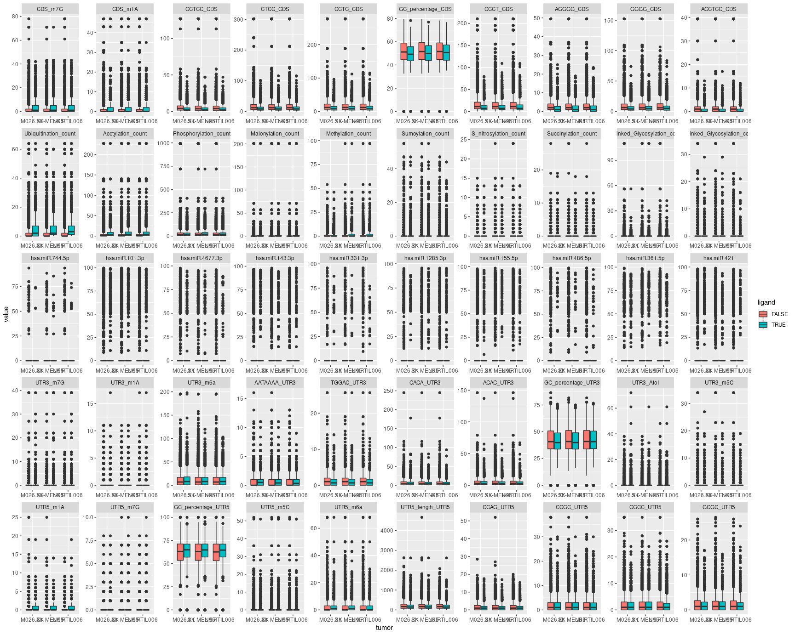

## T test

To specifically select a couple features that are significantly
associated with HLA sampling, we can do a simple t test.

Plot the T statistics as barplots, either all together or facetted.

``` r
feat.classes <- (c("UTR5","CDS" ,"UTR3","hsa",  "count"))

plot.data %>% 
  group_by(feature) %>% 
  t_test(value~ligand) %>% 
  adjust_pvalue(method = "bonferroni") -> stats

stats
```

    ## # A tibble: 50 × 10
    ##    feature  .y.   group1 group2    n1    n2 statistic     df         p     p.adj
    ##  * <fct>    <chr> <chr>  <chr>  <int> <int>     <dbl>  <dbl>     <dbl>     <dbl>
    ##  1 CDS_m7G  value FALSE  TRUE   40668 10167     -30.3 12826. 3.47e-195 1.73e-193
    ##  2 CDS_m1A  value FALSE  TRUE   40668 10167     -16.5 13501. 1.5 e- 60 7.5 e- 59
    ##  3 CCTCC_C… value FALSE  TRUE   40668 10167      36.8 35599. 5.93e-291 2.96e-289
    ##  4 CTCC_CDS value FALSE  TRUE   40668 10167      37.5 31895. 2.67e-301 1.33e-299
    ##  5 CCTC_CDS value FALSE  TRUE   40668 10167      36.9 30095. 1.53e-291 7.65e-290
    ##  6 GC_perc… value FALSE  TRUE   40668 10167      16.3 16798. 1.6 e- 59 8   e- 58
    ##  7 CCCT_CDS value FALSE  TRUE   40668 10167      36.0 25689. 1.32e-276 6.60e-275
    ##  8 AGGGG_C… value FALSE  TRUE   40668 10167      31.9 24684. 8.49e-219 4.24e-217
    ##  9 GGGG_CDS value FALSE  TRUE   40668 10167      35.3 25738. 4.78e-266 2.39e-264
    ## 10 ACCTCC_… value FALSE  TRUE   40668 10167      30.6 36698. 1.84e-203 9.2 e-202
    ## # … with 40 more rows

``` r
stats %>% 
  mutate(feature.type = case_when(str_detect(feature, "UTR5") ~ "UTR5",
                                  str_detect(feature, "UTR3") ~ "UTR3",
                                  str_detect(feature, "count") ~ "count",
                                  str_detect(feature, "CDS") ~ "CDS",
                                  str_detect(feature, "hsa") ~ "miR",
                                  TRUE ~ "misc"),
           feature = str_remove_all(feature, "UTR5|UTR3|CDS|count|hsa|\\."),
           feature = str_replace_all(feature, "_", " "),
           feature = reorder_within(feature, -statistic, feature.type)) %>% 
  ggplot(aes(x = feature, y = -statistic, fill = p.adj < 0.05))+
    geom_bar(stat = "identity")+
    coord_flip()+
    scale_x_reordered()+
    theme_minimal()+
    facet_wrap(~feature.type, scales = "free_y", nrow = 1)
```

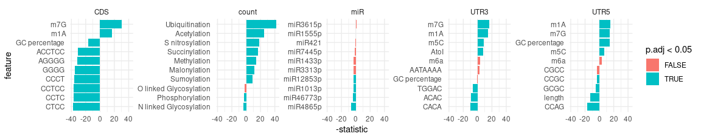

``` r
ggsave(here("Figs", "importance_Tstat_facet.pdf"), width = 16, height = 2.8)
```

``` r
stats %>% 
  ggplot(aes(x = reorder(feature, -statistic), y = -statistic, fill = p.adj < 0.05))+
    geom_bar(stat = "identity")+
    coord_flip()+
    theme_minimal()
```

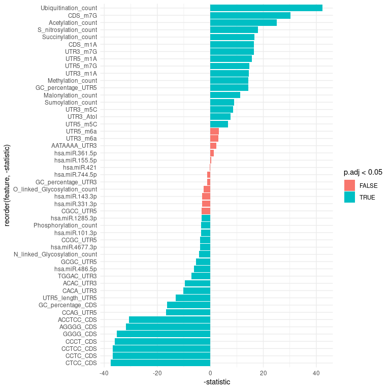

``` r
ggsave(here("Figs", "importance_Tstat_all.pdf"), width = 6, height = 7)
```

Next we can plot the top and bottom 10 features by t-statistic.

``` r
stats %>% 
  filter(dense_rank(statistic) <= 10 | dense_rank(desc(statistic)) <= 10) %>% 
  pull(feature) %>% 
  fct_drop() -> feats

plot.data %>% 
  filter(feature %in% feats) %>% 
  ggplot(aes(tumor, log10(value+1), fill = ligand))+
  geom_boxplot()+
  facet_wrap(~feature, nrow = 2, scales = "free")+
  theme_classic()
```

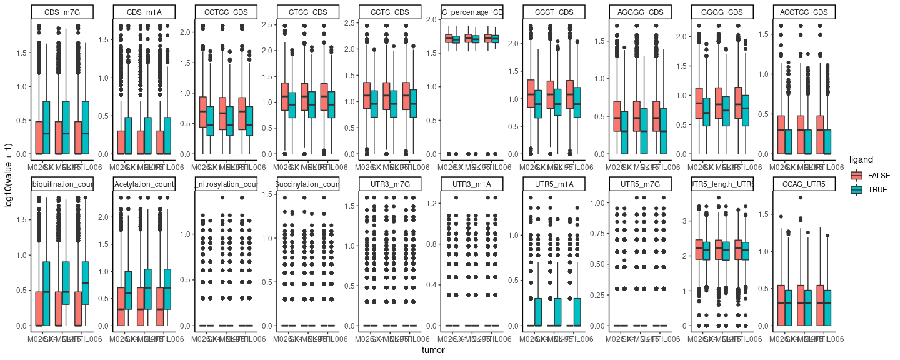

``` r
ggsave(here("Figs", "importance_boxplots.pdf"), width = 12, height = 4, scale = 1.5)
```

## HLA ligand enrichment

Was looking for other ways to visualize whether the values of a feature
would allow one to enrich for MS detected peptides. One way to do this
could be to count the amount of HLA ligands present in the top 50%
peptides after sorting for each feature. As a control, I can calculate
the same metric after randomly permuting that feature. I can
subsequently plot the difference between the actual and control setting.

Achieved this with the bit of code below; Adding a column where each
feature is permuted, and a column of random values which I can use later
on for tie breaking. Then nest to get separate tibbles for each feature
and tumor. Then arrange these tibbles by feature value and tie-breaker,
slice off 50% of the columns, calculate the amount of HLA ligands, and
pull those values. Do the sample for the permuted control column.

bootstrapped this analysis. I added some lines to subset 30% of the data
during each loop.

``` r
df.list <- list()
for(i in 1:50){
  plot.data %>% 
    select(ligand, feature, value, tumor, feature.type) %>% 
    group_by(feature, tumor, feature.type) %>%
    mutate(random = sample(value, n()),
           for.arrange = 1:n()) %>% 
    nest() %>%          
    mutate(PPV = map(data, ~sample_frac(., size = .3)),
           control = PPV,
           PPV = map(PPV, ~arrange(., desc(value))),
           PPV = map(PPV, ~slice_head(.,prop =  .5)),
           PPV = map(PPV, ~summarise(., PPV = sum(ligand))),
           PPV = map_dbl(PPV, pull, PPV),
           control = map(control, ~arrange(., desc(random))),
           control = map(control, ~slice_head(.,prop =  .5)),
           control = map(control, ~summarise(., PPV = sum(ligand))),
           control = map_dbl(control, pull, PPV)) %>%
    mutate(difference = PPV-control,
           perc.difference = ((PPV-control)/control)*100) %>% 
    rename_with(~paste0(., i), contains("difference")) %>% 
    select(!c(data, PPV, control)) -> PPV.data
  
  df.list[[i]] <- PPV.data
}

PPV.data <- reduce(df.list, inner_join, by = c("feature", "tumor", "feature.type"))
```

Plot that data as bar plot, and each individual run as points.

``` r
PPV.data %>% 
  pivot_longer(cols = starts_with("perc."), names_to = "replicate", values_to = "difference") %>% 
  group_by(feature.type) %>% 
  group_split() -> to.plot

map(to.plot, ~ggplot(., aes(x = tumor, y = difference, fill = tumor))+
                geom_bar(position = "dodge", stat = "summary", fun = "median")+
                geom_point(position = position_jitterdodge() )+
                facet_wrap(~feature, nrow = 1))
```

    ## [[1]]

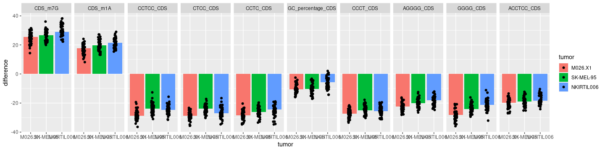

    ## 
    ## [[2]]

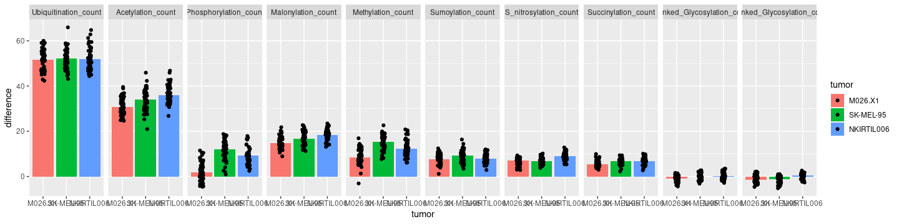

    ## 
    ## [[3]]

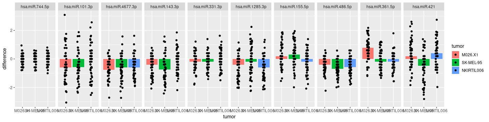

    ## 
    ## [[4]]

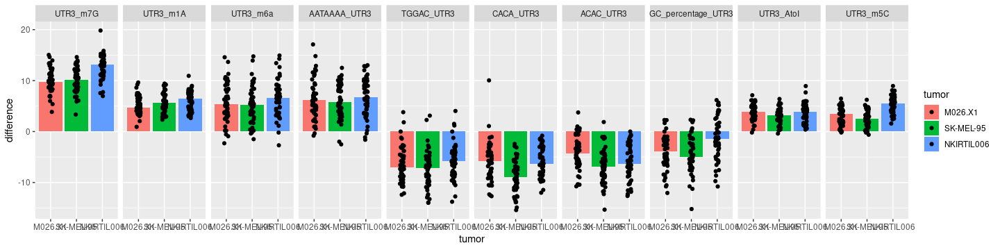

    ## 
    ## [[5]]

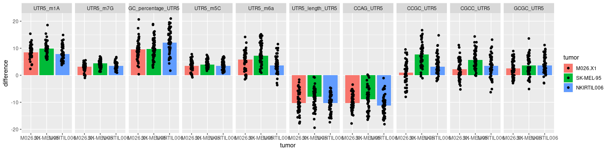

Or plot as barplot, adding the the confidence interval.

``` r
PPV.data %>% 
  pivot_longer(cols = starts_with("perc."), names_to = "replicate", values_to = "diff") %>% 
  group_by(feature, feature.type, tumor) %>% 
  summarise(difference = mean(diff), stdev = sd(diff), n=n()) %>% 
  mutate(se = stdev/sqrt(n)) %>%
  mutate(ic = se * qt((1-0.05)/2 + .5, n-1)) %>% 
  group_by(feature, feature.type) %>% 
  mutate(group.mean = mean(difference)) %>% 
  mutate(feature.label = str_replace_all(feature, "_", " "),
         feature.label = str_remove(feature.label, feature.type),
         feature = reorder_within(feature, group.mean, feature.type)) -> to.plot

ggplot(to.plot, aes(x = reorder(feature, group.mean), y = difference, fill = tumor,  
                    ymin=difference-ic, ymax=difference+ic))+
  geom_bar( stat="identity", color = "black", position = "dodge") +
  geom_errorbar(  position=position_dodge(width=0.9), width = .3)+
  geom_hline(yintercept = 0)+
  facet_wrap(~feature.type, scales = "free", nrow =1)+
  coord_flip()+
  scale_x_reordered()+
  theme_classic()+
  theme(panel.grid.major.x = element_line())
```


``` r
ggsave(here("Figs", "importance_enrichment_final.pdf"), width = 150, height = 35, units = "mm", scale = 2.5)
```

Plot the mean difference from each feature as a measure of importance of
each feature class.

``` r
library(scales)
to.plot %>% 
  group_by(feature, feature.type) %>% 
  summarise(mean.difference = mean(difference)) %>% 
  mutate(feature = paste0(feature, feature.type)) %>% 
  ggplot(aes(reorder(feature, mean.difference), mean.difference, fill = feature.type))+
  geom_bar(stat = "identity")+
  scale_y_continuous(breaks = extended_breaks(n = 6))+
  theme_classic()+
  theme(panel.grid.major.y = element_line())
```

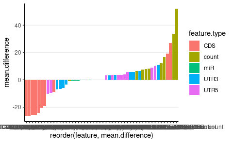

``` r
ggsave(here("Figs", "importance_enrichment_classes_final.pdf"), width = 5, height = 3)
```

``` r
to.plot %>% 
  group_by(feature, feature.type) %>% 
  summarise(mean.difference = mean(difference)) %>% 
  ggplot(aes(reorder(feature.type, abs(mean.difference)), abs(mean.difference), color = feature.type))+
  geom_boxplot(outlier.shape = NA, size = 1)+
  geom_jitter(width = .15, color = "black")+
  theme_classic()+
  theme(panel.grid.major.y = element_line())
```

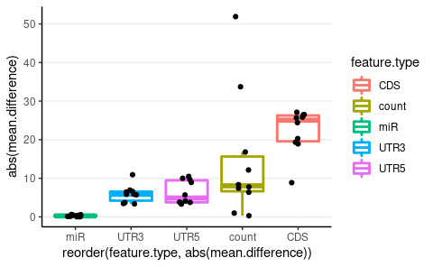

``` r
ggsave(here("Figs", "importance_enrichment_classes_box_final.pdf"), width = 4, height = 3)
```
