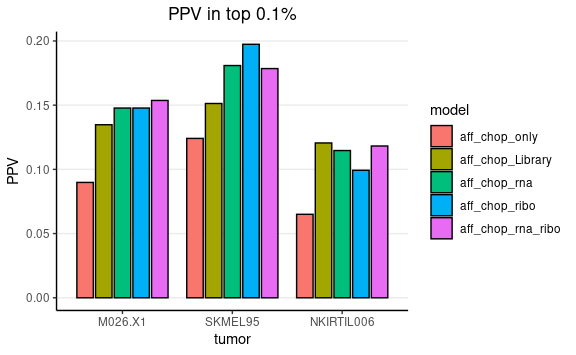
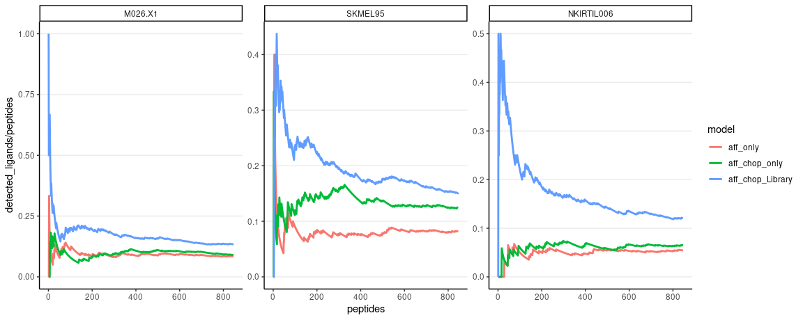

XGB results top 0.1%
================
Kaspar Bresser
28/12/2021

-   [Import and tidy data](#import-and-tidy-data)
-   [Positive predictive value](#positive-predictive-value)
-   [Cumulative sums](#cumulative-sums)
-   [Area under the curve](#area-under-the-curve)

Used the analysis below to compare the performance of the XGB models.

``` r
library(here)
library(bayestestR)
library(tidyverse)
```

## Import and tidy data

Import the results table.

``` r
here("Output", "XGB_final") %>% 
  list.files() %>% 
  here("Output", "XGB_final", .) %>% 
  map(read_tsv) %>% 
  reduce(bind_rows) %>% 
  mutate(tumor = fct_recode(tumor, M026.X1 = "M026", SKMEL95 = "mel95", NKIRTIL006 = "RTE")) -> XGB.results

XGB.results
```

    ## # A tibble: 2,540,538 × 15
    ##    aff_chop_Library_ribo aff_chop_Library_rn… aff_chop_Library… aff_chop_Library
    ##                    <dbl>                <dbl>             <dbl>            <dbl>
    ##  1             0.0468               0.0184            0.0353            0.0228  
    ##  2             0.0000181            0.0000418         0.0000566         0.000230
    ##  3             0.000156             0.000496          0.000215          0.00117 
    ##  4             0.240                0.381             0.284             0.0740  
    ##  5             0.346                0.603             0.430             0.128   
    ##  6             0.0169               0.00869           0.00594           0.0123  
    ##  7             0.0575               0.0431            0.0731            0.0581  
    ##  8             0.00370              0.0126            0.00329           0.00915 
    ##  9             0.0108               0.00482           0.00319           0.0361  
    ## 10             0.0111               0.0121            0.0462            0.0540  
    ## # … with 2,540,528 more rows, and 11 more variables: aff_chop_only <dbl>,
    ## #   aff_chop_ribo <dbl>, aff_chop_rna_ribo <dbl>, aff_chop_rna <dbl>,
    ## #   aff_only <dbl>, library_only <dbl>, random <dbl>, ribo_only <dbl>,
    ## #   rna_only <dbl>, tumor <fct>, ligand <lgl>

``` r
XGB.results %>% 
  count(ligand, tumor)
```

    ## # A tibble: 6 × 3
    ##   ligand tumor           n
    ##   <lgl>  <fct>       <int>
    ## 1 FALSE  M026.X1    846000
    ## 2 FALSE  SKMEL95    846000
    ## 3 FALSE  NKIRTIL006 846000
    ## 4 TRUE   M026.X1       846
    ## 5 TRUE   SKMEL95       846
    ## 6 TRUE   NKIRTIL006    846

Convert the ligand column to a binary so it can be used for cumsum
calculation, pivot to longer data by putting the models in a grouped
format.

``` r
XGB.results %>% 
  mutate(detected = case_when(ligand == TRUE ~ 1,
                              TRUE ~ 0)) %>% 
  pivot_longer(cols = !c("detected", "ligand", "tumor"), 
               names_to =  "model", 
               values_to =  "score") -> XGB.results

XGB.results
```

    ## # A tibble: 33,026,994 × 5
    ##    tumor   ligand detected model                      score
    ##    <fct>   <lgl>     <dbl> <chr>                      <dbl>
    ##  1 SKMEL95 FALSE         0 aff_chop_Library_ribo     0.0468
    ##  2 SKMEL95 FALSE         0 aff_chop_Library_rna_ribo 0.0184
    ##  3 SKMEL95 FALSE         0 aff_chop_Library_rna      0.0353
    ##  4 SKMEL95 FALSE         0 aff_chop_Library          0.0228
    ##  5 SKMEL95 FALSE         0 aff_chop_only             0.0994
    ##  6 SKMEL95 FALSE         0 aff_chop_ribo             0.248 
    ##  7 SKMEL95 FALSE         0 aff_chop_rna_ribo         0.140 
    ##  8 SKMEL95 FALSE         0 aff_chop_rna              0.110 
    ##  9 SKMEL95 FALSE         0 aff_only                  0.363 
    ## 10 SKMEL95 FALSE         0 library_only              0.203 
    ## # … with 33,026,984 more rows

For these analysis we’ll focus on the top 0.1% scoring peptides for each
model. Let’s subset on those. Note that I arrange on both both model
scores and a random number for tie breaking.

``` r
XGB.results %>% 
  group_by(tumor, model) %>% 
  mutate(random = sample(1:n())) %>% 
  arrange(desc(score), random, .by_group = T) %>% 
  slice_head(prop = .001) -> XGB.results
 
XGB.results
```

    ## # A tibble: 32,994 × 6
    ## # Groups:   tumor, model [39]
    ##    tumor   ligand detected model            score random
    ##    <fct>   <lgl>     <dbl> <chr>            <dbl>  <int>
    ##  1 M026.X1 TRUE          1 aff_chop_Library  1.00 427085
    ##  2 M026.X1 FALSE         0 aff_chop_Library  1.00 779842
    ##  3 M026.X1 TRUE          1 aff_chop_Library  1.00 554996
    ##  4 M026.X1 FALSE         0 aff_chop_Library  1.00 510839
    ##  5 M026.X1 TRUE          1 aff_chop_Library  1.00 825699
    ##  6 M026.X1 TRUE          1 aff_chop_Library  1.00 449160
    ##  7 M026.X1 FALSE         0 aff_chop_Library  1.00 640497
    ##  8 M026.X1 FALSE         0 aff_chop_Library  1.00 172707
    ##  9 M026.X1 FALSE         0 aff_chop_Library  1.00  48269
    ## 10 M026.X1 FALSE         0 aff_chop_Library  1.00 588754
    ## # … with 32,984 more rows

Next we’ll calculate the cumulative sums by grouping by tumor and model.

Note that `cumsum()` takes an ordered datafame.

``` r
XGB.results %>% 
  group_by(tumor, model) %>%
  mutate(peptides = 1:n(), 
         detected_ligands = cumsum(detected)) %>% 
  ungroup() -> XGB.results

XGB.results
```

    ## # A tibble: 32,994 × 8
    ##    tumor   ligand detected model            score random peptides detected_ligands
    ##    <fct>   <lgl>     <dbl> <chr>            <dbl>  <int>    <int>            <dbl>
    ##  1 M026.X1 TRUE          1 aff_chop_Library  1.00 427085        1                1
    ##  2 M026.X1 FALSE         0 aff_chop_Library  1.00 779842        2                1
    ##  3 M026.X1 TRUE          1 aff_chop_Library  1.00 554996        3                2
    ##  4 M026.X1 FALSE         0 aff_chop_Library  1.00 510839        4                2
    ##  5 M026.X1 TRUE          1 aff_chop_Library  1.00 825699        5                3
    ##  6 M026.X1 TRUE          1 aff_chop_Library  1.00 449160        6                4
    ##  7 M026.X1 FALSE         0 aff_chop_Library  1.00 640497        7                4
    ##  8 M026.X1 FALSE         0 aff_chop_Library  1.00 172707        8                4
    ##  9 M026.X1 FALSE         0 aff_chop_Library  1.00  48269        9                4
    ## 10 M026.X1 FALSE         0 aff_chop_Library  1.00 588754       10                4
    ## # … with 32,984 more rows

Lastly, set the ordering in which we’d like the models to appear in
plots, by converting the models variable to a factor

``` r
unique(XGB.results$model)
```

    ##  [1] "aff_chop_Library"          "aff_chop_Library_ribo"    
    ##  [3] "aff_chop_Library_rna"      "aff_chop_Library_rna_ribo"
    ##  [5] "aff_chop_only"             "aff_chop_ribo"            
    ##  [7] "aff_chop_rna"              "aff_chop_rna_ribo"        
    ##  [9] "aff_only"                  "library_only"             
    ## [11] "random"                    "ribo_only"                
    ## [13] "rna_only"

``` r
model.order <- c("aff_only", "aff_chop_only", "aff_chop_Library", "aff_chop_rna", 
                 "aff_chop_ribo", "aff_chop_rna_ribo", "aff_chop_Library_rna", "aff_chop_Library_ribo",
                 "aff_chop_Library_rna_ribo")

XGB.results %>% 
  mutate(model = as_factor(model),
         model = fct_relevel(model, model.order)) -> XGB.results

XGB.results
```

    ## # A tibble: 32,994 × 8
    ##    tumor   ligand detected model            score random peptides detected_ligands
    ##    <fct>   <lgl>     <dbl> <fct>            <dbl>  <int>    <int>            <dbl>
    ##  1 M026.X1 TRUE          1 aff_chop_Library  1.00 427085        1                1
    ##  2 M026.X1 FALSE         0 aff_chop_Library  1.00 779842        2                1
    ##  3 M026.X1 TRUE          1 aff_chop_Library  1.00 554996        3                2
    ##  4 M026.X1 FALSE         0 aff_chop_Library  1.00 510839        4                2
    ##  5 M026.X1 TRUE          1 aff_chop_Library  1.00 825699        5                3
    ##  6 M026.X1 TRUE          1 aff_chop_Library  1.00 449160        6                4
    ##  7 M026.X1 FALSE         0 aff_chop_Library  1.00 640497        7                4
    ##  8 M026.X1 FALSE         0 aff_chop_Library  1.00 172707        8                4
    ##  9 M026.X1 FALSE         0 aff_chop_Library  1.00  48269        9                4
    ## 10 M026.X1 FALSE         0 aff_chop_Library  1.00 588754       10                4
    ## # … with 32,984 more rows

## Positive predictive value

Lets first plot the positive predictive value (PPV), i.e. the number of
true positives within a certain threshold. Calculate the PPV as the
number of true positives divided by the total number of peptides within
the selected pool.

``` r
XGB.results %>%  
  group_by(tumor, model) %>% 
  summarise(PPV = sum(detected)/n()) %>% 
ggplot( aes(x = tumor, y = PPV, fill = model)) +
  geom_bar(stat = "identity", width=0.75, position=position_dodge(width=0.85), color = "black")+
  ggtitle("PPV in top 0.1%")+
  theme_classic()+
  theme(plot.title = element_text(hjust = 0.5), panel.grid.major.y = element_line())
```


``` r
ggsave(here("Figs", "XGB_PPV_bar_all_final.pdf"), width = 4, height = 2, scale = 2)
```

Plot improvement gained with library:

``` r
core.models <- c("aff_only", "aff_chop_only", "aff_chop_Library")

XGB.results %>%  
  filter(model %in% core.models) %>% 
  group_by(tumor, model) %>% 
  summarise(PPV = sum(detected)/n()) %>% 
ggplot( aes(x = tumor, y = PPV, fill = model)) +
  geom_bar(stat = "identity", width=0.75, position=position_dodge(width=0.85), color = "black")+
  ggtitle("PPV in top 0.1%")+
  theme_classic()+
  theme(plot.title = element_text(hjust = 0.5), panel.grid.major.y = element_line())
```


``` r
ggsave(here("Figs", "XGB_PPV_bar_core_final.pdf"), width = 3, height = 2, scale = 2)
```

Compare with expression

``` r
expr.models <- c("aff_chop_only", "aff_chop_Library","aff_chop_rna", 
                 "aff_chop_ribo", "aff_chop_rna_ribo" )

XGB.results %>%  
  filter(model %in% expr.models) %>% 
  group_by(tumor, model) %>% 
  summarise(PPV = sum(detected)/n()) %>% 
ggplot( aes(x = tumor, y = PPV, fill = model)) +
  geom_bar(stat = "identity", width=0.75, position=position_dodge(width=0.85), color = "black")+
  ggtitle("PPV in top 0.1%")+
  theme_classic()+
  theme(plot.title = element_text(hjust = 0.5), panel.grid.major.y = element_line())
```



``` r
ggsave(here("Figs", "XGB_PPV_bar_expression_final.pdf"), width = 3, height = 2, scale = 2)
```

And the combined:

``` r
comb.models <- c("aff_chop_only", "aff_chop_Library","aff_chop_Library_rna", "aff_chop_Library_ribo",
                 "aff_chop_Library_rna_ribo" )

XGB.results %>%  
  filter(model %in% comb.models) %>% 
  group_by(tumor, model) %>% 
  summarise(PPV = sum(detected)/n()) %>% 
ggplot( aes(x = tumor, y = PPV, fill = model)) +
  geom_bar(stat = "identity", width=0.75, position=position_dodge(width=0.85), color = "black")+
  ggtitle("PPV in top 0.1%")+
  theme_classic()+
  theme(plot.title = element_text(hjust = 0.5), panel.grid.major.y = element_line())
```


``` r
ggsave(here("Figs", "XGB_PPV_bar_combined_final.pdf"), width = 3, height = 2, scale = 2)
```

Can also plot the PPV on a continuous scale across the top 0.1%.

``` r
XGB.results %>% 
  filter(model %in% model.order) %>% 
  ggplot(aes(x = peptides, y = detected_ligands/peptides, color = model))+
  geom_line(size = 1)+
  facet_wrap(~tumor, scales = "free")+
  theme_classic()+
  theme(panel.grid.major.y = element_line())
```


``` r
ggsave(here("Figs", "XGB_PPV_line_all_final.pdf"), width = 6, height = 2, scale = 2)
```

Core models:

``` r
XGB.results %>% 
  filter(model %in% core.models) %>% 
  ggplot(aes(x = peptides, y = detected_ligands/peptides, color = model))+
  geom_line(size = 1)+
  facet_wrap(~tumor, scales = "free")+
  theme_classic()+
  theme(panel.grid.major.y = element_line())
```



``` r
ggsave(here("Figs", "XGB_PPV_line_core_final.pdf"), width = 6, height = 2, scale = 2)
```

``` r
XGB.results %>% 
  filter(model %in% expr.models) %>% 
  ggplot(aes(x = peptides, y = detected_ligands/peptides, color = model))+
  geom_line(size = 1)+
  facet_wrap(~tumor, scales = "free")+
  theme_classic()+
  theme(panel.grid.major.y = element_line())
```


``` r
ggsave(here("Figs", "XGB_PPV_line_expr_final.pdf"), width = 6, height = 2, scale = 2)
```

``` r
XGB.results %>% 
  filter(model %in% comb.models) %>% 
  ggplot(aes(x = peptides, y = detected_ligands/peptides, color = model))+
  geom_line(size = 1)+
  facet_wrap(~tumor, scales = "free")+
  theme_classic()+
  theme(panel.grid.major.y = element_line())
```


``` r
ggsave(here("Figs", "XGB_PPV_line_expr_final.pdf"), width = 6, height = 2, scale = 2)
```

## Cumulative sums

We can additionally plot the cumulative sums of all models.

``` r
XGB.results %>% 
  filter(model %in% model.order) %>% 
  ggplot(aes(x = peptides, y = detected_ligands, color = model))+
  geom_line(size = 1)+
  facet_wrap(~tumor, scales = "free")+
  theme_classic()+
  theme(panel.grid.major.y = element_line())
```


``` r
ggsave(here("Figs", "XGB_cumsum_all_final.pdf"), width = 6, height = 2, scale = 2)
```

Core models:

``` r
XGB.results %>% 
  filter(model %in% core.models) %>% 
  ggplot(aes(x = peptides, y = detected_ligands, color = model))+
  geom_line(size = 1)+
  facet_wrap(~tumor, scales = "free")+
  theme_classic()+
  theme(panel.grid.major.y = element_line())
```


``` r
ggsave(here("Figs", "XGB_cumsum_core_final.pdf"), width = 6, height = 2, scale = 2)
```

``` r
XGB.results %>% 
  filter(model %in% expr.models) %>% 
  ggplot(aes(x = peptides, y = detected_ligands, color = model))+
  geom_line(size = 1)+
  facet_wrap(~tumor, scales = "free")+
  theme_classic()+
  theme(panel.grid.major.y = element_line())
```


``` r
ggsave(here("Figs", "XGB_cumsum_expr_final.pdf"), width = 6, height = 2, scale = 2)
```

``` r
XGB.results %>% 
  filter(model %in% comb.models) %>% 
  ggplot(aes(x = peptides, y = detected_ligands, color = model))+
  geom_line(size = 1)+
  facet_wrap(~tumor, scales = "free")+
  theme_classic()+
  theme(panel.grid.major.y = element_line())
```


``` r
ggsave(here("Figs", "XGB_cumsum_comb_final.pdf"), width = 6, height = 2, scale = 2)
```

## Area under the curve

Or calculate the AUC of these curves as a summary metric and plot that.
Used the `area_under_curve()` function from the
[bayestestR](https://easystats.github.io/bayestestR/index.html) package.
First check maximum AUC to normalize between 0 and 1.

``` r
XGB.results %>% 
  group_by(tumor, model) %>% 
  summarise(auc = area_under_curve(peptides, peptides)) %>% 
  distinct(auc)
```

    ## # A tibble: 3 × 2
    ## # Groups:   tumor [3]
    ##   tumor          auc
    ##   <fct>        <dbl>
    ## 1 M026.X1    357858.
    ## 2 SKMEL95    357858.
    ## 3 NKIRTIL006 357858.

``` r
XGB.results %>% 
  group_by(tumor, model) %>% 
  summarise(auc = area_under_curve(peptides, detected_ligands) / 357857.5) %>% 
  ggplot( aes(x = tumor, y = auc, fill = model)) +
  geom_bar(stat = "identity", width=0.75, position=position_dodge(width=0.85), color = "black")+
  ggtitle("AUC in top 0.1%")+
  theme_classic()+
  theme(plot.title = element_text(hjust = 0.5), panel.grid.major.y = element_line())
```


``` r
ggsave(here("Figs", "XGB_AUC_all_final.pdf"), width = 6, height = 2, scale = 2)
```

Core models:

``` r
XGB.results %>% 
  filter(model %in% core.models) %>% 
  group_by(tumor, model) %>% 
  summarise(auc = area_under_curve(peptides, detected_ligands / 357857.5)) %>% 
  ggplot( aes(x = tumor, y = auc, fill = model)) +
  geom_bar(stat = "identity", width=0.75, position=position_dodge(width=0.85), color = "black")+
  ggtitle("AUC in top 0.1%")+
  theme_classic()+
  theme(plot.title = element_text(hjust = 0.5), panel.grid.major.y = element_line())
```


``` r
ggsave(here("Figs", "XGB_AUC_core_final.pdf"), width = 6, height = 2, scale = 2)
```

``` r
XGB.results %>% 
  filter(model %in% expr.models) %>% 
  group_by(tumor, model) %>% 
  summarise(auc = area_under_curve(peptides, detected_ligands / 357857.5)) %>% 
  ggplot( aes(x = tumor, y = auc, fill = model)) +
  geom_bar(stat = "identity", width=0.75, position=position_dodge(width=0.85), color = "black")+
  ggtitle("AUC in top 0.1%")+
  theme_classic()+
  theme(plot.title = element_text(hjust = 0.5), panel.grid.major.y = element_line())
```


``` r
ggsave(here("Figs", "XGB_AUC_expr_final.pdf"), width = 6, height = 2, scale = 2)
```

``` r
XGB.results %>% 
  filter(model %in% comb.models) %>% 
  group_by(tumor, model) %>% 
  summarise(auc = area_under_curve(peptides, detected_ligands / 357857.5)) %>% 
  ggplot( aes(x = tumor, y = auc, fill = model)) +
  geom_bar(stat = "identity", width=0.75, position=position_dodge(width=0.85), color = "black")+
  ggtitle("AUC in top 0.1%")+
  theme_classic()+
  theme(plot.title = element_text(hjust = 0.5), panel.grid.major.y = element_line())
```


``` r
ggsave(here("Figs", "XGB_AUC_comb_final.pdf"), width = 6, height = 2, scale = 2)
```
