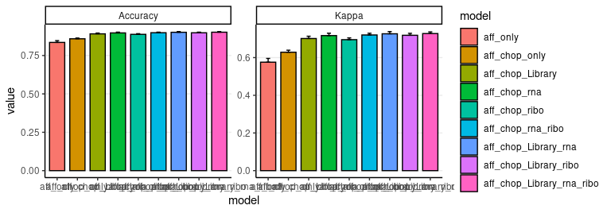
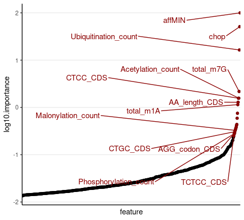
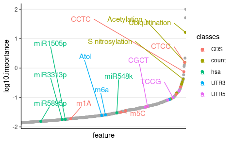
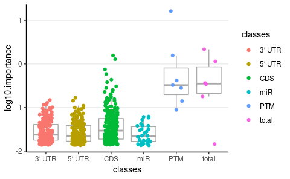

Check importance XGB models
================
Kaspar Bresser
04/03/2022

Applied the analyses below to examine the importance of the various
features to the XGBoost model. Will look at both models including the
feature library.

Import packages.

``` r
library(here)
library(caret)
library(xgboost)
library(tidytext)
library(ggpointdensity)
library(gghighlight)
library(ggrepel)
library(tidyverse)
```

Get file names of models using the feature library.

``` r
files <- list.files(here("XGB_models_final"), pattern = "aff")

files %>% 
  str_extract("\\|.*\\|") %>% 
  str_remove_all("\\|") -> names

files <- set_names(files, names)

files
```

    ##                                  aff_chop_Library_ribo 
    ##       "xgb_ligands|aff_chop_Library_ribo|23_12_21.RDS" 
    ##                              aff_chop_Library_rna_ribo 
    ## "xgb_ligands|aff_chop_Library_rna_ribo|24_04_2022.RDS" 
    ##                                   aff_chop_Library_rna 
    ##        "xgb_ligands|aff_chop_Library_rna|23_12_21.RDS" 
    ##                                       aff_chop_Library 
    ##            "xgb_ligands|aff_chop_Library|23_12_21.RDS" 
    ##                                          aff_chop_only 
    ##             "xgb_ligands|aff_chop_only|24_04_2022.RDS" 
    ##                                          aff_chop_ribo 
    ##             "xgb_ligands|aff_chop_ribo|24_04_2022.RDS" 
    ##                                      aff_chop_rna_ribo 
    ##         "xgb_ligands|aff_chop_rna_ribo|24_04_2022.RDS" 
    ##                                           aff_chop_rna 
    ##              "xgb_ligands|aff_chop_rna|24_04_2022.RDS" 
    ##                                               aff_only 
    ##                  "xgb_ligands|aff_only|24_04_2022.RDS"

Import the models

``` r
files %>% 
  map(~read_rds(here("XGB_models_final", .))) %>% 
  set_names(names) -> XGB.models

XGB.models
```

    ## $aff_chop_Library_ribo
    ## eXtreme Gradient Boosting 
    ## 
    ## No pre-processing
    ## Resampling: Cross-Validated (10 fold, repeated 2 times) 
    ## Summary of sample sizes: 45000, 45000, 45000, 45000, 45000, 45000, ... 
    ## Addtional sampling using down-sampling
    ## 
    ## Resampling results:
    ## 
    ##   Accuracy  Kappa    
    ##   0.89807   0.7183847
    ## 
    ## Tuning parameter 'nrounds' was held constant at a value of 1000
    ## 
    ## Tuning parameter 'min_child_weight' was held constant at a value of 0.9
    ## 
    ## Tuning parameter 'subsample' was held constant at a value of 1
    ## 
    ## $aff_chop_Library_rna_ribo
    ## eXtreme Gradient Boosting 
    ## 
    ## No pre-processing
    ## Resampling: Cross-Validated (10 fold, repeated 2 times) 
    ## Summary of sample sizes: 45000, 45000, 45000, 45000, 45000, 45000, ... 
    ## Addtional sampling using down-sampling
    ## 
    ## Resampling results:
    ## 
    ##   Accuracy  Kappa    
    ##   0.90184   0.7275291
    ## 
    ## Tuning parameter 'nrounds' was held constant at a value of 1000
    ## 
    ## Tuning parameter 'min_child_weight' was held constant at a value of 0.9
    ## 
    ## Tuning parameter 'subsample' was held constant at a value of 1
    ## 
    ## $aff_chop_Library_rna
    ## eXtreme Gradient Boosting 
    ## 
    ## No pre-processing
    ## Resampling: Cross-Validated (10 fold, repeated 2 times) 
    ## Summary of sample sizes: 45000, 45000, 45000, 45000, 45000, 45000, ... 
    ## Addtional sampling using down-sampling
    ## 
    ## Resampling results:
    ## 
    ##   Accuracy  Kappa    
    ##   0.90131   0.7262852
    ## 
    ## Tuning parameter 'nrounds' was held constant at a value of 1000
    ## 
    ## Tuning parameter 'min_child_weight' was held constant at a value of 0.9
    ## 
    ## Tuning parameter 'subsample' was held constant at a value of 1
    ## 
    ## $aff_chop_Library
    ## eXtreme Gradient Boosting 
    ## 
    ## No pre-processing
    ## Resampling: Cross-Validated (10 fold, repeated 2 times) 
    ## Summary of sample sizes: 45000, 45000, 45000, 45000, 45000, 45000, ... 
    ## Addtional sampling using down-sampling
    ## 
    ## Resampling results:
    ## 
    ##   Accuracy  Kappa    
    ##   0.89114   0.7012391
    ## 
    ## Tuning parameter 'nrounds' was held constant at a value of 1000
    ## 
    ## Tuning parameter 'min_child_weight' was held constant at a value of 0.9
    ## 
    ## Tuning parameter 'subsample' was held constant at a value of 1
    ## 
    ## $aff_chop_only
    ## eXtreme Gradient Boosting 
    ## 
    ## No pre-processing
    ## Resampling: Cross-Validated (10 fold, repeated 2 times) 
    ## Summary of sample sizes: 45000, 45000, 45000, 45000, 45000, 45000, ... 
    ## Addtional sampling using down-sampling
    ## 
    ## Resampling results:
    ## 
    ##   Accuracy  Kappa    
    ##   0.85906   0.6285168
    ## 
    ## Tuning parameter 'nrounds' was held constant at a value of 1000
    ## 
    ## Tuning parameter 'min_child_weight' was held constant at a value of 0.9
    ## 
    ## Tuning parameter 'subsample' was held constant at a value of 1
    ## 
    ## $aff_chop_ribo
    ## eXtreme Gradient Boosting 
    ## 
    ## No pre-processing
    ## Resampling: Cross-Validated (10 fold, repeated 2 times) 
    ## Summary of sample sizes: 45000, 45000, 45000, 45000, 45000, 45000, ... 
    ## Addtional sampling using down-sampling
    ## 
    ## Resampling results:
    ## 
    ##   Accuracy  Kappa    
    ##   0.88788   0.6951733
    ## 
    ## Tuning parameter 'nrounds' was held constant at a value of 1000
    ## 
    ## Tuning parameter 'min_child_weight' was held constant at a value of 0.9
    ## 
    ## Tuning parameter 'subsample' was held constant at a value of 1
    ## 
    ## $aff_chop_rna_ribo
    ## eXtreme Gradient Boosting 
    ## 
    ## No pre-processing
    ## Resampling: Cross-Validated (10 fold, repeated 2 times) 
    ## Summary of sample sizes: 45000, 45000, 45000, 45000, 45000, 45000, ... 
    ## Addtional sampling using down-sampling
    ## 
    ## Resampling results:
    ## 
    ##   Accuracy  Kappa    
    ##   0.8985    0.7200657
    ## 
    ## Tuning parameter 'nrounds' was held constant at a value of 1000
    ## 
    ## Tuning parameter 'min_child_weight' was held constant at a value of 0.9
    ## 
    ## Tuning parameter 'subsample' was held constant at a value of 1
    ## 
    ## $aff_chop_rna
    ## eXtreme Gradient Boosting 
    ## 
    ## No pre-processing
    ## Resampling: Cross-Validated (10 fold, repeated 2 times) 
    ## Summary of sample sizes: 45000, 45000, 45000, 45000, 45000, 45000, ... 
    ## Addtional sampling using down-sampling
    ## 
    ## Resampling results:
    ## 
    ##   Accuracy  Kappa    
    ##   0.89723   0.7168193
    ## 
    ## Tuning parameter 'nrounds' was held constant at a value of 1000
    ## 
    ## Tuning parameter 'min_child_weight' was held constant at a value of 0.9
    ## 
    ## Tuning parameter 'subsample' was held constant at a value of 1
    ## 
    ## $aff_only
    ## eXtreme Gradient Boosting 
    ## 
    ## No pre-processing
    ## Resampling: Cross-Validated (10 fold, repeated 2 times) 
    ## Summary of sample sizes: 45000, 45000, 45000, 45000, 45000, 45000, ... 
    ## Addtional sampling using down-sampling
    ## 
    ## Resampling results:
    ## 
    ##   Accuracy  Kappa    
    ##   0.83528   0.5756165
    ## 
    ## Tuning parameter 'nrounds' was held constant at a value of 1000
    ## 
    ## Tuning parameter 'min_child_weight' was held constant at a value of 0.9
    ## 
    ## Tuning parameter 'subsample' was held constant at a value of 1

Plot the model metrics.

``` r
XGB.models %>% 
  map( "results") %>% 
  reduce(bind_rows) %>% 
  mutate(model = names) -> model.metrics 

model.metrics
```

    ##   nrounds max_depth colsample_bytree eta gamma min_child_weight subsample
    ## 1    1000         1              0.5 0.3     1              0.9         1
    ## 2    1000         1              0.5 0.3     1              0.9         1
    ## 3    1000         1              0.5 0.3     1              0.9         1
    ## 4    1000         1              0.5 0.3     1              0.9         1
    ## 5    1000         1              0.5 0.3     1              0.9         1
    ## 6    1000         1              0.5 0.3     1              0.9         1
    ## 7    1000         1              0.5 0.3     1              0.9         1
    ## 8    1000         1              0.5 0.3     1              0.9         1
    ## 9    1000         1              0.5 0.3     1              0.9         1
    ##   Accuracy     Kappa  AccuracySD     KappaSD                     model
    ## 1  0.89807 0.7183847 0.004244265 0.010575609     aff_chop_Library_ribo
    ## 2  0.90184 0.7275291 0.003802824 0.009027188 aff_chop_Library_rna_ribo
    ## 3  0.90131 0.7262852 0.004526170 0.011685404      aff_chop_Library_rna
    ## 4  0.89114 0.7012391 0.005247195 0.012150339          aff_chop_Library
    ## 5  0.85906 0.6285168 0.004821924 0.010687117             aff_chop_only
    ## 6  0.88788 0.6951733 0.004441147 0.009309694             aff_chop_ribo
    ## 7  0.89850 0.7200657 0.003628252 0.009093650         aff_chop_rna_ribo
    ## 8  0.89723 0.7168193 0.005083420 0.012442311              aff_chop_rna
    ## 9  0.83528 0.5756165 0.011669556 0.020063321                  aff_only

``` r
model.metrics %>% 
  pivot_longer(8:11, names_to = "metric", values_to = "value") %>%
  mutate(which = case_when(str_detect(metric, "SD") ~ "SD",
                           TRUE ~ "value"),
         metric = str_remove(metric, "SD")) %>% 
  pivot_wider(names_from = which, values_from = "value") -> to.plot

to.plot
```

    ## # A tibble: 18 × 11
    ##    nrounds max_depth colsample_bytree   eta gamma min_child_weight subsample
    ##      <dbl>     <dbl>            <dbl> <dbl> <dbl>            <dbl>     <dbl>
    ##  1    1000         1              0.5   0.3     1              0.9         1
    ##  2    1000         1              0.5   0.3     1              0.9         1
    ##  3    1000         1              0.5   0.3     1              0.9         1
    ##  4    1000         1              0.5   0.3     1              0.9         1
    ##  5    1000         1              0.5   0.3     1              0.9         1
    ##  6    1000         1              0.5   0.3     1              0.9         1
    ##  7    1000         1              0.5   0.3     1              0.9         1
    ##  8    1000         1              0.5   0.3     1              0.9         1
    ##  9    1000         1              0.5   0.3     1              0.9         1
    ## 10    1000         1              0.5   0.3     1              0.9         1
    ## 11    1000         1              0.5   0.3     1              0.9         1
    ## 12    1000         1              0.5   0.3     1              0.9         1
    ## 13    1000         1              0.5   0.3     1              0.9         1
    ## 14    1000         1              0.5   0.3     1              0.9         1
    ## 15    1000         1              0.5   0.3     1              0.9         1
    ## 16    1000         1              0.5   0.3     1              0.9         1
    ## 17    1000         1              0.5   0.3     1              0.9         1
    ## 18    1000         1              0.5   0.3     1              0.9         1
    ## # … with 4 more variables: model <chr>, metric <chr>, value <dbl>, SD <dbl>

``` r
model.order <- c("aff_only", "aff_chop_only", "aff_chop_Library", "aff_chop_rna", 
                 "aff_chop_ribo", "aff_chop_rna_ribo", "aff_chop_Library_rna", "aff_chop_Library_ribo",
                 "aff_chop_Library_rna_ribo")

to.plot %>% 
  mutate(model = as_factor(model),
         model = fct_relevel(model, model.order)) -> to.plot
```

``` r
ggplot(to.plot, aes(x=model, y=value, fill=model)) + 
  geom_bar(stat="identity", color="black", position=position_dodge(), width = .75) +
  geom_errorbar(aes(ymin=value, ymax=value+SD), width=.2,
                 position=position_dodge(.9))+
  facet_wrap(~metric, scales = "free_y", nrow = 1)+
  theme_classic()+
  theme(panel.grid.major.y = element_line())
```



``` r
ggsave(here("Figs", "XGB_model_metrics.pdf"), width = 90, height = 40, units = "mm", scale = 4)
```

Get the importance scores for the library model.

``` r
importance.scores <- varImp(XGB.models[["aff_chop_Library"]] )


importance.scores$importance %>% 
  as_tibble(rownames = "feature") %>% 
  dplyr::filter(Overall != 0) %>% 
  mutate(log10.importance = log10(Overall)) -> importance.scores
```

Plot the scores, and highlight the top 20.

``` r
importance.scores %>% 
  mutate(feature = reorder(feature, log10.importance)) %>% 
ggplot(aes(x = feature, y = log10.importance, label = feature))+
    geom_point()+
    theme_classic()+
    geom_point(data = slice_max(importance.scores, log10.importance, n = 20 ), color = "darkred")+
    geom_text_repel(data = slice_max(importance.scores, log10.importance, n = 20 ), 
                    box.padding = 1.4, max.overlaps = 25, color = "darkred", size = 4)+
    theme(axis.text.x=element_blank(),
          axis.ticks.x=element_blank(), panel.grid.major.y = element_line())
```

    ## Warning: ggrepel: 7 unlabeled data points (too many overlaps). Consider
    ## increasing max.overlaps



``` r
ggsave(here("Figs", "XGB_importance_pointlabel.pdf"), width = 75, height = 40, units = "mm", scale = 4)
```

Get the importance scores from the randomforest model, and select the
top 20 of each class.

``` r
read_rds(here("Output", "RF_per_tumor_new.rds")) %>% 
  mutate(importance = map(rf.models, varImp),
         importance = map(importance, "importance"),
         importance = map(importance, as_tibble, rownames = "feature")) %>% 
  select(tumor, classes, importance) %>% 
  unnest(importance ) %>% 
  select(-no) %>% 
  rename(importance = yes) -> rf.importance.table

rf.importance.table %>% 
  group_by(classes, feature) %>% 
  summarise(score = sum(importance)) %>% 
  slice_max(score, n = 20) -> top.important
```

Reformat, and plot, highlighting the features that were in the top 20 of
the randomforest models.

``` r
importance.scores %>% 
  left_join(top.important) %>% 
  mutate(classes = replace_na(classes, "none"),
         feature.label = str_remove_all(feature, "UTR5|UTR3|CDS|count|hsa|\\."),
         feature.label = str_replace_all(feature.label, "_", " "),
         feature = reorder(feature, log10.importance)) -> to.plot

to.plot
```

    ## # A tibble: 666 × 6
    ##    feature              Overall log10.importance classes score feature.label    
    ##    <fct>                  <dbl>            <dbl> <chr>   <dbl> <chr>            
    ##  1 affMIN               100               2      none     NA   "affMIN"         
    ##  2 chop                  51.1             1.71   none     NA   "chop"           
    ##  3 Ubiquitination_count  16.4             1.22   count   300   "Ubiquitination "
    ##  4 total_m7G              2.17            0.337  none     NA   "total m7G"      
    ##  5 Acetylation_count      1.57            0.195  count   120.  "Acetylation "   
    ##  6 CTCC_CDS               1.56            0.194  CDS     102.  "CTCC "          
    ##  7 AA_length_CDS          1.29            0.110  none     NA   "AA length "     
    ##  8 total_m1A              1.14            0.0587 none     NA   "total m1A"      
    ##  9 CCTC_CDS               0.752          -0.124  CDS      92.7 "CCTC "          
    ## 10 CTTC_CDS               0.591          -0.229  none     NA   "CTTC "          
    ## # … with 656 more rows

``` r
ggplot(to.plot, aes(x = feature, y = log10.importance, label = feature.label))+
  geom_point(size = NA)+
  geom_point(data = to.plot %>% filter(classes == "none"), color = "darkgrey")+
  geom_point(data = to.plot %>% filter(classes != "none"), aes(color = classes))+
  geom_text_repel(data = to.plot %>% filter(classes != "none"), aes(color = classes), 
                    box.padding = 1.4, max.overlaps = 25, size = 4)+
  theme_classic()+
  theme(axis.text.x=element_blank(),
        axis.ticks.x=element_blank(),
        panel.grid.major.y = element_line())
```

    ## Warning: Removed 666 rows containing missing values (geom_point).

    ## Warning: ggrepel: 12 unlabeled data points (too many overlaps). Consider
    ## increasing max.overlaps



``` r
ggsave(here("Figs", "XGB_importance_classes.pdf"), width = 90, height = 55, units = "mm", scale = 4)      
```

    ## Warning: Removed 666 rows containing missing values (geom_point).

Make a boxplot comparing the importance of the different classes of
features.

``` r
importance.scores %>% 
  filter(!(feature %in% c("affMIN", "chop"))) %>% 
    mutate(classes = case_when(str_detect(feature, "UTR5") ~ "5' UTR",
                                  str_detect(feature, "UTR3") ~ "3' UTR",
                                  str_detect(feature, "count") ~ "PTM",
                                  str_detect(feature, "CDS") ~ "CDS",
                                  str_detect(feature, "hsa") ~ "miR",
                                  TRUE ~ "total")) %>% 
  mutate(feature = reorder(feature, log10.importance)) -> to.plot


ggplot(to.plot, aes(x = classes, y = log10.importance, color = classes))+
  geom_boxplot(color = "darkgrey", outlier.shape = NA)+
  geom_jitter(width = .2)+
  theme_classic()+
  theme(panel.grid.major.y = element_line())
```



``` r
ggsave(here("Figs", "XGB_importance_classes_compared.pdf"), width = 70, height = 55, units = "mm", scale = 4)  
```
