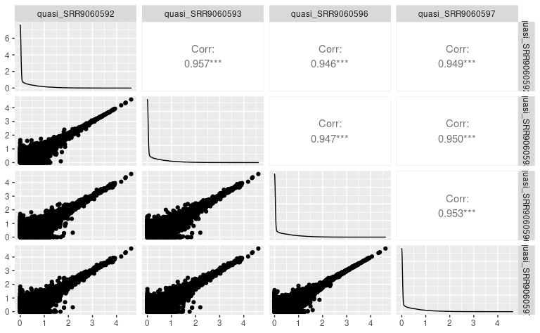

Generate peptide database
================
Kaspar Bresser
22/12/2021

-   [Get RNA expression](#get-rna-expression)
-   [Import ligands](#import-ligands)
-   [Select decoys](#select-decoys)

``` r
library(here)
library(babelgene)
library(seqinr)
library(tidyverse)
library(GGally)
library(readxl)
library(Biostrings)
```

## Get RNA expression

We’ll first want to check which genes are expressed by the cell line
that was used in the manuscript. Analyzed 4 RNAseq samples that were
deposited by the authors. Start with reading in the tables.

``` r
folders <- list.files(here("Broad_Data", "RNAseq"), pattern = "^quasi_")

salmon.results <- tibble(salmon = map(here("Broad_Data", "RNAseq", folders, "quant.sf"), read_tsv),
                         sample = folders)

salmon.results
```

    ## # A tibble: 4 × 2
    ##   salmon                     sample          
    ##   <list>                     <chr>           
    ## 1 <spec_tbl_df [95,309 × 5]> quasi_SRR9060592
    ## 2 <spec_tbl_df [95,309 × 5]> quasi_SRR9060593
    ## 3 <spec_tbl_df [95,309 × 5]> quasi_SRR9060596
    ## 4 <spec_tbl_df [95,309 × 5]> quasi_SRR9060597

Check correlation between the samples using `GGally::ggpairs`.

``` r
salmon.results %>% 
  unnest(salmon) %>% 
  mutate(TPM = log10(TPM+1)) %>% 
  pivot_wider(id_cols = Name, names_from = sample, values_from = TPM) %>% 
  ggpairs(columns = 2:5)
```



Consistency between samples looks good. Calculate mean values.

``` r
salmon.results %>% 
  unnest(salmon) %>%
  group_by(Name) %>% 
  summarise(TPM = mean(TPM)) %>% 
  transmute(ensembl_id = str_remove_all(Name, "\\.\\d+"), TPM = TPM) -> rna.expression

rna.expression
```

    ## # A tibble: 95,309 × 2
    ##    ensembl_id                                                                TPM
    ##    <chr>                                                                   <dbl>
    ##  1 ENST00000000233|ENSG00000004059|OTTHUMG00000023246|OTTHUMT0000005956… 123.   
    ##  2 ENST00000000412|ENSG00000003056|OTTHUMG00000168276|OTTHUMT0000039913…  71.8  
    ##  3 ENST00000000442|ENSG00000173153|OTTHUMG00000150641|OTTHUMT0000031930…   0.793
    ##  4 ENST00000001008|ENSG00000004478|OTTHUMG00000090429|OTTHUMT0000020686…  84.7  
    ##  5 ENST00000001146|ENSG00000003137|OTTHUMG00000129756|OTTHUMT0000025196…   0    
    ##  6 ENST00000002125|ENSG00000003509|OTTHUMG00000128468|OTTHUMT0000025026…  17.1  
    ##  7 ENST00000002165|ENSG00000001036|OTTHUMG00000015728|OTTHUMT0000004252…  38.1  
    ##  8 ENST00000002501|ENSG00000003249|OTTHUMG00000138984|OTTHUMT0000027287…   0    
    ##  9 ENST00000002596|ENSG00000002587|OTTHUMG00000090547|OTTHUMT0000020707…   0.244
    ## 10 ENST00000002829|ENSG00000001617|OTTHUMG00000156806|OTTHUMT0000034592…   0    
    ## # … with 95,299 more rows

Check the amount of expressed genes

``` r
table(rna.expression$TPM > 0)
```

    ## 
    ## FALSE  TRUE 
    ## 32308 63001

Read conversion table, which contains Ensemble transcript and gene IDs,
and swissprot IDs.

``` r
conversion.table <- na.omit(read_tsv(here("Broad_Data", "HLA_peptidomics", "conversion.txt")))

conversion.table
```

    ## # A tibble: 46,100 × 3
    ##    `Ensembl Gene ID` `Ensembl Transcript ID` `UniProt/SwissProt Accession`
    ##    <chr>             <chr>                   <chr>                        
    ##  1 ENSG00000261530   ENST00000566356         P35070                       
    ##  2 ENSG00000260334   ENST00000561776         P01350                       
    ##  3 ENSG00000261125   ENST00000562865         P54257                       
    ##  4 ENSG00000261125   ENST00000568643         P54257                       
    ##  5 ENSG00000261125   ENST00000568276         P54257                       
    ##  6 ENSG00000261125   ENST00000568474         P54257                       
    ##  7 ENSG00000261577   ENST00000565220         P14923                       
    ##  8 ENSG00000261577   ENST00000562805         P14923                       
    ##  9 ENSG00000261577   ENST00000565780         P14923                       
    ## 10 ENSG00000261258   ENST00000568842         Q96AY3                       
    ## # … with 46,090 more rows

Extract the transcript ID from the ensembl_id column, join with the
conversion table,

``` r
rna.expression %>% 
  transmute(`Ensembl Transcript ID` = str_extract(ensembl_id, "ENST\\d+"), TPM = TPM) %>% 
  left_join(conversion.table) %>% 
  mutate(ensembl_id = `Ensembl Gene ID`, swissprot_id = `UniProt/SwissProt Accession`) %>% 
  group_by(ensembl_id) %>% 
  summarise(TPM = sum(TPM), swissprot_id = unique(swissprot_id)) -> rna.expression

write_tsv(rna.expression, here("Broad_Data", "RNAseq", "averaged_TPM_values_salmon.tsv"))
```

And extract the expressed protein identifiers.

``` r
rna.expression %>% 
  filter(TPM > 0) %>% 
  pull(swissprot_id) -> expressed.ids

head(expressed.ids, 15)
```

    ##  [1] "O43657" "O60762" "Q8IZE3" "Q9NSG2" "P09769" "P08603" "Q9BTY2" "P48506"
    ##  [9] "P23511" "Q6P499" "Q9Y4W2" "Q9Y6X5" "P13569" "Q9P2G1" "Q16850"

## Import ligands

``` r
excel_sheets(here("Broad_Data", "HLA_peptidomics", "41587_2019_322_MOESM3_ESM.xlsx"))
```

    ##  [1] "Sheet1" "A0101"  "A0201"  "A0202"  "A0203"  "A0204"  "A0205"  "A0206" 
    ##  [9] "A0207"  "A0211"  "A0301"  "A1101"  "A1102"  "A2301"  "A2402"  "A2407" 
    ## [17] "A2501"  "A2601"  "A2902"  "A3001"  "A3002"  "A3101"  "A3201"  "A3301" 
    ## [25] "A3303"  "A3401"  "A3402"  "A3601"  "A6601"  "A6801"  "A6802"  "A7401" 
    ## [33] "B0702"  "B0704"  "B0801"  "B1301"  "B1302"  "B1402"  "B1501"  "B1502" 
    ## [41] "B1503"  "B1510"  "B1517"  "B1801"  "B2705"  "B3501"  "B3503"  "B3507" 
    ## [49] "B3701"  "B3801"  "B3802"  "B4001"  "B4002"  "B4006"  "B4201"  "B4402" 
    ## [57] "B4403"  "B4501"  "B4601"  "B4901"  "B5001"  "B5101"  "B5201"  "B5301" 
    ## [65] "B5401"  "B5501"  "B5502"  "B5601"  "B5701"  "B5703"  "B5801"  "B5802" 
    ## [73] "C0102"  "C0202"  "C0302"  "C0303"  "C0304"  "C0401"  "C0403"  "C0501" 
    ## [81] "C0602"  "C0701"  "C0702"  "C0704"  "C0801"  "C0802"  "C1202"  "C1203" 
    ## [89] "C1402"  "C1403"  "C1502"  "C1601"  "C1701"  "G0101"  "G0103"  "G0104"

``` r
#alleles <- excel_sheets(here("Broad_Data", "HLA_peptidomics", "41587_2019_322_MOESM3_ESM.xlsx"))[-1]
alleles <- c("A2402", "A0201", "B3501", "B5101", "A1101", "A3101", "B4001", "B0702")
excel.file <- here("Broad_Data", "HLA_peptidomics", "41587_2019_322_MOESM3_ESM.xlsx")

tibble(data = map(alleles, ~read_excel(excel.file, sheet = . )), allele = alleles) %>% 
  mutate(data = map(data, ~select(., sequence, hg19.kgXref.geneSymbol))) -> broad.HLA.data
  
broad.HLA.data
```

    ## # A tibble: 8 × 2
    ##   data                 allele
    ##   <list>               <chr> 
    ## 1 <tibble [2,428 × 2]> A2402 
    ## 2 <tibble [3,485 × 2]> A0201 
    ## 3 <tibble [1,113 × 2]> B3501 
    ## 4 <tibble [1,875 × 2]> B5101 
    ## 5 <tibble [5,550 × 2]> A1101 
    ## 6 <tibble [1,506 × 2]> A3101 
    ## 7 <tibble [3,429 × 2]> B4001 
    ## 8 <tibble [1,903 × 2]> B0702

Tidy up, and add peptide lengths.

``` r
broad.HLA.data %>% 
  unnest(data) %>% 
  mutate(pep_length = str_length(sequence)) %>% 
  dplyr::rename(gene.symbol = "hg19.kgXref.geneSymbol") -> broad.HLA.data

broad.HLA.data
```

    ## # A tibble: 21,289 × 4
    ##    sequence     gene.symbol allele pep_length
    ##    <chr>        <chr>       <chr>       <int>
    ##  1 AFFEGPPFKFKF WDR1        A2402          12
    ##  2 AFFGDVVLRF   CCDC134     A2402          10
    ##  3 AFHPTAQLL    AMBRA1      A2402           9
    ##  4 AFIEKHWTF    CSRP2BP     A2402           9
    ##  5 AFIQKSNLI    ZNF146      A2402           9
    ##  6 AFLDKQNQVKF  ITGA4       A2402          11
    ##  7 AFLEINRQLLF  EID2B       A2402          11
    ##  8 AFLKVSSVF    RANGAP1     A2402           9
    ##  9 AFLYNDQLIW   CCZ1        A2402          10
    ## 10 AFMVNGQKF    PRC1        A2402           9
    ## # … with 21,279 more rows

Check the amount of 9mers for each allele.

``` r
broad.HLA.data %>% 
  filter(pep_length == 9) %>% 
  dplyr::count(allele) %>% 
  arrange(desc(n))
```

    ## # A tibble: 8 × 2
    ##   allele     n
    ##   <chr>  <int>
    ## 1 A0201   2196
    ## 2 A1101   2177
    ## 3 A2402   1556
    ## 4 B4001   1474
    ## 5 B0702   1100
    ## 6 B5101    981
    ## 7 B3501    547
    ## 8 A3101    483

Broad data uses gene symbols, expand the conversion table to include
those.

``` r
babelgene::orthologs(genes = na.omit(broad.HLA.data)$gene.symbol, species = "mouse", top = T) %>% 
  transmute(gene.symbol = human_symbol, ensemble_id =  human_ensembl) %>% 
  full_join(conversion.table, by = c("ensemble_id" = "Ensembl Gene ID")) %>% 
  as_tibble() -> conversion.table

conversion.table
```

    ## # A tibble: 46,466 × 4
    ##    gene.symbol ensemble_id     `Ensembl Transcript ID` `UniProt/SwissProt Acces…
    ##    <chr>       <chr>           <chr>                   <chr>                    
    ##  1 A2M         ENSG00000175899 ENST00000318602         P01023                   
    ##  2 AAAS        ENSG00000094914 ENST00000209873         Q9NRG9                   
    ##  3 AAAS        ENSG00000094914 ENST00000394384         Q9NRG9                   
    ##  4 AACS        ENSG00000081760 ENST00000316519         Q86V21                   
    ##  5 AACS        ENSG00000081760 ENST00000316543         Q86V21                   
    ##  6 AACS        ENSG00000081760 ENST00000261686         Q86V21                   
    ##  7 AAGAB       ENSG00000103591 ENST00000261880         Q6PD74                   
    ##  8 AAK1        ENSG00000115977 ENST00000409085         Q2M2I8                   
    ##  9 AAK1        ENSG00000115977 ENST00000406297         Q2M2I8                   
    ## 10 AAMP        ENSG00000127837 ENST00000248450         Q13685                   
    ## # … with 46,456 more rows

Select the alleles that have the largest amount of data, and filter on
9mers.

``` r
broad.HLA.data %>% 
  filter(pep_length == 9) %>% 
  mutate(sequence = str_to_upper(sequence)) %>% 
  inner_join(conversion.table, na_matches = "never") %>% 
  distinct(sequence, .keep_all = T) %>% 
  transmute(sequence = sequence, swissprot_id = `UniProt/SwissProt Accession`, allele = allele, ensembl_id = ensemble_id) -> fitered.peptides

fitered.peptides
```

    ## # A tibble: 9,196 × 4
    ##    sequence  swissprot_id allele ensembl_id     
    ##    <chr>     <chr>        <chr>  <chr>          
    ##  1 AFHPTAQLL Q9C0C7       A2402  ENSG00000110497
    ##  2 AFIQKSNLI Q15072       A2402  ENSG00000167635
    ##  3 AFLKVSSVF P46060       A2402  ENSG00000100401
    ##  4 AFMVNGQKF O43663       A2402  ENSG00000198901
    ##  5 ALPAAFHTW A8K8P3       A2402  ENSG00000198089
    ##  6 ALPEIFTEL P41091       A2402  ENSG00000130741
    ##  7 ALPKELPLI Q8N344       A2402  ENSG00000105556
    ##  8 ALPSKLPTF Q14258       A2402  ENSG00000121060
    ##  9 ALPSKVPAF P17036       A2402  ENSG00000166526
    ## 10 ALPYFWEHF P26641       A2402  ENSG00000254772
    ## # … with 9,186 more rows

``` r
write_tsv(fitered.peptides, here("Output", "Broad_peptides.tsv"))
```

Subsample the peptide pools to get a more workable number, 350 is
slightly under the smallest allele-set. Make sure they are expressed and
in the library.

``` r
here( "Protein_per_Uniprot_entry_library_v2_RBP_GC_length_codon_AA_m6A_m5C_AtoI_m1A_m7G_CD8miRDB_PTM.csv") %>% 
  read_tsv() %>% 
  pull(Entry) -> IDs.in.library

fitered.peptides %>% 
  filter(swissprot_id %in% expressed.ids) %>% 
  filter(swissprot_id %in% IDs.in.library) %>% 
  group_by(allele) %>% 
  slice_sample(n = 350) %>% 
  ungroup() -> fitered.peptides

fitered.peptides
```

    ## # A tibble: 2,800 × 4
    ##    sequence  swissprot_id allele ensembl_id     
    ##    <chr>     <chr>        <chr>  <chr>          
    ##  1 ILAKEVEIV Q6P2E9       A0201  ENSG00000038358
    ##  2 RLLEGVNQL Q10570       A0201  ENSG00000071894
    ##  3 NQFPGFKEV P09012       A0201  ENSG00000077312
    ##  4 TMLSLEFHL Q9NUX5       A0201  ENSG00000128513
    ##  5 GLAKLIADV P39748       A0201  ENSG00000168496
    ##  6 SIAEVVHQL O14976       A0201  ENSG00000178950
    ##  7 FLYAGHIFL Q66K64       A0201  ENSG00000132017
    ##  8 KLQDQIFNL O43665       A0201  ENSG00000148908
    ##  9 KMLGLTVSL Q9Y3E5       A0201  ENSG00000141378
    ## 10 VLLSEILHL O43432       A0201  ENSG00000075151
    ## # … with 2,790 more rows

``` r
write_tsv(fitered.peptides, here("Output", "Broad_peptides_subsample.tsv"))
```

## Select decoys

Import UniProt sequences and filter on expressed genes

``` r
uniprot <- read_csv(here("Broad_Data", "HLA_peptidomics", "UniProt_reviewed_input.tsv"))

(uniprot <- filter(uniprot, sequence_id %in% expressed.ids))
```

    ## # A tibble: 14,854 × 2
    ##    sequence_id sequence                                                         
    ##    <chr>       <chr>                                                            
    ##  1 Q8TBF5      MAARVAAVRAAAWLLLGAATGLTRGPAAAFTAARSDAGIRAMCSEIILRQEVLKDGFHRDLLIK…
    ##  2 Q8TBF4      MSGGLAPSKSTVYVSNLPFSLTNNDLYRIFSKYGKVVKVTIMKDKDTRKSKGVAFILFLDKDSA…
    ##  3 O60507      MVGKLKQNLLLACLVISSVTVFYLGQHAMECHHRIEERSQPVKLESTRTTVRTGLDLKANKTFA…
    ##  4 Q8WUP2      MASKPEKRVASSVFITLAPPRRDVAVAEEVRQAVCEARRGRPWEAPAPMKTPEAGLAGRPSPWT…
    ##  5 Q9NVL8      MGLSHSKTHLRVIKVAPLQNKEVETPSAGRVDFAFNQNLEEKTSYSLARLQDQNKALEGQLPPL…
    ##  6 Q8IZF5      MVCSAAPLLLLATTLPLLGSPVAQASQPVSETGVRPREGLQRRQWGPLIGRDKAWNERIDRPFP…
    ##  7 P30613      MSIQENISSLQLRSWVSKSQRDLAKSILIGAPGGPAGYLRRASVAQLTQELGTAFFQQQQLPAA…
    ##  8 O75326      MTPPPPGRAAPSAPRARVPGPPARLGLPLRLRLLLLLWAAAASAQGHLRSGPRIFAVWKGHVGQ…
    ##  9 Q9NVL1      MAPEENAGSELLLQSFKRRFLAARALRSFRWQSLEAKLRDSSDSELLRDILQKHEAVHTEPLDE…
    ## 10 P20933      MARKSNLPVLLVPFLLCQALVRCSSPLPLVVNTWPFKNATEAAWRALASGGSALDAVESGCAMC…
    ## # … with 14,844 more rows

`tibble::deframe` into a a named character vector, and then create a
`Biostrings::AAStringSet`, which can be written as a fasta file using
`Biostrings::writeXStringSet`.

``` r
uniprot %>% 
  deframe() %>% 
  AAStringSet(use.names = T) %>% 
  writeXStringSet(filepath = here("Broad_Data", "HLA_peptidomics", "expressed_proteins.fasta"))
```
