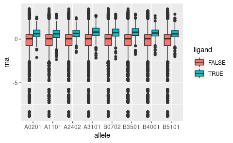

Generate test set for XGB models
================
Kaspar Bresser
12/01/2021

``` r
library(here)
library(tidyverse)
```

First, import the ligands that we’ll use as positive cases.

``` r
(ligand.table <- read_tsv(here("Output", "Broad_peptides_subsample.tsv")))
```

    ## # A tibble: 2,800 × 4
    ##    sequence  swissprot_id allele ensembl_id     
    ##    <chr>     <chr>        <chr>  <chr>          
    ##  1 ILAKEVEIV Q6P2E9       A0201  ENSG00000038358
    ##  2 RLLEGVNQL Q10570       A0201  ENSG00000071894
    ##  3 NQFPGFKEV P09012       A0201  ENSG00000077312
    ##  4 TMLSLEFHL Q9NUX5       A0201  ENSG00000128513
    ##  5 GLAKLIADV P39748       A0201  ENSG00000168496
    ##  6 SIAEVVHQL O14976       A0201  ENSG00000178950
    ##  7 FLYAGHIFL Q66K64       A0201  ENSG00000132017
    ##  8 KLQDQIFNL O43665       A0201  ENSG00000148908
    ##  9 KMLGLTVSL Q9Y3E5       A0201  ENSG00000141378
    ## 10 VLLSEILHL O43432       A0201  ENSG00000075151
    ## # … with 2,790 more rows

Import the swissprot IDs that are in the feature library

``` r
here( "Protein_per_Uniprot_entry_library_v2_RBP_GC_length_codon_AA_m6A_m5C_AtoI_m1A_m7G_CD8miRDB_PTM.csv") %>% 
  read_tsv() %>% 
  pull(Entry) -> IDs.in.library
```

Next, define a function that will take the netMHCpan output table for a
given allele, plus the allele name. This function will read the file,
add the allele name as a column, annotate which peptides are positive
cases, and finally subset the dataset to 350 positive and 350,000
negative cases.

``` r
import_peptides <- function(file, al){

  
  ligand.table %>% 
    filter(allele == al) %>% 
    pull(sequence) -> detected.ligands
  
  file %>% 
    read_tsv(skip = 1) %>% 
    filter(ID %in% IDs.in.library) %>% 
    mutate(allele = al) %>% 
    select( c("Peptide", "ID", "Rank", "allele")) %>% 
    mutate(ligand = case_when(Peptide %in% detected.ligands ~ TRUE,
                              TRUE ~ FALSE)) %>% 
    group_by(ligand) %>% 
    nest() %>% 
    ungroup() %>% 
    mutate(data = map2(data, c(350000, 350), sample_n)) %>% 
    unnest(data)
      
}
```

Now, get the the files, set the alleles as names, apply the
`import_peptides` function and row bind the output into a single table.

``` r
file.names <- list.files(here("Broad_Data", "HLA_peptidomics", "netMHCpan"), pattern = "broad")

file.names %>% 
  here("Broad_Data", "HLA_peptidomics", "netMHCpan", .) %>% 
  set_names(str_remove(file.names, "_broad.txt")) -> files

files
```

    ##                                                                                                                          A0201 
    ## "/DATA/users/k.bresser/ligandome_project/analysis_new/Ligandome_external/Broad_Data/HLA_peptidomics/netMHCpan/A0201_broad.txt" 
    ##                                                                                                                          A1101 
    ## "/DATA/users/k.bresser/ligandome_project/analysis_new/Ligandome_external/Broad_Data/HLA_peptidomics/netMHCpan/A1101_broad.txt" 
    ##                                                                                                                          A2402 
    ## "/DATA/users/k.bresser/ligandome_project/analysis_new/Ligandome_external/Broad_Data/HLA_peptidomics/netMHCpan/A2402_broad.txt" 
    ##                                                                                                                          A3101 
    ## "/DATA/users/k.bresser/ligandome_project/analysis_new/Ligandome_external/Broad_Data/HLA_peptidomics/netMHCpan/A3101_broad.txt" 
    ##                                                                                                                          B0702 
    ## "/DATA/users/k.bresser/ligandome_project/analysis_new/Ligandome_external/Broad_Data/HLA_peptidomics/netMHCpan/B0702_broad.txt" 
    ##                                                                                                                          B3501 
    ## "/DATA/users/k.bresser/ligandome_project/analysis_new/Ligandome_external/Broad_Data/HLA_peptidomics/netMHCpan/B3501_broad.txt" 
    ##                                                                                                                          B4001 
    ## "/DATA/users/k.bresser/ligandome_project/analysis_new/Ligandome_external/Broad_Data/HLA_peptidomics/netMHCpan/B4001_broad.txt" 
    ##                                                                                                                          B5101 
    ## "/DATA/users/k.bresser/ligandome_project/analysis_new/Ligandome_external/Broad_Data/HLA_peptidomics/netMHCpan/B5101_broad.txt"

``` r
files %>% 
  map2(., names(.), import_peptides) %>% 
  purrr::reduce(bind_rows) -> test.table

test.table
```

    ## # A tibble: 2,802,800 × 5
    ##    ligand Peptide   ID      Rank allele
    ##    <lgl>  <chr>     <chr>  <dbl> <chr> 
    ##  1 FALSE  EAESWARDK Q9H254    85 A0201 
    ##  2 FALSE  KTCYICDEQ P55197    45 A0201 
    ##  3 FALSE  INRFEITLS P20936    70 A0201 
    ##  4 FALSE  DIISHLQFL Q8TCD6     9 A0201 
    ##  5 FALSE  LLVRKWRVK Q9BVM2    33 A0201 
    ##  6 FALSE  SGCLLVTDM Q86TB3    35 A0201 
    ##  7 FALSE  YACVLESHL Q9NSN8    12 A0201 
    ##  8 FALSE  ETVGGISPG Q01094    46 A0201 
    ##  9 FALSE  PGEQLDHQT Q86V87   100 A0201 
    ## 10 FALSE  DTVGTMMTC P52789    25 A0201 
    ## # … with 2,802,790 more rows

Now we’ll add the netChop processing scores. I’ll take an old file for
which I applied the neolution pipeline (which spits out the processing
scores) on all swissprot annotated proteins.

``` r
here("Broad_Data", "HLA_peptidomics", "swissprot_A0201_9mer.csv") %>% 
  read_csv() %>% 
  transmute( Peptide = peptide, processing_score = processing_score) %>%
  distinct(Peptide, .keep_all = T) %>% 
  inner_join(test.table, by = "Peptide") -> test.table

test.table
```

    ## # A tibble: 2,802,718 × 6
    ##    Peptide   processing_score ligand ID      Rank allele
    ##    <chr>                <dbl> <lgl>  <chr>  <dbl> <chr> 
    ##  1 YLIDWIFTL            0.979 FALSE  Q9P2M4  8    A1101 
    ##  2 KLMDHIYAV            0.963 FALSE  Q9UP83  2.5  B4001 
    ##  3 KLMDHIYAV            0.963 FALSE  Q9UP83  4.5  B5101 
    ##  4 SLFEGTWYL            0.977 TRUE   Q01581  0.01 A0201 
    ##  5 FIYAWPFPI            0.659 FALSE  Q96R69  1.5  A2402 
    ##  6 FLMSYLNEV            0.878 FALSE  Q8WUH2 12    A1101 
    ##  7 FLLERIAPV            0.970 FALSE  Q29RF7  5    A3101 
    ##  8 FLLERIAPV            0.970 FALSE  Q29RF7  5    B0702 
    ##  9 FLLERIAPV            0.970 FALSE  Q29RF7  5    B4001 
    ## 10 YLMGFLHAV            0.959 FALSE  P85298  8    A1101 
    ## # … with 2,802,708 more rows

Finally add the RNAseq data. Make sure to z-score normalize

``` r
(TPM.table <- read_tsv(here("Broad_Data", "RNAseq", "averaged_TPM_values_salmon.tsv")))
```

    ## # A tibble: 19,154 × 3
    ##    ensembl_id          TPM swissprot_id
    ##    <chr>             <dbl> <chr>       
    ##  1 ENSG00000000003  1.94   O43657      
    ##  2 ENSG00000000005  0      Q9H2S6      
    ##  3 ENSG00000000419 70.0    O60762      
    ##  4 ENSG00000000457  3.78   Q8IZE3      
    ##  5 ENSG00000000460  3.83   Q9NSG2      
    ##  6 ENSG00000000938 48.5    P09769      
    ##  7 ENSG00000000971  0.0525 P08603      
    ##  8 ENSG00000001036 38.1    Q9BTY2      
    ##  9 ENSG00000001084  2.38   P48506      
    ## 10 ENSG00000001167  8.67   P23511      
    ## # … with 19,144 more rows

``` r
TPM.table %>% 
  filter(TPM > 0) %>% 
  transmute(ID = swissprot_id, rna = TPM) %>% 
  distinct(ID, .keep_all = T) %>% 
  mutate(rna = scale(log10(rna))[,1]) %>% 
  inner_join(test.table, by = "ID") -> test.table

test.table
```

    ## # A tibble: 2,802,718 × 7
    ##    ID         rna Peptide   processing_score ligand  Rank allele
    ##    <chr>    <dbl> <chr>                <dbl> <lgl>  <dbl> <chr> 
    ##  1 O43657 -0.0692 FQLIGIFLA           0.476  FALSE   14   A2402 
    ##  2 O43657 -0.0692 AMFLTLVFL           0.572  FALSE    9.5 A2402 
    ##  3 O43657 -0.0692 LIYTFIFWI           0.365  FALSE    7   A3101 
    ##  4 O43657 -0.0692 FVLIATGTV           0.602  FALSE   24   A3101 
    ##  5 O43657 -0.0692 FIFWITGVI           0.766  FALSE    6   B3501 
    ##  6 O43657 -0.0692 SVLLIYTFI           0.0872 FALSE    5.5 B5101 
    ##  7 O43657 -0.0692 VLIATGTVI           0.415  FALSE    6.5 B4001 
    ##  8 O43657 -0.0692 SAWMLKLYA           0.0618 FALSE   30   A2402 
    ##  9 O43657 -0.0692 FWITGVILL           0.774  FALSE   11   B3501 
    ## 10 O43657 -0.0692 ATGTVIILL           0.925  FALSE   25   B0702 
    ## # … with 2,802,708 more rows

``` r
test.table %>% 
  ggplot(aes(x = allele, y = rna, fill = ligand))+
  geom_boxplot()
```



And write out the file

``` r
test.table %>% 
  write_tsv(here("Output", "Broad_test_set_forXGB1.tsv"))
```
