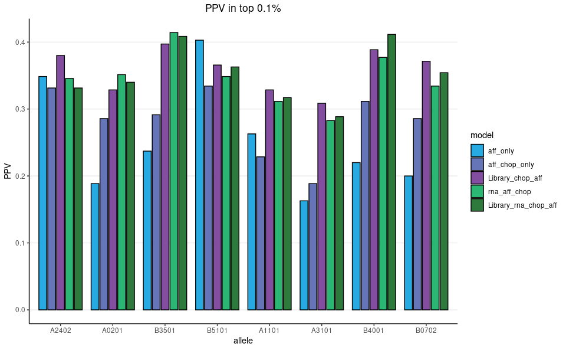
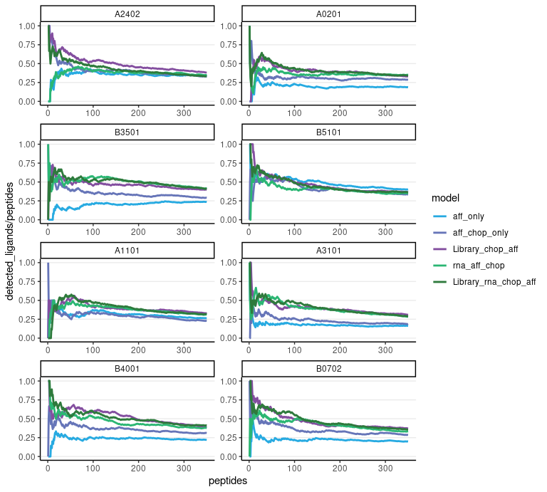
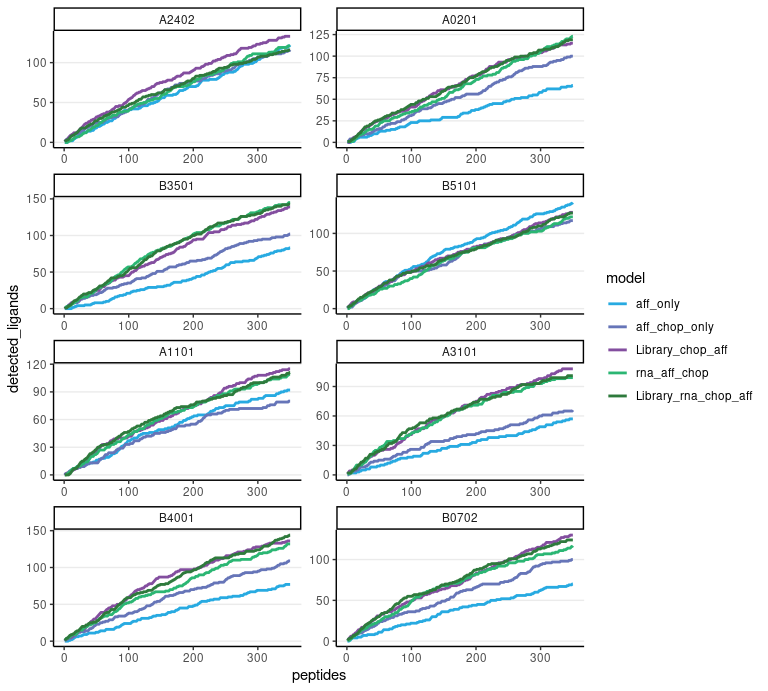
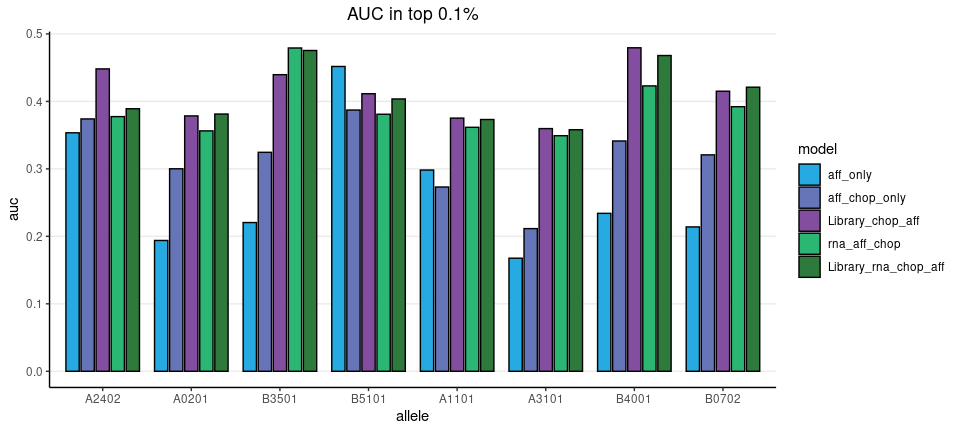

XGB results top 0.1% Broad data
================
Kaspar Bresser
11/01/2021

-   [Import and tidy data](#import-and-tidy-data)
-   [Positive predictive value](#positive-predictive-value)
-   [Cumulative sums](#cumulative-sums)
-   [Area under the curve](#area-under-the-curve)

Used the analysis below to compare the performance of the XGB models.

``` r
library(here)
library(bayestestR)
library(tidyverse)
```

## Import and tidy data

Import the results table.

``` r
here("Output", "XGB") %>% 
  list.files() %>% 
  here("Output", "XGB", .) %>% 
  map(read_tsv) %>% 
  reduce(bind_rows)  -> XGB.results

XGB.results
```

    ## # A tibble: 2,802,729 × 10
    ##    aff_chop_only aff_only Library_chop_aff library_only Library_rna_chop… random
    ##            <dbl>    <dbl>            <dbl>        <dbl>             <dbl>  <dbl>
    ##  1        0.571    0.366            0.793         0.797            0.821   0.528
    ##  2        0.0118   0.0544           0.0280        0.797            0.0311  0.528
    ##  3        0.0394   0.0331           0.0979        0.797            0.135   0.528
    ##  4        0.169    0.298            0.418         0.797            0.463   0.528
    ##  5        0.102    0.298            0.293         0.797            0.248   0.528
    ##  6        0.135    0.102            0.353         0.797            0.242   0.528
    ##  7        0.819    0.708            0.964         0.797            0.966   0.528
    ##  8        0.283    0.366            0.581         0.797            0.478   0.528
    ##  9        0.0163   0.0132           0.0429        0.797            0.0430  0.528
    ## 10        0.272    0.298            0.551         0.797            0.463   0.528
    ## # … with 2,802,719 more rows, and 4 more variables: rna_aff_chop <dbl>,
    ## #   rna_only <dbl>, allele <chr>, ligand <lgl>

Convert the ligand column to a binary so it can be used for cumsum
calculation, pivot to longer data by putting the models in a grouped
format.

``` r
XGB.results %>% 
  mutate(detected = case_when(ligand == TRUE ~ 1,
                              TRUE ~ 0)) %>% 
  pivot_longer(cols = !c("detected", "ligand", "allele"), 
               names_to =  "model", 
               values_to =  "score") -> XGB.results

XGB.results
```

    ## # A tibble: 22,421,832 × 5
    ##    allele ligand detected model                 score
    ##    <chr>  <lgl>     <dbl> <chr>                 <dbl>
    ##  1 B5101  FALSE         0 aff_chop_only        0.571 
    ##  2 B5101  FALSE         0 aff_only             0.366 
    ##  3 B5101  FALSE         0 Library_chop_aff     0.793 
    ##  4 B5101  FALSE         0 library_only         0.797 
    ##  5 B5101  FALSE         0 Library_rna_chop_aff 0.821 
    ##  6 B5101  FALSE         0 random               0.528 
    ##  7 B5101  FALSE         0 rna_aff_chop         0.246 
    ##  8 B5101  FALSE         0 rna_only             0.245 
    ##  9 A1101  FALSE         0 aff_chop_only        0.0118
    ## 10 A1101  FALSE         0 aff_only             0.0544
    ## # … with 22,421,822 more rows

For these analysis we’ll focus on the top 0.1% scoring peptides for each
model. Let’s subset on those. Note that I arrange on both both model
scores and a random number for tie breaking.

``` r
XGB.results %>% 
  group_by(allele, model) %>% 
  mutate(random = sample(1:n())) %>% 
  arrange(desc(score), random, .by_group = T) %>% 
  slice_head(prop = .001) -> XGB.results
 
XGB.results
```

    ## # A tibble: 22,400 × 6
    ## # Groups:   allele, model [64]
    ##    allele ligand detected model         score random
    ##    <chr>  <lgl>     <dbl> <chr>         <dbl>  <int>
    ##  1 A0201  TRUE          1 aff_chop_only 0.993    680
    ##  2 A0201  FALSE         0 aff_chop_only 0.993  57391
    ##  3 A0201  TRUE          1 aff_chop_only 0.993  60869
    ##  4 A0201  TRUE          1 aff_chop_only 0.993  93367
    ##  5 A0201  TRUE          1 aff_chop_only 0.993 267637
    ##  6 A0201  FALSE         0 aff_chop_only 0.993  99291
    ##  7 A0201  FALSE         0 aff_chop_only 0.993 165785
    ##  8 A0201  FALSE         0 aff_chop_only 0.993 199687
    ##  9 A0201  TRUE          1 aff_chop_only 0.993 342855
    ## 10 A0201  FALSE         0 aff_chop_only 0.992  51428
    ## # … with 22,390 more rows

Next we’ll calculate the cumulative sums by grouping by allele and
model.

Note that `cumsum()` takes an ordered dataframe.

``` r
XGB.results %>% 
  group_by(allele, model) %>%
  mutate(peptides = 1:n(), 
         detected_ligands = cumsum(detected)) %>% 
  ungroup() -> XGB.results

XGB.results
```

    ## # A tibble: 22,400 × 8
    ##    allele ligand detected model         score random peptides detected_ligands
    ##    <chr>  <lgl>     <dbl> <chr>         <dbl>  <int>    <int>            <dbl>
    ##  1 A0201  TRUE          1 aff_chop_only 0.993    680        1                1
    ##  2 A0201  FALSE         0 aff_chop_only 0.993  57391        2                1
    ##  3 A0201  TRUE          1 aff_chop_only 0.993  60869        3                2
    ##  4 A0201  TRUE          1 aff_chop_only 0.993  93367        4                3
    ##  5 A0201  TRUE          1 aff_chop_only 0.993 267637        5                4
    ##  6 A0201  FALSE         0 aff_chop_only 0.993  99291        6                4
    ##  7 A0201  FALSE         0 aff_chop_only 0.993 165785        7                4
    ##  8 A0201  FALSE         0 aff_chop_only 0.993 199687        8                4
    ##  9 A0201  TRUE          1 aff_chop_only 0.993 342855        9                5
    ## 10 A0201  FALSE         0 aff_chop_only 0.992  51428       10                5
    ## # … with 22,390 more rows

Lastly, set the ordering in which we’d like the models to appear in
plots, by converting the models variable to a factor

``` r
unique(XGB.results$model)
```

    ## [1] "aff_chop_only"        "aff_only"             "Library_chop_aff"    
    ## [4] "library_only"         "Library_rna_chop_aff" "random"              
    ## [7] "rna_aff_chop"         "rna_only"

``` r
#model.order <- c("aff_only", "aff_chop_only",  "aff_chop_Library","aff_chop_rna",  "aff_chop_Library_rna")

model.order <- c("aff_only", "aff_chop_only",  "Library_chop_aff","rna_aff_chop",  "Library_rna_chop_aff")

allele.order <- c("A2402", "A0201", "B3501", "B5101", "A1101", "A3101", "B4001", "B0702")

colors <- c("#27aae1", "#6675b8", "#834e9f", "#2bb673", "#2e7a3c")

XGB.results %>% 
  filter(model %in% model.order) %>% 
  mutate(model = as_factor(model),
         model = fct_relevel(model, model.order),
         allele = as_factor(allele),
         allele = fct_relevel(allele, allele.order)) -> XGB.results

XGB.results
```

    ## # A tibble: 14,000 × 8
    ##    allele ligand detected model         score random peptides detected_ligands
    ##    <fct>  <lgl>     <dbl> <fct>         <dbl>  <int>    <int>            <dbl>
    ##  1 A0201  TRUE          1 aff_chop_only 0.993    680        1                1
    ##  2 A0201  FALSE         0 aff_chop_only 0.993  57391        2                1
    ##  3 A0201  TRUE          1 aff_chop_only 0.993  60869        3                2
    ##  4 A0201  TRUE          1 aff_chop_only 0.993  93367        4                3
    ##  5 A0201  TRUE          1 aff_chop_only 0.993 267637        5                4
    ##  6 A0201  FALSE         0 aff_chop_only 0.993  99291        6                4
    ##  7 A0201  FALSE         0 aff_chop_only 0.993 165785        7                4
    ##  8 A0201  FALSE         0 aff_chop_only 0.993 199687        8                4
    ##  9 A0201  TRUE          1 aff_chop_only 0.993 342855        9                5
    ## 10 A0201  FALSE         0 aff_chop_only 0.992  51428       10                5
    ## # … with 13,990 more rows

## Positive predictive value

Lets first plot the positive predictive value (PPV), i.e. the number of
true positives within a certain threshold. Calculate the PPV as the
number of true positives divided by the total number of peptides within
the selected pool.

``` r
XGB.results %>%  
  group_by(allele, model) %>% 
  summarise(PPV = sum(detected)/n()) %>% 
   ggplot( aes(x = allele, y = PPV, fill = model)) +
    geom_bar(stat = "identity", width=0.75, position=position_dodge(width=0.85), color = "black")+
    scale_fill_manual(values = colors)+
    ggtitle("PPV in top 0.1%")+
    theme_classic()+
    theme(plot.title = element_text(hjust = 0.5), panel.grid.major.y = element_line())
```



``` r
ggsave(here("Figs", "XGB_Ext_PPV_bar_final.pdf"), width = 4, height = 2, scale = 2)
```

Can also plot the PPV on a continuous scale across the top 0.1%.

``` r
XGB.results %>% 
  filter(model %in% model.order) %>% 
    ggplot(aes(x = peptides, y = detected_ligands/peptides, color = model))+
    geom_line(size = 1)+
    scale_color_manual(values = colors)+
    facet_wrap(~allele, scales = "free", nrow = 4)+
    theme_classic()+
    theme(panel.grid.major.y = element_line())
```



``` r
ggsave(here("Figs", "XGB_Ext_PPV_line_final.pdf"), width = 4, height = 4, scale = 2)
```

## Cumulative sums

We can additionally plot the cumulative sums of all models.

``` r
XGB.results %>% 
  filter(model %in% model.order) %>% 
  ggplot(aes(x = peptides, y = detected_ligands, color = model))+
  geom_line(size = 1)+
  scale_color_manual(values = colors)+
  facet_wrap(~allele, scales = "free", nrow = 4)+
  theme_classic()+
  theme(panel.grid.major.y = element_line())
```



``` r
ggsave(here("Figs", "XGB_Ext_cumsum_final.pdf"), width = 4, height = 4, scale = 2)
```

## Area under the curve

Or calculate the AUC of these curves as a summary metric and plot that.
Used the `area_under_curve()` function from the
[bayestestR](https://easystats.github.io/bayestestR/index.html) package.

``` r
XGB.results %>% 
  group_by(allele, model) %>% 
  summarise(auc = area_under_curve(peptides, peptides)) %>% 
  distinct(auc)
```

    ## # A tibble: 8 × 2
    ## # Groups:   allele [8]
    ##   allele    auc
    ##   <fct>   <dbl>
    ## 1 A2402  61250.
    ## 2 A0201  61250.
    ## 3 B3501  61250.
    ## 4 B5101  61250.
    ## 5 A1101  61250.
    ## 6 A3101  61250.
    ## 7 B4001  61250.
    ## 8 B0702  61250.

``` r
XGB.results %>% 
  group_by(allele, model) %>% 
  summarise(auc = area_under_curve(peptides, detected_ligands) / 61249.5) %>% 
  ggplot( aes(x = allele, y = auc, fill = model)) +
  geom_bar(stat = "identity", width=0.75, position=position_dodge(width=0.85), color = "black")+
  scale_fill_manual(values = colors)+
  ggtitle("AUC in top 0.1%")+
  theme_classic()+
  theme(plot.title = element_text(hjust = 0.5), panel.grid.major.y = element_line())
```



``` r
ggsave(here("Figs", "XGB_Ext_AUC_final.pdf"), width = 5, height = 2, scale = 2)
```
